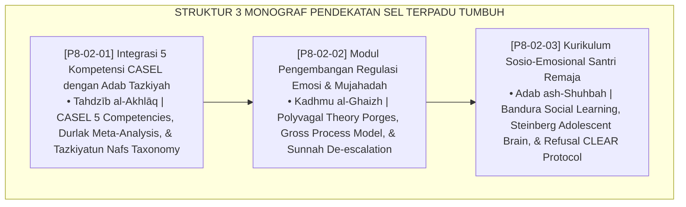

# P8-02: DOKUMEN INDUK PENDEKATAN TERINTEGRASI SOSIO-EMOSIONAL (SEL)
## *Arsitektur dan Standarisasi Integrasi 5 Kompetensi CASEL dengan Adab Tazkiyatun Nafs, Modul Psikoedukasi Regulasi Emosi Somato-Spiritual, dan Kurikulum Keterampilan Sebaya Remaja sebagai Tiga Pilar Kecerdasan Sosio-Emosional (CASEL-Tazkiyah Integration Form SEL-Tazkiyah, Emotion Regulation Module Form SEL-RegulasiEmosi, Serta Adolescent SEL Curriculum Form SEL-KurikulumRemaja) di Ekosistem TUMBUH Pesantren*

**Nomor Identifikasi**: `P8-02/DOKUMEN-INDUK-PENDEKATAN-TERINTEGRASI-SEL/2026`  
**Domain**: `08 Integrated Approaches` > `02 SEL` (Gugus Sub-Domain 02: *Social-Emotional Learning, Tazkiyatun Nafs, & Emotional Regulation*)  
**Klasifikasi Naskah**: *Master Architecture & Navigation Monograph*  
**Rumpun Disiplin Pengkaji**: Social-Emotional Learning (CASEL), Tazkiyatun Nafs & Akhlaq Turats, Neurosains Afektif, Psikologi Sosial Remaja  

---

> ### 💡 INTISARI EKSEKUTIF
>
> * **Kedudukan Strategis Gugus Pendekatan Terintegrasi SEL:** Gugus ini adalah jembatan emas yang menghubungkan khazanah adab dan tasawuf Islam (*Tazkiyatun Nafs*) dengan sains modern kecerdasan sosial-emosional (*Social-Emotional Learning*). Melalui pendekatan ini, adab tidak lagi diajarkan sekadar sebagai doktrin hafalan, melainkan dilatihkan secara sistematis menjadi keterampilan hidup nyata, kemampuan regulasi emosi di bawah tekanan, dan ketahanan sosial menghadapi dinamika asrama 24 jam (*From Abstract Ethics to Somatosensory Competence*).
> * **Triad Pendekatan Terintegrasi SEL TUMBUH:** (1) **Integrasi CASEL-Tazkiyah** yang memetakan 5 kompetensi inti dengan konsep klasik tazkiyatun nafs, (2) **Modul Regulasi Emosi & Mujahadah** yang menggabungkan Sunnah de-eskalasi Nabawi dengan neurosains somatosensorik, dan (3) **Kurikulum SEL Santri Remaja** yang melatih ketahanan menghadapi tekanan negatif teman sebaya melalui simulasi peran kelompok kecil.
> * **3 Monograf Riset Komprehensif:** Form SEL-Tazkiyah, Form SEL-RegulasiEmosi, dan Form SEL-KurikulumRemaja.

---

## 📑 PETA NAVIGASI TIGA MONOGRAF

---

## 📚 DESKRIPSI RINGKAS 3 BERKAS MONOGRAF

1. **[P8-02-01: Integrasi 5 Kompetensi CASEL dengan Adab Tazkiyah](file:///c:/xampp/htdocs/tumbuh/08%20Integrated%20Approaches/02%20SEL/P8-02-01-Integrasi-5-Kompetensi-CASEL-dengan-Adab-Tazkiyah.md)**  
   *Matriks pemetaan komprehensif 5 kompetensi CASEL dengan konsep turats (Muhasabah, Mujahadah, Tarahum, Ukhuwah, Wara'), rencana pembelajaran mingguan, dan Form SEL-Tazkiyah.*
2. **[P8-02-02: Modul Pengembangan Regulasi Emosi dan Mujahadah](file:///c:/xampp/htdocs/tumbuh/08%20Integrated%20Approaches/02%20SEL/P8-02-02-Modul-Pengembangan-Regulasi-Emosi-dan-Mujahadah.md)**  
   *Protokol 4 langkah de-eskalasi Nabawi + Polyvagal (napas diafragma, perubahan posisi, wudhu termal, ta'awwudz), standarisasi Calming Corner asrama, dan Form SEL-RegulasiEmosi.*
3. **[P8-02-03: Kurikulum Sosio-Emosional Santri Remaja](file:///c:/xampp/htdocs/tumbuh/08%20Integrated%20Approaches/02%20SEL/P8-02-03-Kurikulum-Sosio-Emosional-Santri-Remaja.md)**  
   *Kurikulum 16 minggu kelompok kecil 8-12 santri, pedagogi role-play Bandura, protokol penolakan asertif CLEAR, pencegahan eksklusi/bystander, dan Form SEL-KurikulumRemaja.*

---

## 🎯 STANDAR PENJAMINAN MUTU PENDEKATAN SEL

Penerapan gugus **Pendekatan Terintegrasi Sosio-Emosional (SEL)** menjamin bahwa:
1. **Adab Islam Diinternalisasi Menjadi Keterampilan Perilaku Nyata (*Actionable Adab Guarantee*)**: Santri mampu mempraktikkan adab saat berada di bawah tekanan emosi tinggi.
2. **Setiap Ledakan Emosi Ditangani dengan Pemulihan Tenang Tanpa Kekerasan (*Somatic De-escalation Guarantee*)**: Protokol Sunnah dan Calming Corner menjamin zero kekerasan balasan dari musyrif.
3. **Santri Memiliki Ketahanan Mental terhadap Tekanan Negatif Lingkungan (*Peer Resistance Guarantee*)**: Pelatihan asertif melindungi santri dari konformitas menyimpang di asrama.
