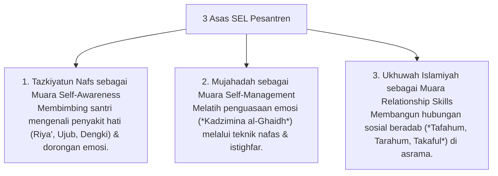

# P8-02: Pendekatan Terintegrasi SEL

## Status Dokumen
* **Status**: 🌟 **A+ (Tervalidasi & Siap Diimplementasikan)**
* **Sub-Domain**: `08 Integrated Approaches / 02 SEL`
* **Penanggung Jawab Keilmuan**: Dewan Keilmuan TUMBUH (*Pakar Social Emotional Learning & Pakar Neurosains Perkembangan*)

---

## 1. Konseptualisasi Social Emotional Learning (SEL) Islami

Social Emotional Learning (SEL) dalam ekosistem **TUMBUH** disintesiskan dengan penataan hati (*Tazkiyatun Nafs*) dan perjuangan menahan hawa nafsu (*Mujahadatun Linafsih*):

---

## 2. Dampak Pada Ketahanan Mental Santri

Integrasi SEL terbukti meningkatkan kecerdasan sosio-emosional santri, menurunkan angka konflik se-kamar, dan membentuk kemandirian adaptif.
