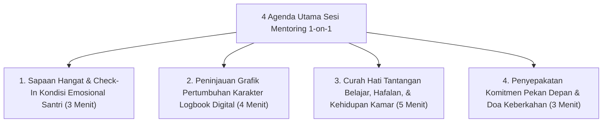

# P8-03-01: Sistem Mentoring Qudwah Musyrif-Santri

## Status Dokumen
* **Status**: 🌟 **A+ (Tervalidasi & Siap Diimplementasikan)**
* **Sub-Domain**: `08 Integrated Approaches / 03 Mentoring`
* **Penanggung Jawab Keilmuan**: Dewan Keilmuan TUMBUH (*Pakar Pengasuhan Asrama & Pakar Bimbingan Konseling*)

---

## 1. Operasionalisasi Sesi Mentoring 1-on-1 Musyrif

Setiap Musyrif Asrama menyelenggarakan sesi dialog **Mentoring Qudwah 1-on-1** selama 15 menit secara berkala 2 kali sebulan dengan santri binaannya:

---

## 2. Prinsip Hubungan Berbasis Kerahasiaan & Kepercayaan

Curhat pribadi santri selama sesi mentoring dijaga kerahasiaannya oleh Musyrif dan hanya didiskusikan dengan Konselor BK apabila ditemukan indikasi krisis keamanan (*Safety Risk*).
