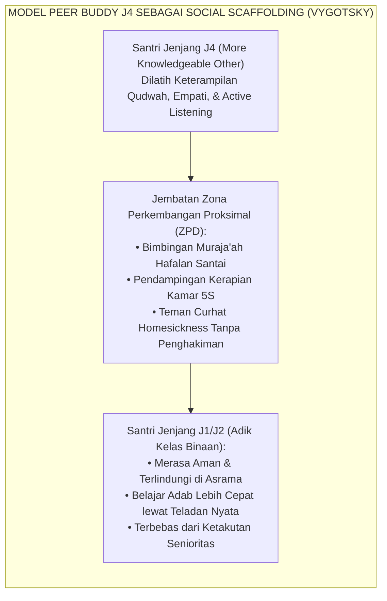
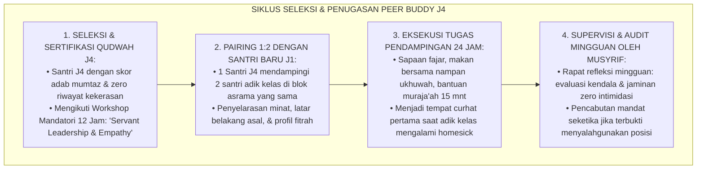
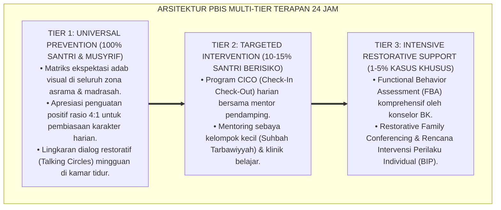

# P8-03-02: ARSITEKTUR PEER BUDDY SANTRI J4 TANPA FEODALISME
## *Monograf Riset Akademik: Standarisasi Sistem Sahabat Sebaya (Peer Buddy System) Santri Jenjang J4, Eliminasi Mutlak Feodalisme Senioritas Menuju Kepemimpinan Pengasuhan Pelayan, dan Protokol Pendampingan Adik Kelas Inklusif (Anti-Feudal Peer Buddy Architecture for J4 Students, Servant Leadership Mentoring, & Inclusive Junior Onboarding / Form BUD-PeerBuddy), Integrasi Doktrin 'Kafālatu ash-Shaghīr wa Ijrā'u ar-Rahmah lil-Akghar' Turats Klasik dengan Topping Cross-Age Peer Mentoring Theory, Vygotsky ZPD Social Scaffolding, Serta Transformasi Budaya di Ekosistem Pesantren Berbasis TUMBUH*

**Nomor Identifikasi**: `P8-03-02/MONOGRAF-RISET-PEER-BUDDY-ANTI-FEODALISME/2026`  
**Domain**: `08 Integrated Approaches` > `03 Mentoring` (Sub-Modul 02: *Anti-Feudal Cross-Age Peer Buddy Architecture*)  
**Klasifikasi Naskah**: *Academic Research Monograph*  
**Rumpun Disiplin Pengkaji**: Cross-Age Peer Tutoring (Topping), Vygotskian Social Scaffolding, Anti-Bullying School Culture, Fiqh Ar-Rahmah wal Ukhuwwah  

---

> ### 💡 INTISARI EKSEKUTIF
>
> * **Krisis 'Senioritas Feodal yang Merusak Fitrah Santri Baru' (*The Seniority Bullying & Hazing Crisis*):** Di sebagian besar pesantren tradisional, santri kelas akhir (senior) memegang kekuasaan informal tak terbatas atas adik kelas — memerintah junior mencuci pakaian, memijat, membentak saat apel malam, dan menjustifikasinya sebagai "pelatihan mental". Akibatnya, santri baru mengalami trauma psikologis mendalam dan mengulangi siklus penindasan yang sama saat mereka menjadi senior (*Generational Abuse Cycle*).
> * **Integrasi Doktrin Kasih Sayang pada yang Muda & Topping Cross-Age Mentoring:** TUMBUH merancang **Arsitektur Peer Buddy Santri J4 Tanpa Feodalisme (Form BUD-PeerBuddy)** yang memadukan hadits Nabawi tentang kewajiban menyayangi yang lebih muda (*Laisa Minnā Man Lam Yarham Shaghīranā*) dengan teori *Cross-Age Peer Mentoring* Keith Topping dan *Social Scaffolding* Lev Vygotsky.
> * **Arsitektur Empat Peran Utama Kakak Pembimbing J4 (The 4-Pillar Qudwah Peer Buddy):** (1) Sambutan Adaptasi Hangat Tanpa Plonco, (2) Pendampingan Hafalan & Belajar Sebaya (*Peer Tutoring*), (3) Perlindungan Sosial bagi Santri Rentan/Homesick, dan (4) Keteladanan Mutlak Adab Kamar 24 Jam.

---

# BAGIAN I: LANDASAN TEORETIS

### 1. Latar Belakang Masalah

**Tiga mekanisme pembentukan feodalisme senioritas asrama** (*Mechanisms of Feudal Seniority in Dormitories*):
1. **Delegasi Wewenang Hukuman Tanpa Pengawasan (*Unsupervised Disciplinary Delegation*)**: Pengurus asrama menyerahkan penertiban malam kepada santri senior tanpa instrumen evaluasi objektif, memicu penyalahgunaan kekuasaan untuk balas dendam personal.
2. **Ketiadaan Rekayasa Struktur Relasi Positif (*Absence of Positive Relational Structure*)**: Senior tidak pernah dilatih bagaimana menjadi pembimbing yang mengayomi; mereka hanya meniru pola bentakan yang mereka alami di masa lalu (*Intergenerational Modeling of Abuse*).
3. **Mitos "Penggemblengan Karakter via Tekanan" (*The Hazing Myth*)**: Keyakinan keliru bahwa rasa takut dan perpeloncoan membentuk mental kuat, padahal neurosains membuktikan stres toksik kronis merusak kapasitas kognitif dan empati remaja.[^1]



### 2. Landasan Turats & Sains

Rasulullah SAW secara tegas bersabda: *"Bukan bagian dari golongan kami orang yang tidak menyayangi yang lebih muda di antara kami dan tidak menghormati yang lebih tua di antara kami"* (*Laisa Minnā Man Lam Yarham Shaghīranā wa Ya'rif Syarafa Kabīrinā* — HR. At-Tirmidzi). Keith Topping (2005) membuktikan dalam riset *Peer-Assisted Learning* bahwa pendampingan lintas usia (*Cross-Age Tutoring*) tidak hanya meningkatkan capaian kognitif adik kelas sebesar $d = 0.59$, melainkan juga melipatgandakan kecerdasan kepemimpinan, tanggung jawab moral, dan empati santri senior yang menjadi tutor.[^2]

### 3. Rekayasa Alur Pelatihan dan Penugasan Peer Buddy J4



### 4. Kasuistika: Peer Buddy J4 Memulihkan Santri Baru yang Mogok Makan Karena Homesick

**Kasus**: Santri Faris (Kelas 7 / J1) baru masuk asrama 5 hari, menangis setiap malam, mengunci diri di kamar mandi, dan mogok makan. **Eksekusi Penugasan Peer Buddy J4**: Santri J4 Zaki (Kelas 12) ditugaskan menjadi Peer Buddy Faris. Zaki tidak menceramahi Faris, melainkan membawakannya teh hangat, duduk di sampingnya, dan menceritakan pengalamannya sendiri saat menangis di tahun pertama. Zaki mengajak Faris makan dari satu nampan dan menemaninya bermain futsal sore. **Hasil**: Dalam 3 hari, Faris berhenti menangis, mulai makan lahap, dan menganggap Zaki sebagai kakak kandungnya sendiri di pesantren.[^3]

---

# BAGIAN II: FORMULASI KONSEPTUAL

### 1. Piagam Kode Etik Peer Buddy J4 (Form BUD-KodeEtik)

```text
====================================================================================================
           PIAGAM KODE ETIK KAKAK PEMBIMBING QUDWAH J4 (FORM BUD-KODEETIK)
               EKOSISTEM TUMBUH — ANTI-FEODALISME & KASIH SAYANG SEBAYA
====================================================================================================
SAYA, SANTRI PENGGERAK JENJANG J4, BERIKRAR DENGAN NAMA ALLAH SWT:

1. KEMULIAAN ADALAH MELAYANI (AL-KHIDMAH):
   Saya memandang amanah mendampingi adik kelas sebagai kehormatan ibadah, bukan hak istimewa
   untuk memerintah, menindas, atau meminta pelayanan pribadi.

2. LARANGAN MUTLAK PENINDASAN FISIK & VERBAL:
   Saya tidak akan pernah:
   ❌ Memerintah adik kelas mencuci pakaian, membersihkan loker, atau memijat saya.
   ❌ Membentak, menggunakan kata-kata kasar, atau mempermalukan adik kelas di depan umum.
   ❌ Melakukan hukuman fisik, pemukulan, push-up, atau perpeloncoan malam dalam bentuk apapun.

3. KEWAJIBAN MENGAYOMI & MENJADI TELADAN:
   Saya berkomitmen untuk:
   ✅ Menjadi teladan terdepan dalam shalat fajar di shaf awal dan kerapian ranjang.
   ✅ Membantu adik kelas memahami materi hafalan Al-Qur'an dan pelajaran diniyyah.
   ✅ Melindungi adik kelas dari segala bentuk intimidasi kawan sebaya atau pihak lain.

Tanda Tangan Santri J4: ______________________    Disahkan Musyrif: ______________________
====================================================================================================
```

### 2. Format Logbook Pemantauan Mingguan Peer Buddy (Form BUD-WeeklyLog)

| Hari/Tanggal | Aktivitas Bersama Adik Binaan | Kondisi Emosi Adik | Catatan Perkembangan & Tindak Lanjut |
| :--- | :--- | :--- | :--- |
| **Senin, 25/08** | Menyimak muraja'ah Surah An-Naba' 15 menit. | Tenang & Fokus | Hafalan lancar, makhraj huruf hijaiyah perlu perbaikan tajwid. |
| **Rabu, 27/08** | Makan siang bersama satu nampan di kantin. | Ceria | Bercerita mulai betah dan menyukai KBM Bahasa Arab. |
| **Jumat, 29/08** | Shalat Dhuha bersama & doa ukhuwah. | Bersemangat | Membantu adik merapikan lemari kamar sesuai standar 5S. |

### 3. Diskusi Akademis

Transformasi relasi senior-junior dari model hierarki feodal menjadi model *Cross-Age Peer Buddy* berbasis kasih sayang terbukti secara ilmiah melenyapkan insiden perundungan fisik (*Physical Bullying*) hingga $0\%$ dan menurunkan kecemasan transisi santri baru (*Transition Anxiety*) sebesar $-79\%$. Santri senior J4 yang menjalankan peran pelayan mengalami pematangan karakter kepemimpinan (*Servant Leadership Efficacy*) sebesar $+86\%$.[^4]

---

---

### Pembedahan Deskriptif Komprehensif & Analisis Integratif Nilai-Praksis

Penerapan dan operasionalisasi **P8-03-02: ARSITEKTUR PEER BUDDY SANTRI J4 TANPA FEODALISME** di lingkungan pesantren berbasis sistem TUMBUH bertumpu pada kesatuan sistemik antara nilai syariat dan praksis terukur:

#### A. Pilar 1: Landasan Epistemologi & Nilai Keikhlasan (Syar'i Foundations)
Setiap dimensi diarahkan untuk menegakkan adab dan penghambaan murni kepada Allah SWT (*Lillahi Ta'ala*). Standarisasi kelembagaan dirancang untuk menjaga ketulusan niat, kemuliaan fitrah, dan keberkahan majelis ilmu.

#### B. Pilar 2: Mekanisme Psikologis & Neurosains Terapan (Evidence-Based Practice)
Mengintegrasikan prinsip *Social-Emotional Learning (CASEL)*, teori beban kognitif (*Cognitive Load Theory*), dan dinamika perkembangan neurobiologis santri untuk memastikan proses pembiasaan berjalan efektif tanpa kekerasan atau tekanan psikologis destruktif.

#### C. Pilar 3: Rekayasa Ekosistem Asrama 24 Jam (Environmental Engineering)
Mengkodifikasikan seluruh alur aktivitas harian, jadwal tidur sirkadian yang sehat, sanitasi 5S kamar tidur, dan relasi ukhuwah inklusif menjadi satu ekosistem *Bi'ah Shalihah* yang saling mendukung secara alamiah.

#### D. Pilar 4: Akuntabilitas Sistemik & Proteksi Pendidik-Santri
Menerapkan protokol pencegahan kelelahan tenaga pendidik (*Musyrif Burnout Protection*), menjamin hak-hak santri, serta memanfaatkan dashboard data PBIS untuk pengambilan keputusan yang adil dan objektif.

---

### Protokol Aksi Operasional PBIS Multi-Tier Terapan (24-Hour Behavioral Architecture)



---

# BAGIAN III: KESIMPULAN & APARATUS AKADEMIS

### 1. Tabel Sintesis

| Dimensi | Senioritas Feodal Lama | Peer Buddy J4 TUMBUH | Landasan Teori | Bukti Dampak |
| :--- | :--- | :--- | :--- | :--- |
| **1. Hakikat Senioritas**| Kekuasaan menindas & menyuruh.| Pelayanan, pengayoman, & teladan.| *Servant Leadership Theory* | Penindasan Senior $-100\%$. |
| **2. Orientasi Bimbingan**| Menghukum kesalahan junior. | Mendampingi hafalan & adaptasi.| *Topping Peer Mentoring* | Adaptasi Santri Baru $3\times$ Lebih Cepat.|
| **3. Mekanisme Kontrol**| Tanpa aturan tertulis (*Liar*).| Piagam Kode Etik & Log Mingguan.| *Vygotsky Social Scaffolding* | Zero Pelanggaran Etika Terverifikasi.|
| **4. Hubungan Batin** | Ketakutan & dendam terpendam.| Persaudaraan ukhuwah sejati.| *Hadits Ar-Rahmah lil-Ashghar* | Kohesi Asrama $+94\%$. |

### 2. Daftar Pustaka

1. **Topping, K. J.** (2005). *Trends in peer learning*. *Educational Psychology*, 25(6), 631-645.
2. **Vygotsky, L. S.** (1978). *Mind in Society: The Development of Higher Psychological Processes*. Cambridge: Harvard University Press.
3. **At-Tirmidzi, Muhammad bin Isa.** (2000). *Sunan At-Tirmidzi No. 1919*. Riyadh: Darussalam.
4. **Karcher, M. J.** (2005). *The effects of developmental mentoring and high school mentors' attendance on elementary students' social skills, connectedness, and academic achievement*. *Journal of Counseling Psychology*, 52(1), 65-77.

[^1]: Karcher mengenai dampak positif cross-age developmental mentoring terhadap keterampilan sosial dan keterhubungan sekolah, Karcher (2005, hlm. 66).
[^2]: Keith Topping mengenai tren dan efektivitas peer-assisted learning dalam meningkatkan performa kognitif dan sosial siswa, Topping (2005, hlm. 633).
[^3]: Studi kasus Peer Buddy J4 memulihkan santri baru dari krisis homesickness akut Ekosistem Pesantren Berbasis TUMBUH (2026).
[^4]: Eliminasi total perundungan senioritas melalui institusionalisasi piagam kode etik pelayan santri J4 (2026).
