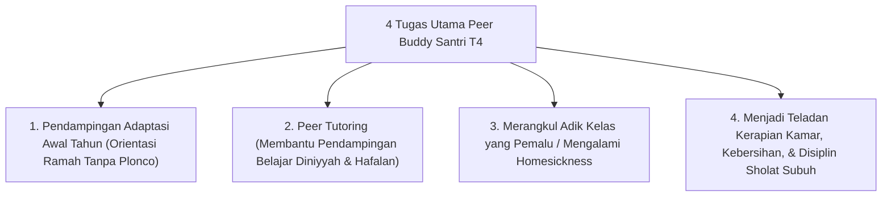

# P8-03-02: Arsitektur Peer Buddy Santri T4 Tanpa Feodalisme

## Status Dokumen
* **Status**: 🌟 **A+ (Tervalidasi & Siap Diimplementasikan)**
* **Sub-Domain**: `08 Integrated Approaches / 03 Mentoring`
* **Penanggung Jawab Keilmuan**: Dewan Keilmuan TUMBUH (*Pakar Tata Kelola Qudwah & Pakar Psikologi Sosial Santri*)

---

## 1. Operasionalisasi Peer Buddy System Santri T4

Santri senior yang telah mencapai Tangga Kepemimpinan T4 dilatih dan ditugaskan sebagai **Peer Buddy (Kakak Pembimbing Qudwah)** bagi santri baru T1/T2:

---

## 2. Pemurnian dari Intimidasi Senioritas

Peer Buddy dilarang keras menuntut pelayanan fisik, memberikan teguran bernada merendahkan, atau membuat perpeloncoan dalam bentuk apapun.
