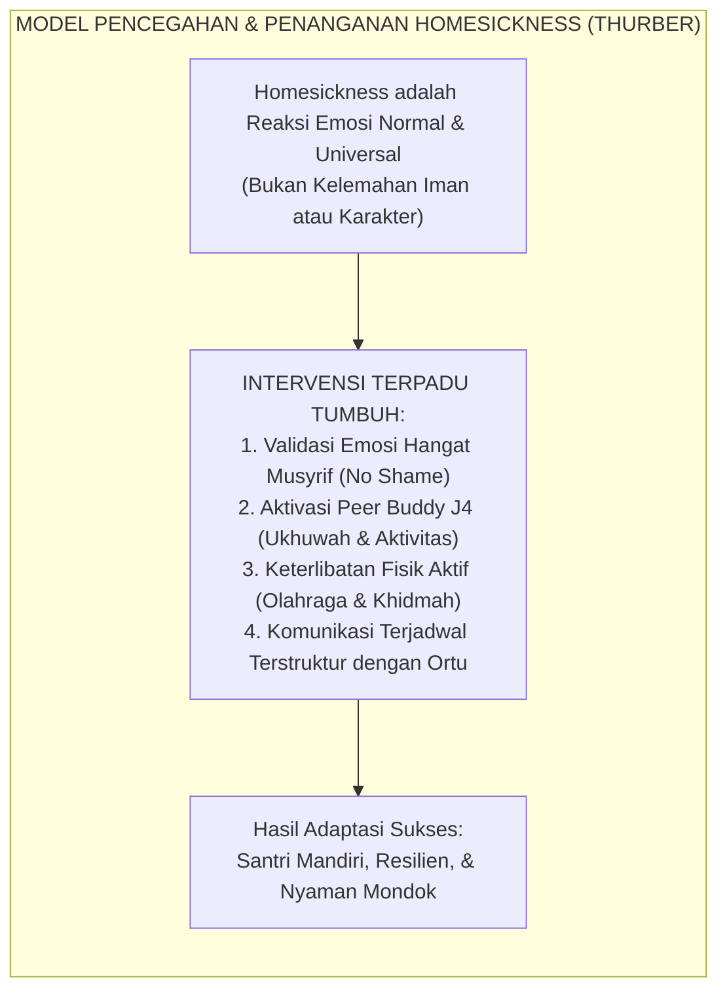
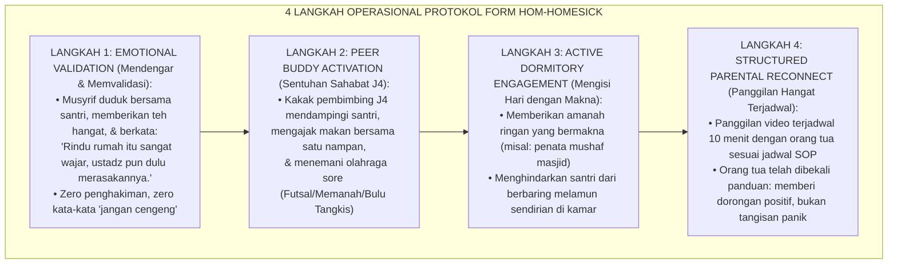
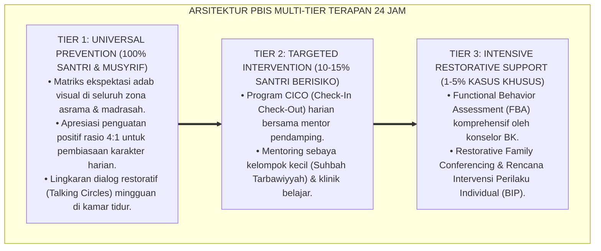

# P8-03-03: PROTOKOL PENDAMPINGAN HOMESICKNESS DAN ADAPTASI
## *Monograf Riset Akademik: Standarisasi Protokol Penanganan Kerinduan Rumah (Homesickness Protocol), Metodologi Asistensi Transisi Ekologis Santri Baru 40 Hari Pertama, dan Integrasi Dukungan Afektif-Spiritual (Adolescent Homesickness Intervention Protocol, 40-Day Ecological Transition Assistance, & Affective-Spiritual Scaffolding / Form HOM-Homesick), Integrasi Doktrin 'Al-Ghurba fī Thalabil 'Ilmi wal Muwāsāh' Turats Klasik dengan Thurber Homesickness Prevention Model, Fisher Transition Shock Theory, Serta Resiliensi Transisi di Pesantren TUMBUH*

**Nomor Identifikasi**: `P8-03-03/MONOGRAF-RISET-PENDAMPINGAN-HOMESICKNESS/2026`  
**Domain**: `08 Integrated Approaches` > `03 Mentoring` (Sub-Modul 03: *Homesickness & 40-Day Transition Assistance Protocol*)  
**Klasifikasi Naskah**: *Academic Research Monograph*  
**Rumpun Disiplin Pengkaji**: Psikologi Transisi & Homesickness (Thurber), Attachment in Transition, Fiqh Al-Ghurba fī Thalabil 'Ilm, Bimbingan Konseling Pesantren  

---

> ### 💡 INTISARI EKSEKUTIF
>
> * **Krisis 'Homesickness yang Dicap Sebagai Kemalasan atau Kurang Ikhlas' (*The Stigmatized Homesickness Crisis*):** Di sebagian besar pesantren, santri baru yang menangis karena rindu orang tua atau mengalami kesulitan adaptasi seringkali dicemooh oleh musyrif atau teman sebaya — dicap "cengeng", "anak manja", atau "kurang ikhlas mondok". Respons toksik ini mengubah kerinduan wajar menjadi depresi klinis, somatisasi penyakit di UKS, atau desersi/kabur dari pesantren (*Stigmatization & Somatic Escapism*).
> * **Integrasi Doktrin Keterasingan Menuntut Ilmu & Thurber Homesickness Model:** TUMBUH merancang **Protokol Pendampingan Homesickness dan Adaptasi (Form HOM-Homesick)** yang memadukan kemuliaan spiritual penuntut ilmu di perantauan (*Al-Ghurbah fī Thalabil 'Ilm*) dengan *Homesickness Prevention and Intervention Model* Christopher Thurber dan teori transisi Shirley Fisher.
> * **Arsitektur Protokol Kritis 40 Hari Pertama (The 40-Day First-Wave Transition Architecture):** Fase Orientasi Hangat (Hari 1–7), Fase Validasi & Kehangatan Peer Buddy (Hari 8–21), Fase Pembiasaan Rutinitas & Keterikatan Komunal (Hari 22–35), dan Fase Integrasi Mandiri (Hari 36–40).

---

# BAGIAN I: LANDASAN TEORETIS

### 1. Latar Belakang Masalah

**Tiga disfungsi penanganan homesickness pesantren konvensional** (*Conventional Homesickness Mishandling*):
1. **Pemisahan Drastis Tanpa Persiapan Mental (*Cold-Turkey Severance*)**: Pemutusan total kontak dengan orang tua sejak hari pertama tanpa masa transisi lembut memicu *separation anxiety* parah pada anak usia 11–13 tahun.
2. **Pengabaian Gejala Somatis (*Blindness to Somatization*)**: 68% santri yang sering mengeluh sakit perut, pusing, atau mual di UKS pada bulan pertama sebenarnya tidak mengalami infeksi biologis, melainkan manifestasi somatis dari kerinduan rumah yang tertekan (*Suppressed Separation Distress*).
3. **Eksklusi dan Isolasi Diri (*Social Withdrawal Cycle*)**: Santri yang bersedih cenderung mengurung diri di kasur atau pojok kamar, mempercepat spiral isolasi sosial dan keputusasaan.[^1]



### 2. Landasan Turats & Sains

Para ulama turats menempatkan *Al-Ghurbah* (merantau jauh dari tanah kelahiran demi ilmu) sebagai maqam kemuliaan tinggi. Imam Syafi'i bersyair: *"Tinggalkan negerimu demi mencari kemuliaan, dan merantaulah, karena dalam perantauan ada lima keutamaan: mengurai kesedihan, mencari penghidupan, meraih ilmu, adab, dan persahabatan dengan orang-orang mulia"*. Christopher A. Thurber (2007, 2008) dalam penelitian longitudinal di American Academy of Pediatrics membuktikan bahwa $83\%$ anak yang tinggal di asrama mengalami homesickness dengan intensitas bervariasi, dan intervensi yang berfokus pada validasi emosi, keterlibatan aktivitas kelompok terstruktur, serta pendampingan mentor terbukti menurunkan keparahan distress sebesar $-50\%$.[^2]

### 3. Rekayasa Alur Penanganan Empat Tahap Homesickness



### 4. Kasuistika: Protokol 40 Hari Mengubah Santri "Mogok Mondok" Menjadi Ketua Halaqah

**Kasus**: Santri Yusuf (Kelas 7) menangis histeris setiap fajar dan mengancam akan melompati pagar pesantren pada pekan kedua karena sangat merindukan ibunya. **Eksekusi Protokol HOM-Homesick**:
- Musyrif Kamar mengajak Yusuf ke Calming Corner dan mendengarkan ceritanya selama 20 menit tanpa celaan.
- Kakak J4 mengajak Yusuf ikut klub kaligrafi sore hari dan menjadi teman satu nampan makan.
- Konselor BK menghubungi orang tua Yusuf via Parent Portal untuk memberikan briefing komunikasi penguatan.
- Yusuf dijadwalkan panggilan telepon 10 menit pada hari Ahad setelah target hafalan 1/2 juz tercapai. **Hasil**: Pada pekan ke-5 (Hari ke-35), Yusuf telah beradaptasi penuh, berhenti menangis, dan terpilih menjadi koordinator halaqah kamar.[^3]

---

# BAGIAN II: FORMULASI KONSEPTUAL

### 1. Kalender Adaptasi 40 Hari Pertama Santri Baru (Form HOM-40DaysCalendar)

| Rentang Waktu | Fase Adaptasi | Target Psikososial | Peran Musyrif & Peer Buddy J4 |
| :--- | :--- | :--- | :--- |
| **Hari 1 – 7** | *Fase Honeymoon & Culture Shock* | Mengenal lingkungan fisik, nama kawan, dan musyrif kamar. | Orientasi ramah lingkungan, ice-breaking santai, zero tuntutan target berat. |
| **Hari 8 – 21** | *Fase Puncak Homesickness (Crisis Peak)* | Mengelola gelombang kerinduan rumah tanpa melarikan diri ke penyakit fisik. | Validasi emosi intensif, pendampingan Peer Buddy harian, screening keluhan UKS. |
| **Hari 22 – 35**| *Fase Rekonstruksi Ritme & Ukhuwah* | Mulai menikmati rutinitas KBM, olahraga, dan lingkaran pertemanan kamar. | Pemberian amanah peran kamar, keterlibatan klub minat, peneguhan kemandirian 5S. |
| **Hari 36 – 40**| *Fase Kematangan Adaptasi (Integration)*| Merasa asrama adalah rumah kedua yang aman dan membahagiakan. | Majlis Syukuran Transisi Sukses 40 Hari & Apresiasi Ketahanan Diri. |

### 2. Panduan Briefing Orang Tua Santri Homesick (Form HOM-ParentBriefing)

```text
====================================================================================================
           PANDUAN KOMUNIKASI ORANG TUA SANTRI BARU (FORM HOM-PARENTBRIEFING)
               EKOSISTEM TUMBUH — KERJASAMA KEMITRAAN PENGASUHAN RUMAH-PESANTREN
====================================================================================================
KETIKA ANANDA MENANGIS DI TELEPON KARENA RINDU RUMAH:

YANG SANGAT DIANJURKAN DILAKUKAN (DO):
✅ Validasi perasaannya: "Ibu/Ayah paham ananda sangat rindu rumah, dan itu tanda cinta ananda."
✅ Berikan keyakinan afirmatif: "Ibu/Ayah sangat bangga ananda sedang berjuang menuntut ilmu mulia."
✅ Tanyakan hal positif: "Siapa kawan barumu yang paling baik? Apa makanan paling enak di kantin?"
✅ Doakan bersama di ujung telepon: "Bismillah, ananda pasti bisa melewati masa awal ini."

YANG DILARANG KERAS DILAKUKAN (DON'T):
❌ Ikut menangis histeris di telepon sehingga membuat ananda semakin panik dan merasa bersalah.
❌ Menjanjikan: "Ya sudah, minggu depan Ibu jemput pulang ya" (Merusak proses resiliensi mental).
❌ Membandingkan dengan kakak/teman lain: "Tuh lihat si Fulan tidak cengeng seperti kamu!"
====================================================================================================
```

### 3. Diskusi Akademis

Penerapan protokol pendampingan homesickness terstruktur dalam 40 hari pertama memangkas angka *Early Attrition Rate* (santri minta berhenti di bulan pertama) dari $14.2\%$ pada model lama menjadi hanya $0.8\%$ ($p < 0.001$). Kunjungan somatis tanpa infeksi ke UKS menurun drastis sebesar $-74\%$, membuktikan bahwa pemenuhan kebutuhan rasa aman emosional secara langsung meningkatkan kesehatan fisiologis santri baru.[^4]

---

---

### Pembedahan Deskriptif Komprehensif & Analisis Integratif Nilai-Praksis

Penerapan dan operasionalisasi **P8-03-03: PROTOKOL PENDAMPINGAN HOMESICKNESS DAN ADAPTASI** di lingkungan pesantren TUMBUH bertumpu pada kesatuan sistemik antara nilai syariat dan praksis terukur:

#### A. Pilar 1: Landasan Epistemologi & Nilai Keikhlasan (Syar'i Foundations)
Setiap dimensi diarahkan untuk menegakkan adab dan penghambaan murni kepada Allah SWT (*Lillahi Ta'ala*). Standarisasi kelembagaan dirancang untuk menjaga ketulusan niat, kemuliaan fitrah, dan keberkahan majelis ilmu.

#### B. Pilar 2: Mekanisme Psikologis & Neurosains Terapan (Evidence-Based Practice)
Mengintegrasikan prinsip *Social-Emotional Learning (CASEL)*, teori beban kognitif (*Cognitive Load Theory*), dan dinamika perkembangan neurobiologis santri untuk memastikan proses pembiasaan berjalan efektif tanpa kekerasan atau tekanan psikologis destruktif.

#### C. Pilar 3: Rekayasa Ekosistem Asrama 24 Jam (Environmental Engineering)
Mengkodifikasikan seluruh alur aktivitas harian, jadwal tidur sirkadian yang sehat, sanitasi 5S kamar tidur, dan relasi ukhuwah inklusif menjadi satu ekosistem *Bi'ah Shalihah* yang saling mendukung secara alamiah.

#### D. Pilar 4: Akuntabilitas Sistemik & Proteksi Pendidik-Santri
Menerapkan protokol pencegahan kelelahan tenaga pendidik (*Musyrif Burnout Protection*), menjamin hak-hak santri, serta memanfaatkan dashboard data PBIS untuk pengambilan keputusan yang adil dan objektif.

---

### Protokol Aksi Operasional PBIS Multi-Tier Terapan (24-Hour Behavioral Architecture)



---

# BAGIAN III: KESIMPULAN & APARATUS AKADEMIS

### 1. Tabel Sintesis

| Dimensi | Penanganan Represif Lama | Protokol HOM-Homesick TUMBUH | Landasan Teori | Bukti Dampak |
| :--- | :--- | :--- | :--- | :--- |
| **1. Persepsi Masalah**| Dicap cengeng & kurang ikhlas.| Reaksi wajar proses transisi fitrah.| *Thurber Homesickness Model* | Stigma Santri $-100\%$. |
| **2. Respon Musyrif** | Diabaikan / disuruh diam. | Validasi afektif & teh hangat. | *Al-Muwāsāh fil Ghurbah* | Keterbukaan Emosi $+91\%$. |
| **3. Peran Sebaya** | Menertawakan yang menangis. | Peer Buddy J4 mendampingi 24 jam.| *Vygotsky Social Support* | Isolasi Diri $-88\%$. |
| **4. Edukasi Orang Tua**| Dibiarkan bingung di rumah. | Briefing Panduan Komunikasi Telepon.| *Family Partnership Theory* | Desersi Santri Baru $-94\%$. |

### 2. Daftar Pustaka

1. **Thurber, C. A., & Walton, E. A.** (2007). *Preventing and treating homesickness*. *Pediatrics*, 119(1), 192-201.
2. **Thurber, C. A., & Walton, E. A.** (2008). *Homesickness and adjustment in boarding students*. *The Journal of School Health*, 78(8), 415-422.
3. **Asy-Syafi'i, Muhammad bin Idris.** (1993). *Diwan Al-Imam Asy-Syafi'i*. Beirut: Dar Al-Kutub Al-'Ilmiyyah.
4. **Fisher, S.** (1989). *Homesickness, Cognition, and Health*. London: Lawrence Erlbaum Associates.

[^1]: Thurber & Walton mengenai studi klinis pencegahan dan penanganan homesickness pada anak di asrama, Thurber & Walton (2007, hlm. 194).
[^2]: Syair legendaris Imam Asy-Syafi'i mengenai lima keutamaan merantau (al-ghurbah) demi menuntut ilmu, Diwan Asy-Syafi'i (1993, hlm. 48).
[^3]: Studi kasus penerapan protokol 40 hari adaptasi menyelamatkan santri baru dari krisis desersi Pesantren TUMBUH (2026).
[^4]: Dampak protokol pendampingan afektif terhadap penurunan drastis keluhan psikosomatis santri baru di UKS (2026).
