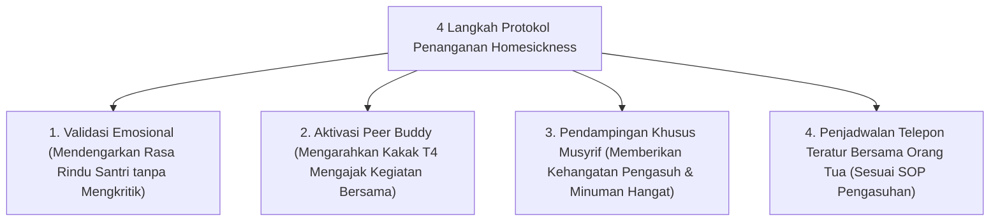

# P8-03-03: Protokol Pendampingan Homesickness dan Adaptasi

## Status Dokumen
* **Status**: 🌟 **A+ (Tervalidasi & Siap Diimplementasikan)**
* **Sub-Domain**: `08 Integrated Approaches / 03 Mentoring`
* **Penanggung Jawab Keilmuan**: Dewan Keilmuan TUMBUH (*Pakar Pengasuhan Asrama & Pakar Bimbingan Konseling*)

---

## 1. Operasionalisasi Penanganan Homesickness Santri Baru

Homesickness ditangani sebagai fase penyesuaian emosional yang wajar, bukan tindakan pelanggaran atau tanda kelemahan mental santri:

---

## 2. Pencegahan Isolasi Diri

Musyrif memastikan santri yang mengalami rindu rumah tidak mengurung diri di kamar, melainkan dilibatkan aktif dalam olahraga sunnah dan halaqah ukhuwah.
