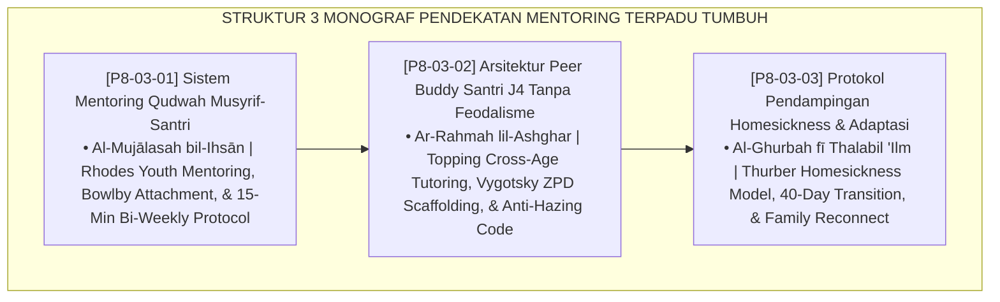

# P8-03: DOKUMEN INDUK PENDEKATAN TERINTEGRASI MENTORING PESANTREN
## *Arsitektur dan Standarisasi Sistem Mentoring Qudwah 1-on-1 Musyrif-Santri, Arsitektur Sahabat Sebaya (Peer Buddy System) Santri J4 Bebas Feodalisme, dan Protokol Pendampingan Adaptasi Homesickness 40 Hari Pertama sebagai Tiga Pilar Mentoring Pengasuhan (1-on-1 Qudwah Mentoring Form MEN-Qudwah, Anti-Feudal Peer Buddy Form BUD-PeerBuddy, Serta Homesickness Protocol Form HOM-Homesick) di Ekosistem TUMBUH Pesantren*

**Nomor Identifikasi**: `P8-03/DOKUMEN-INDUK-PENDEKATAN-TERINTEGRASI-MENTORING/2026`  
**Domain**: `08 Integrated Approaches` > `03 Mentoring` (Gugus Sub-Domain 03: *Youth Mentoring, Anti-Feudal Peer Buddy, & Homesickness Care*)  
**Klasifikasi Naskah**: *Master Architecture & Navigation Monograph*  
**Rumpun Disiplin Pengkaji**: Youth Mentoring Science (Rhodes), Cross-Age Peer Learning (Topping), Attachment & Transition Psychology (Bowlby & Thurber), Fiqh Ar-Ri'ayah wal Ukhuwwah  

---

> ### 💡 INTISARI EKSEKUTIF
>
> * **Kedudukan Strategis Gugus Pendekatan Terintegrasi Mentoring:** Gugus ini adalah jangkar kehangatan relasional (*relational warmth anchor*) di ekosistem TUMBUH. Memastikan tidak ada satu pun santri yang merasa sendirian, asing, atau terabaikan di lingkungan asrama 24 jam. Melalui mentoring orang dewasa terpercaya (musyrif), pendampingan kakak kelas teladan (Peer Buddy J4), dan protokol penanganan homesickness yang manusiawi, pesantren bertransformasi menjadi rumah kedua yang menumbuhkan jiwa (*From Cold Institutions to Warm Sanctuaries*).
> * **Triad Pendekatan Terintegrasi Mentoring TUMBUH:** (1) **Mentoring Qudwah 1-on-1** dua pekanan yang menyediakan ruang aman privat bagi setiap santri, (2) **Arsitektur Peer Buddy J4** yang melenyapkan feodalisme senioritas dan menggantinya dengan kepemimpinan pengasuhan pelayan, dan (3) **Protokol Homesickness 40 Hari** yang mendampingi masa transisi kritis santri baru tanpa stigma.
> * **3 Monograf Riset Komprehensif:** Form MEN-Qudwah, Form BUD-PeerBuddy, dan Form HOM-Homesick.

---

## 📑 PETA NAVIGASI TIGA MONOGRAF

---

## 📚 DESKRIPSI RINGKAS 3 BERKAS MONOGRAF

1. **[P8-03-01: Sistem Mentoring Qudwah Musyrif-Santri](file:///c:/xampp/htdocs/tumbuh/08%20Integrated%20Approaches/03%20Mentoring/P8-03-01-Sistem-Mentoring-Qudwah-Musyrif-Santri.md)**  
   *Protokol dialog 1-on-1 privat 15 menit setiap 14 hari, 4 langkah alur percakapan (check-in, review, tantangan, komitmen doa), kerahasiaan pengasuhan, dan Form MEN-Qudwah.*
2. **[P8-03-02: Arsitektur Peer Buddy Santri J4 Tanpa Feodalisme](file:///c:/xampp/htdocs/tumbuh/08%20Integrated%20Approaches/03%20Mentoring/P8-03-02-Arsitektur-Peer-Buddy-Santri-T4-Tanpa-Feodalisme.md)**  
   *Sistem pairing kakak pembimbing J4 dengan santri baru J1 (1:2), piagam kode etik anti-perpeloncoan, logbook pemantauan mingguan, servant leadership, dan Form BUD-PeerBuddy.*
3. **[P8-03-03: Protokol Pendampingan Homesickness dan Adaptasi](file:///c:/xampp/htdocs/tumbuh/08%20Integrated%20Approaches/03%20Mentoring/P8-03-03-Protokol-Pendampingan-Homesickness-dan-Adaptasi.md)**  
   *Kalender adaptasi 40 hari pertama santri baru, validasi emosi tanpa celaan, pencegahan somatisasi UKS, briefing komunikasi orang tua, dan Form HOM-Homesick.*

---

## 🎯 STANDAR PENJAMINAN MUTU PENDEKATAN MENTORING

Penerapan gugus **Pendekatan Terintegrasi Mentoring** menjamin bahwa:
1. **Setiap Santri Memiliki Figur Dewasa Pengasuh yang Benar-Benar Mengenal Dirinya (*Personalized Care Guarantee*)**: Sesi 1-on-1 rutin menjamin tidak ada santri yang luput dari pendampingan.
2. **Lingkungan Asrama Bersih dari Segala Praktik Penindasan Senioritas (*Zero Feudalism Guarantee*)**: Peer Buddy J4 memastikan kakak kelas menjadi pelindung dan teladan, bukan penindas.
3. **Santri Baru Melewati Masa Adaptasi Awal dengan Penuh Rasa Nyaman dan Resilien (*Smooth Transition Guarantee*)**: Protokol 40 hari menghapuskan trauma homesick dan mencegah fenomena putus sekolah dini.
