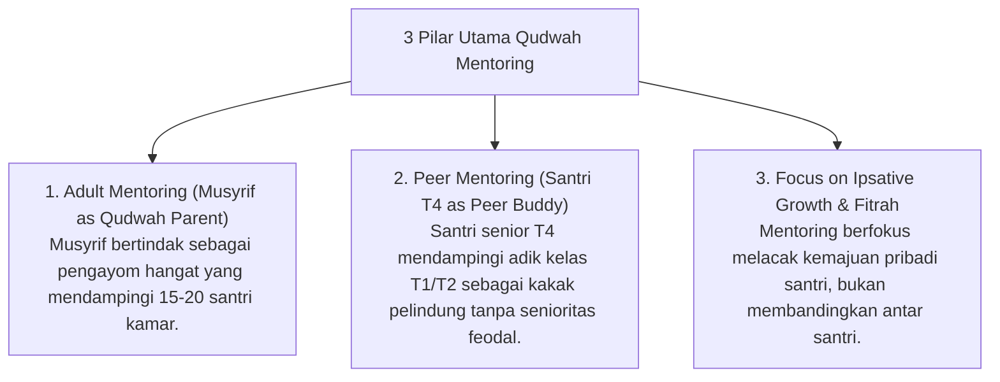

# P8-03: Pendekatan Terintegrasi Mentoring

## Status Dokumen
* **Status**: 🌟 **A+ (Tervalidasi & Siap Diimplementasikan)**
* **Sub-Domain**: `08 Integrated Approaches / 03 Mentoring`
* **Penanggung Jawab Keilmuan**: Dewan Keilmuan TUMBUH (*Pakar Pengasuhan Asrama & Pakar Tata Kelola Qudwah*)

---

## 1. Konseptualisasi Mentoring Qudwah Pesantren

Mentoring dalam ekosistem **TUMBUH** diselaraskan dengan konsep **Suhbah wa al-Mulazamah** (Persetimbangan & Pendampingan Karib) dan **Suhbah as-Shalihiin**:

---

## 2. Penghapusan Budaya Senioritas Intimidatif

Mentoring Qudwah secara tegas melarang budaya senioritas feodal yang menuntut jasa pribadi, melainkan menggantinya dengan tradisi kasih sayang kakak-adik (*Tarahum & Ta'akhuy*).
