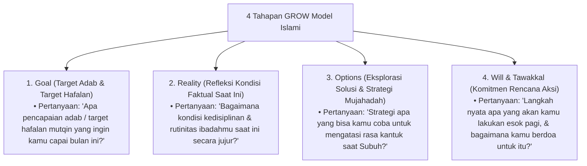

# P8-04-01: Metodologi Coaching Karakter GROW Model Islami

## Status Dokumen
* **Status**: 🌟 **A+ (Tervalidasi & Siap Diimplementasikan)**
* **Sub-Domain**: `08 Integrated Approaches / 04 Coaching`
* **Penanggung Jawab Keilmuan**: Dewan Keilmuan TUMBUH (*Pakar Pedagogi Master Guru & Pakar Tata Kelola Qudwah*)

---

## 1. Operasionalisasi GROW Model Berbasis Nilai-Nilai Islami

Metodologi coaching menggunakan adaptasi GROW Model yang diselaraskan dengan niat ibadah dan ikhtiar syar'i:

---

## 2. Praktik Aplikasi Sesi Coaching

Sesi coaching diselenggarakan selama 20 menit dalam suasana rileks di saung/halaman pesantren.
