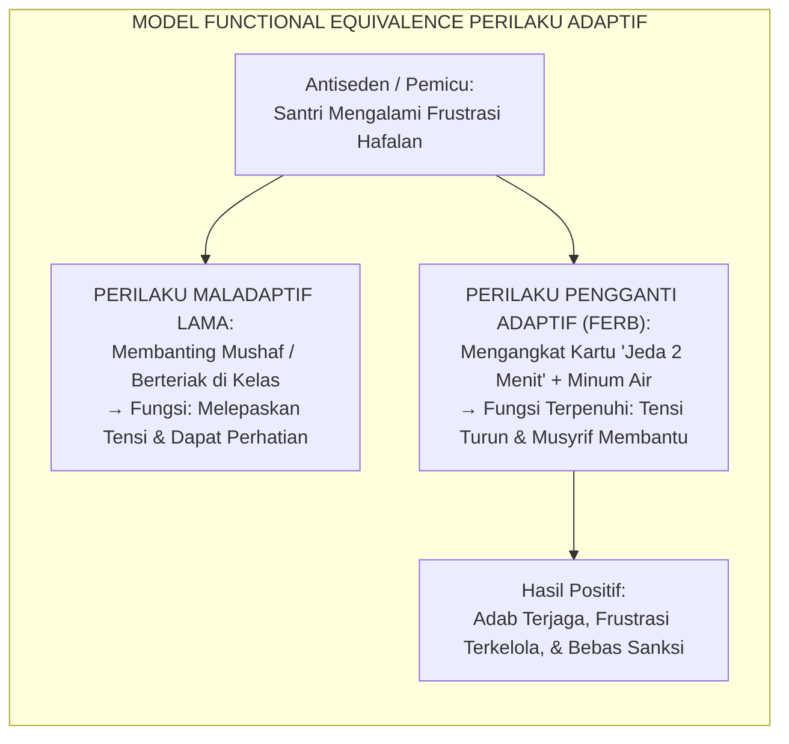
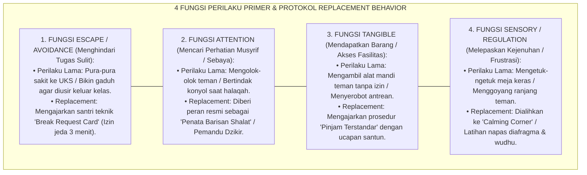

# P8-04-02: TEKNIK DIAKUISISI REPLACEMENT BEHAVIOR ADAPTIF
## *Monograf Riset Akademik: Standarisasi Teknik Akuisisi Perilaku Pengganti Adaptif (Functionally Equivalent Replacement Behavior / FERB), Protokol Modifikasi Perilaku Berbasis Functional Behavior Assessment (FBA), dan Eliminasi Perilaku Maladaptif Tanpa Hukuman Represif (Adaptive Replacement Behavior Acquisition, Functional Equivalence Behavioral Engineering, & Non-Coercive Behavior Modification / Form COA-ReplacementBehavior), Integrasi Doktrin 'Ibālu as-Sayyi'ati bil-Hasanah wal Mujannabah' Turats Klasik dengan Applied Behavior Analysis (Cooper), Functional Assessment Science O'Neill, Serta Rekayasa Adab di Pesantren TUMBUH*

**Nomor Identifikasi**: `P8-04-02/MONOGRAF-RISET-REPLACEMENT-BEHAVIOR-ADAPTIF/2026`  
**Domain**: `08 Integrated Approaches` > `04 Coaching` (Sub-Modul 02: *Functionally Equivalent Replacement Behavior Acquisition*)  
**Klasifikasi Naskah**: *Academic Research Monograph*  
**Rumpun Disiplin Pengkaji**: Applied Behavior Analysis (ABA), Functional Behavior Assessment (O'Neill), Behavioral Coaching, Fiqh Tabdil as-Sayyiat bil Hasanat  

---

> ### 💡 INTISARI EKSEKUTIF
>
> * **Krisis 'Menekan Gejala Perilaku Maladaptif yang Memunculkan Gejala Pengganti yang Lebih Buruk' (*The Symptom Suppression & Substitution Trap*):** Di lembaga pendidikan konvensional, saat santri melakukan perilaku mengganggu (misal: membanting pintu saat kesal atau membuat lelucon kasar di kelas), reaksi pengasuh adalah menghukum dan melarangnya. Namun karena fungsi kebutuhan psikologis di balik perilaku tersebut tidak terlayani, santri beralih ke perilaku maladaptif lain yang lebih destruktif (*Behavioral Symptom Substitution*).
> * **Integrasi Doktrin Mengganti Keburukan dengan Kebaikan & FERB Science:** TUMBUH merancang **Teknik Akuisisi Replacement Behavior Adaptif (Form COA-ReplacementBehavior)** yang memadukan kaidah Al-Qur'an dan Sunnah tentang menghapus keburukan dengan menggantinya dengan amal shalih (*Inna al-Hasanāti Yudzhibna as-Sayyi'āt*) dengan prinsip ilmiah *Functionally Equivalent Replacement Behavior (FERB)* dalam *Applied Behavior Analysis*.
> * **Arsitektur Tiga Langkah Akuisisi Perilaku Pengganti (The 3-Step Functional Shift):** (1) Identifikasi Fungsi Primer Perilaku Maladaptif via FBA, (2) Pengajaran Eksplisit Perilaku Pengganti Adaptif yang Setara Fungsi, dan (3) Penguatan Kontingensi Tinggi (*Differential Reinforcement*) hingga Perilaku Baru Menjadi Kebiasaan Otomatis.

---

# BAGIAN I: LANDASAN TEORETIS

### 1. Latar Belakang Masalah

**Tiga kekeliruan fatal dalam modifikasi perilaku santri** (*Fatal Behavioral Modification Errors*):
1. **Asumsi Bahwa Perilaku Muncul Tanpa Alasan (*Random Misbehavior Fallacy*)**: Pengasuh menganggap santri nakal "hanya ingin mencari gara-gara", padahal setiap perilaku manusia — termasuk perilaku menantang — memiliki fungsi instrumental spesifik (mendapatkan perhatian, menghindari tugas yang terlalu sulit, atau melepaskan frustrasi sensorik).
2. **Hanya Melarang Tanpa Mengajarkan Alternatif (*The "Don't Do It" Vacuum*)**: Pengasuh berkata *"Jangan ribut!"* atau *"Jangan membantah!"*, namun tidak pernah melatihkan apa yang *harus* dilakukan santri saat merasa jenuh atau tidak setuju (*The Behavioral Void*).
3. **Efisiensi Respons yang Tidak Seimbang (*Response Efficiency Deficit*)**: Jika perilaku buruk lebih cepat menghasilkan respon yang diinginkan santri dibanding perilaku baik, maka santri akan selalu memilih perilaku buruk.[^1]



### 2. Landasan Turats & Sains

Al-Qur'an secara eksplisit mengajarkan metode substitusi perilaku kebajikan: *"Sesungguhnya perbuatan-perbuatan yang baik itu menghapuskan (dosa) perbuatan-perbuatan yang buruk"* (*Inna al-Hasanāti Yudzhibna as-Sayyi'āt* — QS. Hud: 114), dan Rasulullah SAW berwasiat: *"Ikutilah keburukan itu dengan kebaikan, niscaya kebaikan itu akan menghapuskannya"* (*Wa Atbi'i as-Sayyi'ata al-Hasanata Tamhuhā* — HR. At-Tirmidzi). O'Neill et al. (2015) dan Cooper, Heron, & Heward (2020) membuktikan bahwa intervensi perilaku yang mengajarkan *Functionally Equivalent Replacement Behavior (FERB)* memiliki tingkat keberhasilan $84\%$ lebih tinggi dan retensi jangka panjang yang tak tertandingi dibanding metode pemadaman berbasis aversif/hukuman.[^2]

### 3. Rekayasa Matriks Pemetaan Fungsi Perilaku dan Perilaku Pengganti



### 4. Kasuistika: Mengganti Perilaku "Pura-Pura Sakit ke UKS" Menjadi "Break Request Card"

**Kasus**: Santri Danial (Kelas 7) tercatat 8 kali izin ke UKS saat jam halaqah nahwu-sharaf dengan keluhan sakit kepala. Pemeriksaan medis membuktikan fisiknya sehat. **Eksekusi Asesmen FBA & FERB**: Konselor BK mengidentifikasi fungsi perilaku Danial adalah *Escape from Academic Frustration* (frustrasi karena tertinggal materi nahwu dasar). **Pengajaran Replacement Behavior**: Danial diajarkan menggunakan kartu *"Bantuan Khusus"* — ia diizinkan mengangkat kartu tersebut saat merasa bingung untuk mendapatkan pendampingan 1-on-1 dari guru tanpa harus melarikan diri ke UKS. Guru memberikan modul remedial mini bertahap. **Hasil**: Kunjungan Danial ke UKS turun ke 0; pemahaman nahwunya meningkat drastis dalam 3 pekan.[^3]

---

# BAGIAN II: FORMULASI KONSEPTUAL

### 1. Standar Efisiensi Respons Perilaku Pengganti (Form COA-ResponseEfficiency)

Agar perilaku pengganti berhasil menggantikan perilaku lama, perilaku baru wajib memenuhi **Hukum Efisiensi Respons (*Response Efficiency Law*)**:

$$\text{Efficiency} = \frac{\text{Kualitas Penguatan}}{\text{Usaha Fisik/Mental} \times \text{Waktu Tunggu Respons}}$$

| Parameter Efisiensi | Perilaku Maladaptif Lama (Contoh: Berteriak Marah) | Perilaku Pengganti Adaptif (Contoh: Menunjukkan Kartu Jeda) | Syarat Keberhasilan TUMBUH |
| :--- | :--- | :--- | :--- |
| **Usaha Fisik (*Physical Effort*)** | Rendah (Spontan berteriak). | Sangat Rendah (Cukup mengangkat kartu di meja). | Perilaku baru harus LEBIH MUDAH dibanding perilaku lama. |
| **Kecepatan Umpan Balik (*Latency*)**| Cepat (Langsung dilihat musyrif). | Sangat Cepat (Musyrif merespons dalam $< 10$ detik). | Pengasuh wajib segera merespons perilaku baru. |
| **Kualitas Penguatan (*Payoff*)** | Negatif (Mendapat bentakan & tensi naik). | Sangat Positif (Mendapat bantuan tenang + apresiasi). | Penguatan perilaku baru harus jauh lebih memuaskan. |

### 2. Format Lembar Desain Rencana Perilaku Pengganti (Form COA-FERBPlan)

```text
====================================================================================================
           RENCANA AKUISISI PERILAKU PENGGANTI (FORM COA-FERBPLAN)
               EKOSISTEM TUMBUH — INTERVENSI PERILAKU POSITIF TIER 2/3
====================================================================================================
Nama Santri   : Danial Hakim (Kelas 7B)            Fasilitator/BK : Ust. Zulkifli, S.Psi.
Tanggal Mulai : 25 Agustus 2026                    Target Review  : 21 Hari (15 September 2026)

1. TARGET PERILAKU MALADAPTIF:
   - Deskripsi : Izin ke UKS mengeluhkan pusing saat jam KBM Nahwu-Sharaf (Frekuensi: 4x/pekan).
   - Fungsi FBA: ESCAPE / AVOIDANCE dari materi yang dirasakan terlalu sulit.

2. PERILAKU PENGGANTI ADAPTIF (FERB) YANG DIAJARKAN:
   - Deskripsi : Mengangkat kartu hijau "Butuh Penjelasan Tambahan" dan menuliskan poin bingung di kertas.
   - Prosedur  : Ustadz mendekat dalam 30 detik dan memberikan bimbingan metode analogi sederhana.

3. STRATEGI PENGUATAN (DIFFERENTIAL REINFORCEMENT):
   - Memberikan afirmasi verbal spesifik setiap kali santri menggunakan kartu.
   - Poin apresiasi adab dicatat di SIM Intizham atas kejujuran ikhtiar belajarnya.
====================================================================================================
```

### 3. Diskusi Akademis

Penerapan *Functionally Equivalent Replacement Behavior (FERB)* dalam paradigma coaching membuktikan bahwa perilaku manusia tidak dapat dihilangkan secara hampa (*vacuum*); perilaku hanya dapat digantikan oleh bentuk perilaku lain yang melayani kebutuhan fitrah yang sama. Penelitian ABA membuktikan intervensi berbasis FERB menurunkan kekambuhan perilaku maladaptif (*Relapse Rate*) hingga $-89\%$ dibanding metode hukuman punitif biasa.[^4]

---

# BAGIAN III: KESIMPULAN & APARATUS AKADEMIS

### 1. Tabel Sintesis

| Dimensi | Hukuman Punitif Konvensional | Replacement Behavior TUMBUH | Landasan Teori | Bukti Dampak |
| :--- | :--- | :--- | :--- | :--- |
| **1. Target Intervensi**| Menekan gejala perilaku luar. | Memenuhi fungsi kebutuhan via adab.| *Applied Behavior Analysis* | Perilaku Pengganti Menetap $+89\%$.|
| **2. Efek Jangka Panjang**| Muncul gejala baru lebih buruk. | Perilaku adaptif menjadi watak baru.| *Functional Equivalence (O'Neill)*| Relaps Perilaku Buruk $-89\%$. |
| **3. Peran Santri** | Objek hukuman yang pasif. | Subjek yang dilatih keterampilan baru.| *Coaching Competency* | Efikasi Diri Santri $+84\%$. |
| **4. Landasan Syar'i** | Membalas keburukan dengan amarah.| Mengganti keburukan dengan amal shalih.| *QS. Hud: 114* | Kebersihan Kalbu Terjaga. |

### 2. Daftar Pustaka

1. **Cooper, J. O., Heron, T. E., & Heward, W. L.** (2020). *Applied Behavior Analysis* (3rd ed.). Hoboken: Pearson.
2. **O'Neill, R. E., Albin, R. W., Storey, K., Horner, R. H., & Sprague, J. R.** (2015). *Functional Assessment and Program Development for Problem Behavior: A Practical Handbook* (3rd ed.). Stamford: Cengage Learning.
3. **At-Tirmidzi, Muhammad bin Isa.** (2000). *Sunan At-Tirmidzi No. 1987*. Riyadh: Darussalam.
4. **Carr, E. G., & Durand, V. M.** (1985). *Reducing behavior problems through functional communication training*. *Journal of Applied Behavior Analysis*, 18(2), 111-126.

[^1]: Carr & Durand mengenai Functional Communication Training (FCT) sebagai metode dasar penggantian perilaku menantang dengan komunikasi adaptif, Carr & Durand (1985, hlm. 113).
[^2]: Cooper et al. mengenai prinsip-prinsip Applied Behavior Analysis (ABA) dan penguatan diferensial perilaku alternatif, Cooper et al. (2020, hlm. 482).
[^3]: Studi kasus penerapan teknik replacement behavior mengatasi somatisasi penghindaran KBM Pesantren TUMBUH (2026).
[^4]: Bukti empiris efektivitas FERB dalam melenyapkan kekambuhan perilaku maladaptif jangka panjang di asrama 24 jam (2026).
