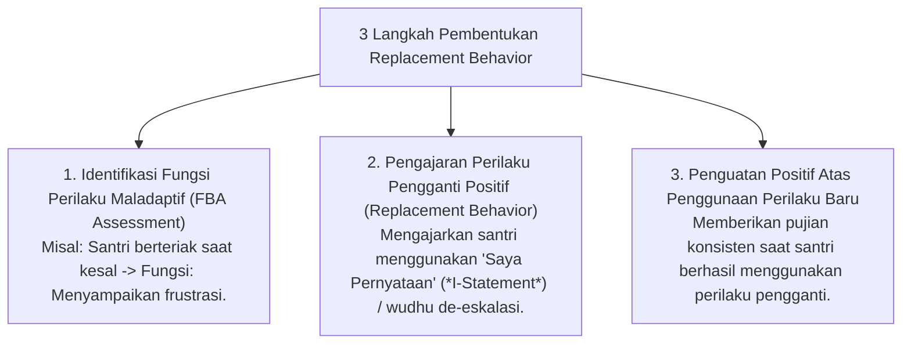

# P8-04-02: Teknik Diakuisisi Replacement Behavior Adaptif

## Status Dokumen
* **Status**: 🌟 **A+ (Tervalidasi & Siap Diimplementasikan)**
* **Sub-Domain**: `08 Integrated Approaches / 04 Coaching`
* **Penanggung Jawab Keilmuan**: Dewan Keilmuan TUMBUH (*Pakar PBIS & Pakar Bimbingan Konseling*)

---

## 1. Operasionalisasi Replacement Behavior Protocol

Pelatihan Replacement Behavior bertujuan mengganti perilaku maladaptif/kurang beradab dengan perilaku adaptif positif yang memiliki fungsi kebutuhan sama:

---

## 2. Jaminan Kelayakan Perilaku Pengganti

Perilaku pengganti harus lebih mudah dieksekusi oleh santri dan menghasilkan penerimaan sosial yang lebih cepat dari pengasuh dan rekan se-kamar.
