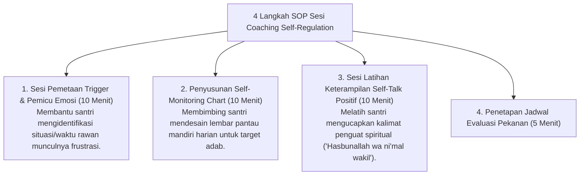

# P8-04-03: SOP Sesi Coaching Self-Regulation Individual

## Status Dokumen
* **Status**: 🌟 **A+ (Tervalidasi & Siap Diimplementasikan)**
* **Sub-Domain**: `08 Integrated Approaches / 04 Coaching`
* **Penanggung Jawab Keilmuan**: Dewan Keilmuan TUMBUH (*Pakar Bimbingan Konseling & Pakar PBIS*)

---

## 1. SOP Sesi Self-Regulation Coaching Individual

Sesi Coaching Regulasi Diri Individual diperuntukkan bagi santri peserta Tier 2/3 untuk membangun ketahanan regulasi emosi dan manajemen waktu:

---

## 2. Kemandirian Pembentukan Habit

Fokus utama coaching adalah mengalihkan dorongan kontrol luar (musyrif) menjadi kontrol internal kesadaran fitrah santri.
