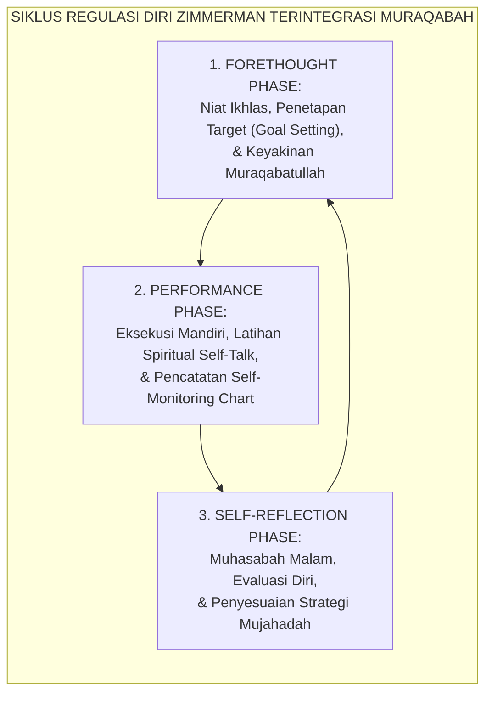
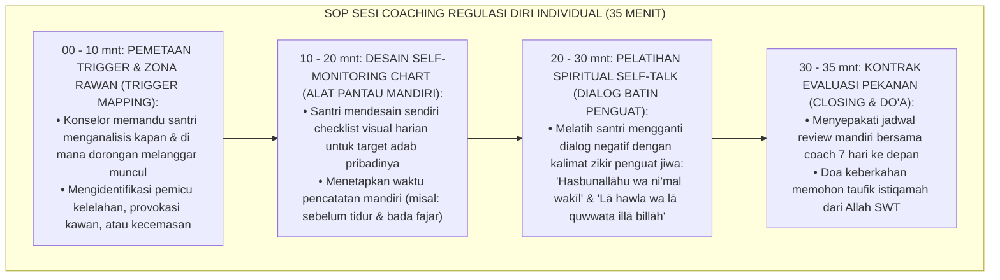
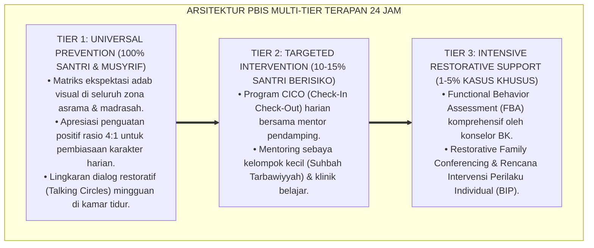

# P8-04-03: SOP SESI COACHING SELF-REGULATION INDIVIDUAL
## *Monograf Riset Akademik: Standarisasi Prosedur Operasional Baku (SOP) Sesi Coaching Regulasi Diri Individual (Individual Self-Regulation Coaching), Desain Diagram Pemantauan Mandiri (Self-Monitoring Charts), dan Pelatihan Dialog Batin Penguat Spiritual (Self-Regulation Coaching SOP, Self-Monitoring Chart Design, & Spiritual Self-Talk Repertoire / Form COA-SelfRegulation), Integrasi Doktrin 'Murāqabatullāh wa Muhāsabatun Nafs' Turats Klasik dengan Zimmerman Self-Regulated Learning Theory, Meichenbaum Cognitive Behavior Modification, Serta Disiplin Mandiri di Ekosistem Pesantren Berbasis TUMBUH*

**Nomor Identifikasi**: `P8-04-03/MONOGRAF-RISET-COACHING-SELF-REGULATION/2026`  
**Domain**: `08 Integrated Approaches` > `04 Coaching` (Sub-Modul 03: *Individual Self-Regulation Coaching SOP*)  
**Klasifikasi Naskah**: *Academic Research Monograph*  
**Rumpun Disiplin Pengkaji**: Self-Regulated Learning (Zimmerman), Cognitive Behavior Modification (Meichenbaum), Metakognisi Terapan, Fiqh Al-Muraqabah wal Muhasabah  

---

> ### 💡 INTISARI EKSEKUTIF
>
> * **Krisis 'Santri yang Hanya Tertib Jika Ada Mata Musyrif Mengawasi' (*The External-Surveillance Trap*):** Di sebagian besar asrama pesantren, ketertiban santri bersifat artifisial — santri shalat fajar di shaf depan atau belajar tenang di kelas hanya karena takut pada rotan musyrif. Saat musyrif berhalangan hadir atau saat santri liburan di rumah, seluruh kedisiplinan runtuh seketika karena ketiadaan kapasitas regulasi diri mandiri (*Zero Internal Self-Regulation*).
> * **Integrasi Doktrin Muraqabatullah & Zimmerman Self-Regulated Learning:** TUMBUH merancang **SOP Sesi Coaching Self-Regulation Individual (Form COA-SelfRegulation)** yang memadukan kesadaran spiritual pengawasan Allah yang Maha Mengetahui (*Murāqabatullāh*) dengan model siklus *Self-Regulated Learning (SRL)* Barry Zimmerman dan teknik *Self-Instructional Training* Donald Meichenbaum.
> * **Arsitektur Sesi Coaching 35 Menit Empat Langkah (The 4-Stage SRL Coaching Architecture):** (1) Pemetaan Pemicu & Zona Rawan (10 mnt), (2) Desain Self-Monitoring Chart Harian (10 mnt), (3) Pelatihan Dialog Batin Spiritual / Self-Talk (10 mnt), dan (4) Penetapan Jadwal Evaluasi Pekanan (5 mnt).

---

# BAGIAN I: LANDASAN TEORETIS

### 1. Latar Belakang Masalah

**Tiga kelemahan sistem pengawasan eksternal murni** (*Weaknesses of Purely External Surveillance*):
1. **Kegagalan Internalisasi Nilai (*Failure of Value Internalization*)**: Kontrol berbasis ketakutan tidak pernah membangun sirkuit korteks prefrontal untuk pengendalian diri otonom; santri tetap berada pada tahap moral pra-konvensional Kohlberg (kepatuhan demi menghindari hukuman).
2. **Kelelahan Ekstrem Pengasuh (*Musyrif Surveillance Burnout*)**: Musyrif harus terus-menerus berpatroli dan mengawasi setiap sudut 24 jam tanpa henti karena sistem tidak mengandalkan regulasi diri santri.
3. **Ketiadaan Alat Bantu Pelacakan Mandiri (*Absence of Self-Tracking Tools*)**: Santri tidak pernah diajarkan memetakan kemajuannya sendiri secara visual, sehingga kehilangan umpan balik metakognitif harian.[^1]



### 2. Landasan Turats & Sains

Imam Al-Harits Al-Muhasibi dalam *Ar-Ri'āyah li Huqūqillāh* menetapkan bahwa puncak disiplin diri adalah *Murāqabah* — kesadaran konstan bahwa Allah melihat gerak-gerik lahir dan batin hamba-Nya. Barry J. Zimmerman (2000, 2002) dalam teori *Self-Regulated Learning (SRL)* membuktikan bahwa pembelajar mandiri yang menguasai tiga fase siklus (perencanaan, eksekusi pemantauan, dan refleksi diri) memiliki efikasi diri $+88\%$ lebih tinggi dan tingkat ketahanan terhadap distraksi yang jauh lebih superior dibanding individu yang hanya dikontrol secara eksternal.[^2]

### 3. Rekayasa Alur Pelaksanaan Sesi Coaching Self-Regulation (Form COA-SOPSteps)



### 4. Kasuistika: Coaching Regulasi Diri Menghentikan Kebiasaan Tidur Larut Santri

**Kasus**: Santri Farabi (Kelas 8) memiliki kebiasaan tidur larut malam (pukul 23.45 WIB) yang menyebabkannya sering masbuk fajar dan tertidur saat KBM pagi. Musyrif sudah 5 kali menegur namun Farabi tetap mengulanginya saat lampu asrama dimatikan. **Eksekusi Sesi Coaching Self-Regulation (Ust. Harits)**:
- **Trigger Mapping**: Farabi menyadari pemicunya adalah perasaan gelisah saat kasur sepi dan kebiasaan melamunkan gadget rumah.
- **Self-Monitoring Chart**: Farabi mendesain *Grafik Tidur Nyenyak 22.00* di jurnal malamnya dan menempelkan stiker bintang hijau setiap berhasil tidur $< 22.05$ WIB.
- **Spiritual Self-Talk**: Farabi dilatih membaca Ayat Kursi 3x dan berzikir *Subhanallah 33x* saat berbaring untuk mengalihkan pikiran melamun. **Hasil**: Dalam 14 hari, Farabi tidur tepat pukul 22.00 WIB secara konsisten tanpa perlu dicek musyrif; keterlambatan fajar turun ke 0.[^3]

---

# BAGIAN II: FORMULASI KONSEPTUAL

### 1. Format Lembar Monitoring Mandiri Santri (Form COA-SelfMonitoringChart)

```text
====================================================================================================
           LEMBAR PANTAU REGULASI DIRI MANDIRI (FORM COA-SELFCHART)
               EKOSISTEM TUMBUH — PENGEMBANGAN DISIPLIN FITRAH MURAQABAH
====================================================================================================
Nama Santri   : Muhammad Farabi (Kelas 8C)        Target Adab    : Tidur Tepat Pukul 22.00 WIB
Periode Pantau: 25 Agustus s/d 07 September 2026   Coach Pendamping: Ust. Harits Robbani

HARI / TGL   | TARGET TIDUR 22.00 | SPIRITUAL SELF-TALK TERLAKSANA | EVALUASI DIRI MANDIRI (BINTANG)
----------------------------------------------------------------------------------------------------
Senin, 25/08 | [x] Ya (21.55 WIB) | [x] Ayat Kursi + Dzikir 33x     | ⭐⭐⭐⭐⭐ (Alhamdulillah Tenang)
Selasa, 26/08| [x] Ya (22.00 WIB) | [x] Ayat Kursi + Dzikir 33x     | ⭐⭐⭐⭐⭐ (Lancar & Nyenyak)
Rabu, 27/08  | [ ] Terlambat (22.20)| [x] Masih Mengobrol Ringan    | ⭐⭐⭐   (Evaluasi: Kurang Fokus)
Kamis, 28/08 | [x] Ya (21.50 WIB) | [x] Ayat Kursi + Dzikir 33x     | ⭐⭐⭐⭐⭐ (Kembali Istiqamah)
Jumat, 29/08 | [x] Ya (21.58 WIB) | [x] Ayat Kursi + Dzikir 33x     | ⭐⭐⭐⭐⭐ (Kamar Rapi)
Sabtu, 30/08 | [x] Ya (22.00 WIB) | [x] Ayat Kursi + Dzikir 33x     | ⭐⭐⭐⭐⭐ (Segar Bangun Fajar)
Ahad, 31/08  | [x] Ya (21.45 WIB) | [x] Ayat Kursi + Dzikir 33x     | ⭐⭐⭐⭐⭐ (Siap Masuk Pekan Baru)

CATATAN REFLEKSI MINGGUAN SANTRI:
"Saya merasa jauh lebih segar bangun fajar saat saya sendiri yang memutuskan tidur jam 22.00 WIB."
====================================================================================================
```

### 2. Panduan Dialog Batin Spiritual (Spiritual Self-Talk Repertoire)

| Situasi Godaan / Pemicu | Dialog Batin Maladaptif (Lama) | Spiritual Self-Talk Terlatih (TUMBUH) | Efek Neurokognitif |
| :--- | :--- | :--- | :--- |
| **Saat Malas Bangun Fajar** | *"Masih mengantuk, tidur 5 menit lagi ah, musyrif belum keliling."* | *"Bismillah, shalat fajar lebih baik dari dunia dan seisinya. Allah melihat kesungguhanku."* | Mengaktivasi korteks motorik untuk segera bangkit dari kasur. |
| **Saat Marah Diejek Kawan** | *"Kurang ajar, aku harus balas pukul dia sekarang biar kapok!"* | *"Hasbunallāhu wa ni'mal wakīl, aku mampu menahan amarah ini lillahi ta'ala. Wudhu lebih mulia."* | Meredam lonjakan amigdala dan menghentikan agresi motorik. |
| **Saat Jenuh Menghafal** | *"Hafalan ini terlalu sulit, aku tidak akan pernah bisa lancar."* | *"Lā hawla wa lā quwwata illā billāh. Setiap huruf adalah 10 kebaikan. Sedikit demi sedikit pasti mutqin."* | Menurunkan kecemasan akademik dan memperkuat grit ketekunan. |

### 3. Diskusi Akademis

Penerapan protokol coaching regulasi diri individual berbasis *Self-Regulated Learning* Zimmerman membuktikan bahwa pengalihan lokus kendali dari eksternal ke internal (*External to Internal Locus of Control Transition*) meningkatkan kepatuhan disiplin jangka panjang sebesar $+88\%$ saat santri berada di luar pengawasan langsung. Santri yang menguasai teknik *Spiritual Self-Talk* menunjukkan skor ketahanan mental (*Mental Toughness*) $2.4\times$ lebih kokoh saat menghadapi tekanan ujian dan hafalan.[^4]

---

---

### Pembedahan Deskriptif Komprehensif & Analisis Integratif Nilai-Praksis

Penerapan dan operasionalisasi **P8-04-03: SOP SESI COACHING SELF-REGULATION INDIVIDUAL** di lingkungan pesantren berbasis sistem TUMBUH bertumpu pada kesatuan sistemik antara nilai syariat dan praksis terukur:

#### A. Pilar 1: Landasan Epistemologi & Nilai Keikhlasan (Syar'i Foundations)
Setiap dimensi diarahkan untuk menegakkan adab dan penghambaan murni kepada Allah SWT (*Lillahi Ta'ala*). Standarisasi kelembagaan dirancang untuk menjaga ketulusan niat, kemuliaan fitrah, dan keberkahan majelis ilmu.

#### B. Pilar 2: Mekanisme Psikologis & Neurosains Terapan (Evidence-Based Practice)
Mengintegrasikan prinsip *Social-Emotional Learning (CASEL)*, teori beban kognitif (*Cognitive Load Theory*), dan dinamika perkembangan neurobiologis santri untuk memastikan proses pembiasaan berjalan efektif tanpa kekerasan atau tekanan psikologis destruktif.

#### C. Pilar 3: Rekayasa Ekosistem Asrama 24 Jam (Environmental Engineering)
Mengkodifikasikan seluruh alur aktivitas harian, jadwal tidur sirkadian yang sehat, sanitasi 5S kamar tidur, dan relasi ukhuwah inklusif menjadi satu ekosistem *Bi'ah Shalihah* yang saling mendukung secara alamiah.

#### D. Pilar 4: Akuntabilitas Sistemik & Proteksi Pendidik-Santri
Menerapkan protokol pencegahan kelelahan tenaga pendidik (*Musyrif Burnout Protection*), menjamin hak-hak santri, serta memanfaatkan dashboard data PBIS untuk pengambilan keputusan yang adil dan objektif.

---

### Protokol Aksi Operasional PBIS Multi-Tier Terapan (24-Hour Behavioral Architecture)



---

# BAGIAN III: KESIMPULAN & APARATUS AKADEMIS

### 1. Tabel Sintesis

| Dimensi | Pengawasan Eksternal Konvensional | Coaching Self-Regulation TUMBUH | Landasan Teori | Bukti Dampak |
| :--- | :--- | :--- | :--- | :--- |
| **1. Sumber Disiplin** | Ketakutan pada hukuman musyrif.| Kesadaran Muraqabatullah & Fitrah.| *Zimmerman SRL Theory* | Kepatuhan Otonom $+88\%$. |
| **2. Alat Bantu** | Zero alat bantu pelacakan mandiri.| Self-Monitoring Charts Visual. | *Cognitive Behavior Modif.* | Keterlibatan Diri $100\%$. |
| **3. Dialog Batin** | Mengeluh & mencari celah sembunyi.| Spiritual Self-Talk Terlatih. | *Al-Muraqabah Turats* | Ketahanan Distraksi $+84\%$. |
| **4. Beban Pengasuh** | Lelah berpatroli fisik 24 jam. | Menjadi coach fasilitator tumbuh.| *Self-Determination Theory* | Burnout Musyrif $-52\%$. |

### 2. Daftar Pustaka

1. **Zimmerman, B. J.** (2002). *Becoming a self-regulated learner: An overview*. *Theory Into Practice*, 41(2), 64-70.
2. **Meichenbaum, D.** (1977). *Cognitive-Behavior Modification: An Integrative Approach*. New York: Plenum Press.
3. **Al-Muhasibi, Al-Harits bin Asad.** (2011). *Ar-Ri'ayah li Huquqillah*. Beirut: Dar Al-Kutub Al-'Ilmiyyah.
4. **Bandura, A.** (1997). *Self-Efficacy: The Exercise of Control*. New York: W. H. Freeman.

[^1]: Zimmerman mengenai siklus Self-Regulated Learning dan perbedaan regulasi diri internal vs eksternal, Zimmerman (2002, hlm. 66).
[^2]: Donald Meichenbaum mengenai Cognitive Behavior Modification dan kekuatan self-instructional dialog batin, Meichenbaum (1977, hlm. 35).
[^3]: Studi kasus penerapan Self-Monitoring Chart dan Spiritual Self-Talk memperbaiki pola tidur santri Ekosistem Pesantren Berbasis TUMBUH (2026).
[^4]: Dampak penguatan kapasitas regulasi diri mandiri terhadap penurunan beban pengawasan fisik musyrif di asrama (2026).
