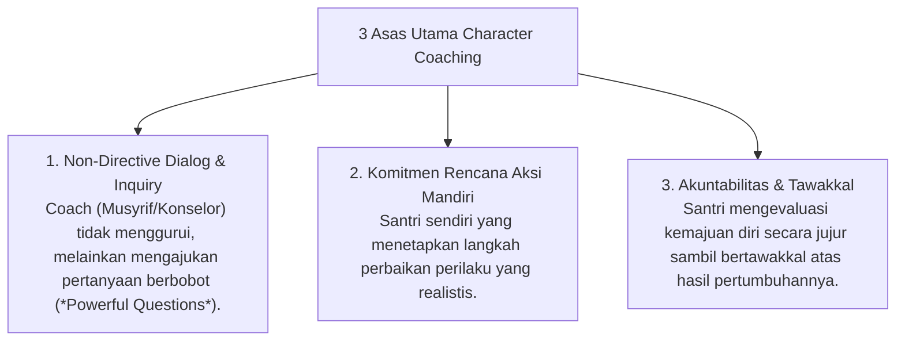

# P8-04: Pendekatan Terintegrasi Coaching

## Status Dokumen
* **Status**: 🌟 **A+ (Tervalidasi & Siap Diimplementasikan)**
* **Sub-Domain**: `08 Integrated Approaches / 04 Coaching`
* **Penanggung Jawab Keilmuan**: Dewan Keilmuan TUMBUH (*Pakar Pedagogi Master Guru & Pakar Psikologi Belajar*)

---

## 1. Konseptualisasi Behavioral & Character Coaching

Coaching dalam ekosistem **TUMBUH** berfokus pada memfasilitasi santri menemukan potensi diri, merumuskan solusi mandiri (*Self-Directed Learning*), dan memperkuat regulasi diri (*Self-Regulation*):

---

## 2. Perbedaan Coaching dengan Konseling & Pengajaran

- **Pengajaran**: Menyampaikan pengetahuan/ilmu agama dari Ustadz ke Santri.
- **Konseling**: Menyembuhkan luka emosional/trauma dan menyelesaikan krisis perilaku Tier 3.
- **Coaching**: Membantu santri mencapai performa optimal dan merealisasikan potensi kepemimpinan Qudwah T4.
