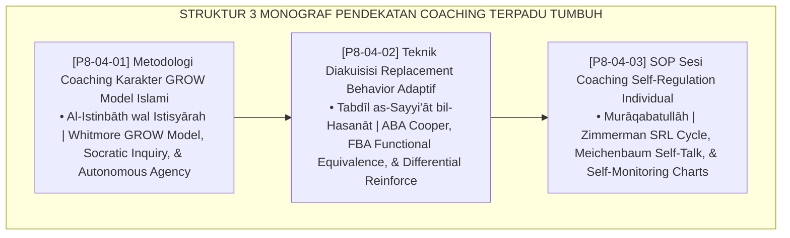

# P8-04: DOKUMEN INDUK PENDEKATAN TERINTEGRASI COACHING PESANTREN
## *Arsitektur dan Standarisasi Metodologi Coaching Karakter GROW Model Islami, Teknik Akuisisi Replacement Behavior Adaptif, dan SOP Sesi Coaching Regulasi Diri Individual sebagai Tiga Pilar Coaching Kemandirian Adab (GROW Model Coaching Form COA-GROW, Replacement Behavior Acquisition Form COA-ReplacementBehavior, Serta Self-Regulation Coaching Form COA-SelfRegulation) di Ekosistem TUMBUH Pesantren*

**Nomor Identifikasi**: `P8-04/DOKUMEN-INDUK-PENDEKATAN-TERINTEGRASI-COACHING/2026`  
**Domain**: `08 Integrated Approaches` > `04 Coaching` (Gugus Sub-Domain 04: *Character Coaching, Replacement Behaviors, & Self-Regulation Coaching*)  
**Klasifikasi Naskah**: *Master Architecture & Navigation Monograph*  
**Rumpun Disiplin Pengkaji**: Performance Coaching Psychology (Whitmore), Applied Behavior Analysis (Cooper), Self-Regulated Learning (Zimmerman), Fiqh Al-Istisyarah wal Muraqabah  

---

> ### 💡 INTISARI EKSEKUTIF
>
> * **Kedudukan Strategis Gugus Pendekatan Terintegrasi Coaching:** Gugus ini adalah motor pemberdayaan kemandirian adab (*autonomous character empowerment engine*) di ekosistem TUMBUH. Menggantikan budaya mendikte dan menasihati satu arah yang menciptakan ketergantungan, pendekatan coaching melatih santri berpikir kritis, menyadari motif perilakunya, merumuskan solusi sendiri, dan membangun regulasi diri berbasis kesadaran *Murāqabatullāh* (*From Dependent Compliance to Autonomous Responsibility*).
> * **Triad Pendekatan Terintegrasi Coaching TUMBUH:** (1) **GROW Model Islami** yang memandu percakapan eksplorasi target adab dan strategi mujahadah, (2) **Akuisisi Replacement Behavior** yang mengganti kebiasaan buruk dengan alternatif perilaku mulia yang setara fungsi kebutuhan, dan (3) **SOP Coaching Self-Regulation** yang membekali santri dengan lembar pemantauan mandiri dan dialog batin spiritual.
> * **3 Monograf Riset Komprehensif:** Form COA-GROW, Form COA-ReplacementBehavior, dan Form COA-SelfRegulation.

---

## 📑 PETA NAVIGASI TIGA MONOGRAF

---

## 📚 DESKRIPSI RINGKAS 3 BERKAS MONOGRAF

1. **[P8-04-01: Metodologi Coaching Karakter GROW Model Islami](file:///c:/xampp/htdocs/tumbuh/08%20Integrated%20Approaches/04%20Coaching/P8-04-01-Metodologi-Coaching-Karakter-GROW-Model-Islami.md)**  
   *Adaptasi 4 kuadran GROW Model Islami (Goal, Reality, Options, Will & Tawakkal), bank pertanyaan pemantik Socratic, lembar komitmen mandiri, dan Form COA-GROW.*
2. **[P8-04-02: Teknik Diakuisisi Replacement Behavior Adaptif](file:///c:/xampp/htdocs/tumbuh/08%20Integrated%20Approaches/04%20Coaching/P8-04-02-Teknik-Diakuisisi-Replacement-Behavior-Adaptif.md)**  
   *Analisis FBA 4 fungsi perilaku primer, hukum efisiensi respons, pengajaran alternatif adaptif pengganti perilaku maladaptif, dan Form COA-ReplacementBehavior.*
3. **[P8-04-03: SOP Sesi Coaching Self-Regulation Individual](file:///c:/xampp/htdocs/tumbuh/08%20Integrated%20Approaches/04%20Coaching/P8-04-03-SOP-Sesi-Coaching-Self-Regulation-Individual.md)**  
   *SOP 35 menit 4 tahap (trigger mapping, self-monitoring chart, spiritual self-talk, evaluasi pekanan), internalisasi nilai muraqabatullah, dan Form COA-SelfRegulation.*

---

## 🎯 STANDAR PENJAMINAN MUTU PENDEKATAN COACHING

Penerapan gugus **Pendekatan Terintegrasi Coaching** menjamin bahwa:
1. **Santri Menjadi Pemilik Penuh atas Perubahan Adab Pribadinya (*Self-Ownership Guarantee*)**: GROW coaching memastikan solusi perubahan lahir dari refleksi jujur diri santri sendiri.
2. **Setiap Perilaku Negatif Digantikan dengan Keterampilan Beradab Nyata (*Constructive Substitution Guarantee*)**: FERB memastikan kebutuhan psikologis santri terlayani secara syar'i tanpa eskalasi kekerasan.
3. **Disiplin Santri Bertahan Kokoh Saat Berada di Luar Pengawasan (*Autonomous Muraqabah Guarantee*)**: Pelatihan regulasi diri mandiri membentuk karakter muttaqin yang berakar kuat dalam kalbu.
