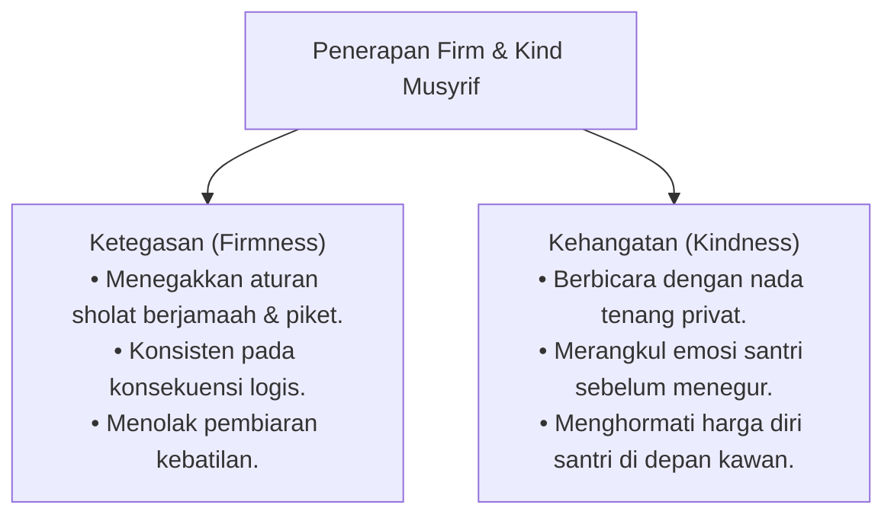

# P8-05-01: Prinsip Disiplin Positif Firm and Kind Jane Nelsen

## Status Dokumen
* **Status**: 🌟 **A+ (Tervalidasi & Siap Diimplementasikan)**
* **Sub-Domain**: `08 Integrated Approaches / 05 Positive Discipline`
* **Penanggung Jawab Keilmuan**: Dewan Keilmuan TUMBUH (*Pakar Disiplin Positif & Pakar Pengasuhan Asrama*)

---

## 1. Operasionalisasi Keseimbangan Firm & Kind dalam Pengasuhan

---

## 2. Penghapusan Hukuman Berbasis Balas Dendam

Musyrif dilarang memberikan hukuman yang didasari oleh rasa jengkel atau keinginan melampiaskan emosi pribadi, melainkan berorientasi pada proses restorasi diri santri.
