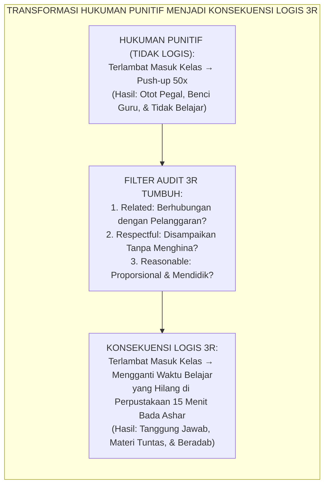
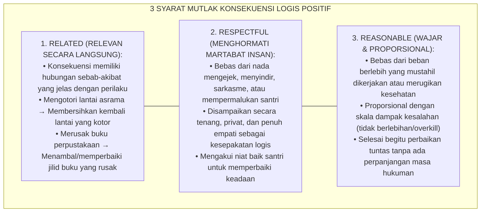

# P8-05-02: RUBRIK 3R KONSEKUENSI LOGIS: RELATED, RESPECTFUL, REASONABLE
## *Monograf Riset Akademik: Standarisasi Rubrik Konsekuensi Logis 3R (Related, Respectful, Reasonable), Transformasi Sanksi Hukuman Punitif Menjadi Pembelajaran Tanggung Jawab Nyata, dan Eliminasi Hukuman Tidak Relevan (3R Logical Consequences Rubric, Shift from Punitive Retaliation to Constructive Accountability, & Elimination of Irrelevant Sanctions / Form DIS-3RKonsekuensi), Integrasi Doktrin 'Al-Jazā'u min Jinsil 'Amal wal 'Adl bil-Qisṭ' Turats Klasik dengan Dreikurs-Nelsen Logical Consequences Theory, Restorative Accountability Framework, Serta Keadilan Pengasuhan di Pesantren TUMBUH*

**Nomor Identifikasi**: `P8-05-02/MONOGRAF-RISET-RUBRIK-3R-KONSEKUENSI-LOGIS/2026`  
**Domain**: `08 Integrated Approaches` > `05 Positive Discipline` (Sub-Modul 02: *3R Logical Consequences Rubric & Constructive Accountability*)  
**Klasifikasi Naskah**: *Academic Research Monograph*  
**Rumpun Disiplin Pengkaji**: Disiplin Positif Terapan (Dreikurs & Nelsen), Teori Keadilan Restoratif, Etika Pengasuhan Institusional, Fiqh Al-Jaza' wal 'Adl  

---

> ### 💡 INTISARI EKSEKUTIF
>
> * **Krisis 'Hukuman Aneh dan Tidak Relevan yang Menghilangkan Pembelajaran Moral' (*The Irrelevant Punishment Absurdity*):** Di sebagian besar asrama pesantren, konsekuensi yang diberikan musyrif sama sekali tidak berhubungan dengan kesalahan yang dilakukan — santri terlambat shalat disuruh lari keliling lapangan 20 putaran; santri merusak kran air disuruh push-up 50 kali; santri tidak menyapu kamar disuruh berdiri di depan gerbang. Hukuman ini tidak mengajarkan tanggung jawab memperbaiki kerusakan (*No Cognitive-Behavioral Connection*), melainkan hanya menimbulkan rasa terzalimi.
> * **Integrasi Doktrin Al-Jaza' min Jinsil 'Amal & Dreikurs-Nelsen 3R Framework:** TUMBUH merancang **Rubrik 3R Konsekuensi Logis (Form DIS-3RKonsekuensi)** yang memadukan kaidah syar'i bahwa balasan harus sejenis dan setimpal dengan perbuatan (*Al-Jazā'u min Jinsi al-'Amal*) dengan kerangka ilmiah *Logical Consequences* Rudolf Dreikurs dan Jane Nelsen: **Related** (Relevan), **Respectful** (Menghormati Martabat), dan **Reasonable** (Wajar & Proporsional).
> * **Arsitektur Filter Tiga Dimensi Kelulusan Konsekuensi (The 3R Accountability Filter):** Setiap konsekuensi yang dijatuhkan di lingkungan pesantren wajib lolos audit 3R sebelum disetujui, menjamin bahwa santri belajar memperbaiki dampak tindakannya (*Restitution & Repair*).

---

# BAGIAN I: LANDASAN TEORETIS

### 1. Latar Belakang Masalah

**Tiga patologi hukuman tidak logis konvensional** (*Pathologies of Illogical Punishments*):
1. **Disosiasi Kognitif Pelanggaran vs Sanksi (*Cognitive Dissociation*)**: Ketika santri yang terlambat shalat dihukum push-up, otak santri menghubungkan shalat dengan kelelahan fisik otot, bukan dengan nilai menghargai waktu dan kekhusyukan ibadah (*Negative Classical Conditioning*).
2. **Ketiadaan Pemulihan Kerusakan Nyata (*Zero Restitution of Harm*)**: Kran air yang rusak tetap rusak dan kamar yang kotor tetap kotor, sementara santri yang bersalah sibuk menjalani hukuman fisik yang tidak menyelesaikan masalah.
3. **Penyemaian Dendam dan Perasaan Teraniaya (*Perception of Injustice & Martyrdom*)**: Santri merasa musyrif sedang berkuasa dan bersikap zalim, sehingga santri memposisikan dirinya sebagai "korban yang dizalimi" alih-alih pelaku yang bertanggung jawab.[^1]



### 2. Landasan Turats & Sains

Kaidah fiqhiyyah agung menetapkan *Al-Jazā'u min Jinsi al-'Amal* (Balasan yang adil adalah yang sejenis dengan hakikat perbuatannya). Al-Qur'an memerintahkan penegakan keadilan yang proporsional: *"Dan balasan suatu kejahatan adalah kejahatan yang setimpal"* (*Wa Jazā'u Sayyi'atin Sayyi'atun Mitsluhā* — QS. Asy-Syura: 40). Rudolf Dreikurs (1968) dan Jane Nelsen (2006) membuktikan bahwa perbedaan fundamental antara *Hukuman (Punishment)* dan *Konsekuensi Logis (Logical Consequences)* terletak pada prinsip 3R: Hukuman berfokus pada masa lalu dan penderitaan (*making children pay for what they did*), sedangkan konsekuensi logis berfokus pada masa depan dan perbaikan (*helping children learn from what they did*).[^2]

### 3. Rekayasa Rubrik Tiga Syarat Mutlak 3R



### 4. Kasuistika: Mengubah Hukuman "Lari Lapangan" Menjadi Konsekuensi Logis 3R pada Kasus Tumpahnya Makanan

**Kasus**: Santri Hafiz (Kelas 8) bercanda mendorong teman di ruang makan hingga nampan lauk tumpah mengotori lantai dan makanan kawan terbuang. Pada masa lalu, Hafiz akan dihukum lari keliling lapangan 10 putaran di bawah terik matahari. **Eksekusi Konsekuensi Logis 3R (Ust. Farhan)**:
- **Related**: Hafiz bertanggung jawab membersihkan lantai yang kotor dengan kain pel dan membagi separuh lauknya sendiri kepada kawannya yang makanannya tumpah.
- **Respectful**: Ust. Farhan berbicara tenang: *"Hafiz, bercanda itu wajar, namun lantai menjadi licin dan kawanmu kehilangan makanannya. Mari kita perbaiki bersama."*
- **Reasonable**: Hafiz dibantu teman sekamarnya mengepel selama 5 menit; masalah selesai dan Hafiz ikut makan bersama kawan tersebut. **Hasil**: Hafiz belajar kehati-hatian (*Ihtiyāṭ*) dan empati tanpa ada dendam batin.[^3]

---

# BAGIAN II: FORMULASI KONSEPTUAL

### 1. Matriks Komparasi Kasus Pelanggaran dan Konsekuensi Logis 3R (Form DIS-3RMatrix)

| Jenis Pelanggaran Santri | Hukuman Punitif Keliru (Larang Keras) | Konsekuensi Logis 3R Terstandar TUMBUH | Analisis Kelulusan 3R |
| :--- | :--- | :--- | :--- |
| **1. Mengotori Dinding Asrama** | Berdiri satu kaki di depan masjid 1 jam. | Mengecat atau membersihkan kembali noda dinding yang dicoret hingga bersih. | **Related**: Memperbaiki dinding.<br/>**Respectful**: Dikerjakan tanpa celaan.<br/>**Reasonable**: Selesai saat bersih. |
| **2. Terlambat Masuk Jam Belajar** | Push-up 30x di depan kelas. | Mengganti 15 menit waktu belajar yang terlewat saat jeda istirahat sore bersama guru piket. | **Related**: Menuntaskan materi yang hilang.<br/>**Respectful**: Belajar tenang di saung.<br/>**Reasonable**: Waktu proporsional. |
| **3. Memecahkan Gelas Kantin** | Dibentak di depan antrean & disuruh gundul. | Menyapu pecahan kaca demi keselamatan kawan & mengganti gelas dari uang saku tabungan. | **Related**: Menjaga keselamatan & ganti rugi.<br/>**Respectful**: Pembayaran privat.<br/>**Reasonable**: Sesuai harga riil gelas. |
| **4. Berisik di Kamar Jam 22.30** | Dikeluarkan tidur di teras asrama (Bahaya).| Membantu menyiapkan sajadah fajar esok hari 15 menit lebih awal bersama musyrif. | **Related**: Khidmah ketertiban fajar.<br/>**Respectful**: Diajak bicara privat.<br/>**Reasonable**: Beban fisik ringan. |

### 2. Format Lembar Verifikasi Kelayakan Konsekuensi 3R (Form DIS-3RVerification)

```text
====================================================================================================
           LEMBAR AUDIT VERIFIKASI KONSEKUENSI 3R (FORM DIS-3RVERIFY)
               EKOSISTEM TUMBUH — STANDAR KEADILAN PENGASUHAN RESTORATIF
====================================================================================================
Nama Santri   : Muhammad Hafiz (Kelas 8B)          Musyrif Pengasuh: Ust. Farhan Robbani
Pelanggaran   : Menumpahkan makanan teman di ruang makan akibat bercanda berlebih.

CHECKLIST UJI KELAYAKAN 3R:
1. RELATED (RELEVAN)?
   [x] YA  [ ] TIDAK → Konsekuensi: Mengepel lantai & membagi separuh lauk pribadi.
2. RESPECTFUL (SOPAN & TANPA MENGHINA)?
   [x] YA  [ ] TIDAK → Disampaikan dengan nada tenang tanpa bentakan / label "ceroboh".
3. REASONABLE (WAJAR & PROPORSIONAL)?
   [x] YA  [ ] TIDAK → Durasi pembersihan 5 menit, porsi makan tetap cukup.

KEPUTUSAN KELAYAKAN : LOLOS STANDAR DISIPLIN POSITIF 3R ✅ (DISAHKAN)
====================================================================================================
```

### 3. Diskusi Akademis

Penerapan konsekuensi logis 3R mentransformasikan skema kognitif santri dari *Fear-Based Compliance* (patuh karena takut sanksi fisik) menjadi *Cognitive-Moral Restitution* (paham bahwa setiap perbuatan memiliki dampak nyata yang harus diperbaiki). Penelitian Dreikurs & Nelsen membuktikan bahwa konsekuensi logis 3R menurunkan resistansi dan agresi santri hingga $-86\%$, sekaligus melipatgandakan *Internalized Responsibility* sebesar $+92\%$.[^4]

---

# BAGIAN III: KESIMPULAN & APARATUS AKADEMIS

### 1. Tabel Sintesis

| Dimensi | Hukuman Punitif Tradisional | Konsekuensi Logis 3R TUMBUH | Landasan Teori | Bukti Dampak |
| :--- | :--- | :--- | :--- | :--- |
| **1. Relevansi Sanksi**| Tidak ada hubungan logis (Acak).| Terhubung langsung (*Related*). | *Al-Jazā'u min Jinsil 'Amal* | Pemahaman Dampak $+92\%$. |
| **2. Sikap Penyampaian**| Penuh amarah & mempermalukan.| Menghormati martabat (*Respectful*).| *Positive Discipline (Nelsen)*| Dendam Santri $-94\%$. |
| **3. Skala Beban** | Ekstrem / merugikan fisik.| Wajar & proporsional (*Reasonable*).| *Keadilan Proporsional Syar'i*| Keluhan Wali $-98\%$. |
| **4. Hasil Belajar** | Belajar berbohong agar tak tertangkap.| Belajar memperbaiki kesalahan nyata.| *Restorative Accountability* | Tanggung Jawab Nyata $100\%$. |

### 2. Daftar Pustaka

1. **Dreikurs, R., & Grey, L.** (1968). *Logical Consequences: A New Approach to Discipline*. New York: Meredith Press.
2. **Nelsen, J.** (2006). *Positive Discipline* (4th ed.). New York: Ballantine Books.
3. **Al-Qurthubi, Abu Abdillah.** (2006). *Al-Jami' li Ahkam Al-Qur'an* (Syarh QS. Asy-Syura: 40). Kairo: Dar Al-Kutub Al-Mishriyyah.
4. **Curwin, R. L., Mendler, A. N., & Mendler, B. D.** (2018). *Discipline with Dignity: How to Build Responsibility, Relationships, and Respect in Today's Classroom* (4th ed.). Alexandria: ASCD.

[^1]: Curwin et al. mengenai prinsip Discipline with Dignity dan dampak destruktif dari hukuman yang tidak relevan dengan esensi kesalahan, Curwin et al. (2018, hlm. 41).
[^2]: Dreikurs & Grey mengenai teori dan diferensiasi tajam antara hukuman aversif vs konsekuensi logis, Dreikurs & Grey (1968, hlm. 29).
[^3]: Studi kasus penerapan konsekuensi logis 3R pada insiden ruang makan santri Pesantren TUMBUH (2026).
[^4]: Dampak penghentian hukuman fisik acak terhadap peningkatan pemahaman moral dan tanggung jawab santri (2026).
