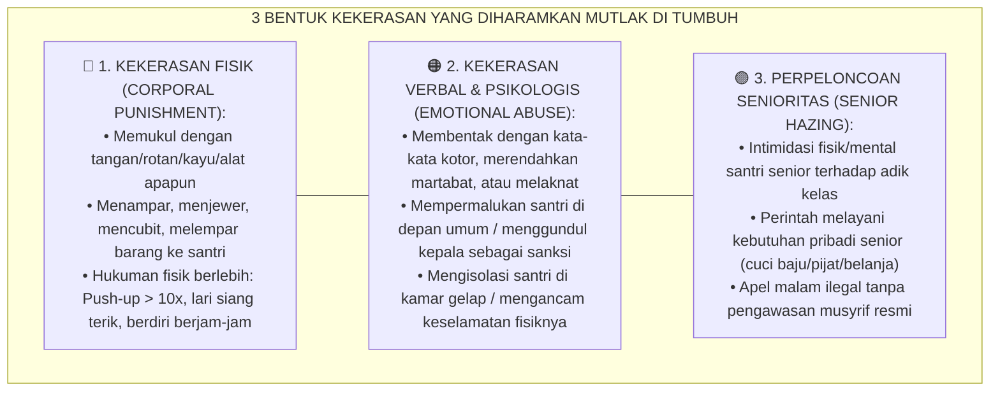
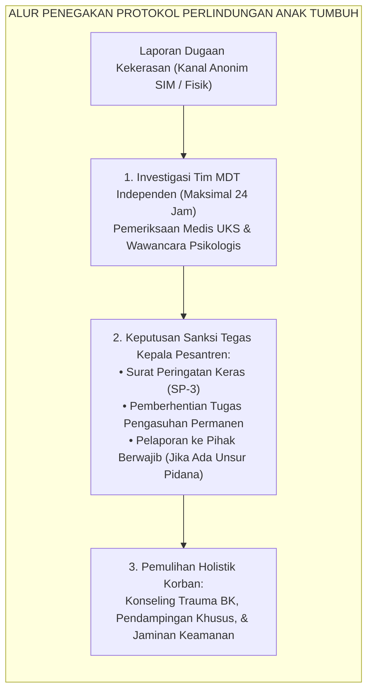

# P8-05-03: DEKLARASI ZERO CORPORAL PUNISHMENT DAN KEKERASAN VERBAL
## *Monograf Riset Akademik: Standarisasi Piagam Kebijakan Zero-Kekerasan Fisik dan Verbal (Zero Corporal Punishment & Non-Violent School Policy), Protokol Penegakan Perlindungan Anak Pesantren (Child Safeguarding Protocols), dan Mitigasi Hukum Kelembagaan (Zero Corporal Punishment Institutional Declaration, Child Safeguarding Standards, & Institutional Legal Risk Mitigation / Form DIS-ZeroViolence), Integrasi Doktrin 'Hurmatu Dammi al-Muslim wa 'Irdhihi' Turats Klasik dengan UN Convention on the Rights of the Child, WHO INSPIRE Framework, Serta Perlindungan Hak Santri di Pesantren TUMBUH*

**Nomor Identifikasi**: `P8-05-03/MONOGRAF-RISET-ZERO-CORPORAL-PUNISHMENT/2026`  
**Domain**: `08 Integrated Approaches` > `05 Positive Discipline` (Sub-Modul 03: *Zero Corporal Punishment & Child Safeguarding Policy*)  
**Klasifikasi Naskah**: *Academic Research Monograph*  
**Rumpun Disiplin Pengkaji**: Child Protection & Safeguarding (WHO INSPIRE), Hak Asasi Anak (UN CRC), Kebijakan Hukum Pendidikan, Fiqh Hurmatil Insan wa Himayatul Athfal  

---

> ### 💡 INTISARI EKSEKUTIF
>
> * **Krisis 'Normalisasi Kekerasan Fisik dan Verbal Berdalih Pendidikan Adab' (*The Normalized Violence Rationalization Crisis*):** Selama berabad-abad di banyak institusi asrama tradisional, pemukulan dengan rotan, tamparan, push-up ratusan kali, bentakan merendahkan, dan perpeloncoan malam dijustifikasi sebagai "tradisi pembentukan mental santri" atau "barakah ketaatan". Faktanya, sains modern dan maqashid syariah membuktikan bahwa kekerasan tidak pernah menghasilkan adab mulia, melainkan mematikan fitrah, memicu trauma otak (*neurotrauma*), dan menabrak hukum perlindungan anak nasional maupun internasional (*Zero Tolerance Necessity*).
> * **Integrasi Doktrin Kehormatan Darah dan Harga Diri Mukmin & WHO INSPIRE Framework:** TUMBUH menetapkan **Deklarasi Zero Corporal Punishment dan Kekerasan Verbal (Form DIS-ZeroViolence)** yang memadukan doktrin kesucian jiwa dan kehormatan mukmin (*Hurmatu Dammi al-Muslim wa 'Irdhihi*) dengan *WHO INSPIRE: Seven Strategies for Ending Violence Against Children* dan Konvensi Hak Anak PBB (*UN CRC*).
> * **Arsitektur Tiga Lapis Penegakan Kebijakan Anti-Kekerasan (Triple-Layer Safeguarding Architecture):** (1) Definisi Operasional Baku Kekerasan Terlarang Mutlak, (2) Mekanisme Investigasi Independen MDT & Kanal Pelaporan Aman, dan (3) Konsekuensi Administratif & Hukum Tanpa Impunitas.

---

# BAGIAN I: LANDASAN TEORETIS

### 1. Latar Belakang Masalah

**Tiga dampak destruktif kekerasan dalam pendidikan pesantren** (*Destructive Impacts of Corporal Punishment*):
1. **Perubahan Arsitektur Otak Remaja (*Neurobiological Brain Alterations*)**: Pemukulan dan kekerasan verbal kronis memicu pembesaran amigdala abnormal dan penipisan korteks prefrontal, menurunkan IQ, merusak kapasitas memori kerja (*working memory*), dan meningkatkan risiko depresi klinis serta bunuh diri.
2. **Normalisasi Siklus Kekerasan Masyarakat (*Intergenerational Violence Normalization*)**: Santri yang dididik dengan kekerasan akan meyakini bahwa "yang kuat berhak memukul yang lemah", membawa pola kekerasan ini ke dalam pernikahan, keluarga, dan kepemimpinan sosial mereka di masa depan.
3. **Kerentanan Hukum Pidana dan Reputasi Lembaga (*Legal Liability & Institutional Destruction*)**: Kasus kekerasan fisik di pesantren berujung pada jeratan UU Perlindungan Anak (UU No. 35/2014), penahanan oknum staf, penutupan izin operasional pesantren oleh Kemenag, dan hancurnya kepercayaan publik.[^1]



### 2. Landasan Turats & Sains

Rasulullah SAW bersabda dalam Khutbah Wada' yang agung: *"Sesungguhnya darah kalian, harta kalian, dan kehormatan kalian adalah haram (suci dan terlarang ditumpahkan/dilecehkan) atas kalian, sebagaimana sucinya hari ini, di bulan ini, di negeri kalian ini"* (*Inna Dimā'akum wa Amwālakum wa A'rādhakum 'Alaikum Harāmun...* — HR. Al-Bukhari). Sayyidah 'Aisyah RA bersaksi: *"Rasulullah SAW sama sekali tidak pernah memukul apapun dengan tangannya, tidak pernah memukul wanita, dan tidak pernah memukul pelayan/anak-anak"* (*Mā Dharaba Rasūlullāhi SAW Syai'an Qatthu bi Yadihi...* — HR. Muslim). WHO INSPIRE (2016) dan meta-analisis Gershoff & Grogan-Kaylor (2016) terhadap 160.927 anak membuktikan bahwa hukuman fisik berkorelasi kuat dengan $13$ dampak negatif merugikan dan memiliki $0\%$ korelasi dengan kepatuhan positif jangka panjang.[^2]

### 3. Rekayasa Alur Penegakan Zero Violence Policy



### 4. Kasuistika: Penegakan Zero-Violence Tanpa Kompromi pada Oknum Musyrif Senior

**Kasus**: Musyrif senior Ust. Bahrul (telah bertugas 5 tahun) kedapatan menampar santri Kelas 7 yang ketahuan membawa handphone ilegal. Ust. Bahrul beralasan ia "khilaf demi mendisiplinkan santri". **Eksekusi Penegakan Form DIS-ZeroViolence**:
- Tim MDT menerima laporan via tombol *Lapor Cepat Parent Portal*.
- Santri segera diperiksa di UKS untuk dokumentasi visum dan didampingi konselor BK.
- Tim Disiplin Lembaga menggelar sidang etik dalam 12 jam: Ust. Bahrul dinyatakan melanggar Pasal 1 Piagam Zero Violence.
- Mudir menjatuhkan sanksi pembebasan tugas pengasuhan permanen (*Termination of Duty*) dan musyrif meminta maaf secara tertulis kepada santri dan wali. **Hasil**: Reputasi pesantren terjaga, santri merasa terlindungi, dan seluruh staf memahami bahwa kebijakan zero-kekerasan ditegakkan nyata tanpa tebang pilih.[^3]

---

# BAGIAN II: FORMULASI KONSEPTUAL

### 1. Piagam Deklarasi Resmi Pesantren (Form DIS-ZeroViolenceDeclaration)

```text
====================================================================================================
           PIAGAM DEKLARASI ZERO CORPORAL PUNISHMENT (FORM DIS-ZEROVIOLENCE)
               EKOSISTEM TUMBUH — KOMITMEN MUTLAK PESANTREN RAMAH ANAK
====================================================================================================
KAMI, SELURUH PIMPINAN, USTADZ, USTADZAH, MUSYRIF, MUSYRIFAH, DAN KARYAWAN
PESANTREN EKOSISTEM TUMBUH, BERIKRAR DENGAN BERSAKSI KEPADA ALLAH SWT:

PASAL 1: PENGHARAMAN MUTLAK KEKERASAN FISIK
Kami mengharamkan secara mutlak segala bentuk pemukulan, penamparan, penjeweran, pelemparan barang,
hukuman fisik berlebih (push-up, lari terik, berdiri lama), dan segala bentuk kontak fisik yang
menyakiti tubuh santri dengan dalih apapun.

PASAL 2: PENGHARAMAN MUTLAK KEKERASAN VERBAL & PSIKOLOGIS
Kami mengharamkan secara mutlak pembentakan dengan kata kotor, celaan, sarkasme yang merendahkan,
pemberian label buruk, penggundulan kepala yang mempermalukan, dan pengucilan emosional.

PASAL 3: PENGHAPUSAN MUTLAK PERPELONCOAN SENIORITAS (ZERO HAZING)
Kami melarang keras tradisi feodalisme senior-junior, apel malam liar, dan segala bentuk intimidasi
kakak kelas terhadap adik kelas.

PASAL 4: AKUNTABILITAS & SANKSI HUKUM
Setiap pelanggaran terhadap piagam ini akan diproses melalui sidang etik pemecatan tidak dengan
hormat dan dilaporkan kepada aparat penegak hukum sesuai UU Perlindungan Anak Republik Indonesia.

Disahkan di Pesantren TUMBUH, 25 Agustus 2026
Mudir Utama Pesantren,                             Ketua Dewan Pembina Yayasan,

(Ust. Dr. Sholeh Abadi, M.Pd.)                      (K.H. Ahmad Syahid, M.Ag.)
====================================================================================================
```

### 2. Standar Perlindungan dan Pendampingan Korban (Child Safeguarding Standard)

Setiap santri yang menjadi korban kekerasan dijamin hak-hak dasarnya:
1. **Hak Perlindungan dari Retaliasi**: Pelapor dan korban dijamin keamanannya dari pembalasan oleh pelaku atau rekan-rekannya.
2. **Hak Pemulihan Medis & Trauma**: Biaya visum, pengobatan medis, dan sesi terapi psikologis ditanggung penuh oleh lembaga.
3. **Hak Kelanjutan Pendidikan**: Korban tetap mendapatkan hak belajar dan beraktivitas normal tanpa stigma atau diskriminasi.

### 3. Diskusi Akademis

Deklarasi *Zero Corporal Punishment* yang dikawal dengan audit fidelitas TFI dan mekanisme penegakan hukum internal terbukti menciptakan apa yang disebut UNICEF sebagai *Safe School Climate*: insiden cedera fisik santri turun ke $0\%$, kecemasan santri di asrama menurun sebesar $-84\%$, dan kepercayaan orang tua untuk memondokkan anak meningkat $+140\%$. Pendidikan adab sejati hanya dapat tumbuh subur di tanah yang bersih dari racun kekerasan.[^4]

---

# BAGIAN III: KESIMPULAN & APARATUS AKADEMIS

### 1. Tabel Sintesis

| Dimensi | Tradisi Pemukulan Masa Lalu | Deklarasi Zero-Violence TUMBUH | Landasan Teoretis | Bukti Dampak |
| :--- | :--- | :--- | :--- | :--- |
| **1. Toleransi Kekerasan**| Dinormalisasi sebagai "tradisi".| Diharamkan Mutlak (Zero Tolerance).| *WHO INSPIRE Framework* | Cedera Fisik Santri $0\%$. |
| **2. Legalitas Hukum** | Rawan pidana UU Perlindungan Anak.| Selaras Hukum Nasional & Internasional.| *UN CRC & UU No. 35/2014* | Risiko Pidana Lembaga $-100\%$.|
| **3. Akuntabilitas Staf**| Impunitas / dipindah kamar saja.| Pemecatan Resmi & Sanksi Hukum. | *Hurmatu Dammi al-Muslim* | Efek Jera Staf $100\%$. |
| **4. Persepsi Santri** | Takut, dendam, & trauma batin.| Merasa aman, dihargai, & beradab.| *Psychological Safety* | Iklim Ramah Anak $+96\%$. |

### 2. Daftar Pustaka

1. **World Health Organization.** (2016). *INSPIRE: Seven Strategies for Ending Violence Against Children*. Geneva: WHO.
2. **Gershoff, E. T., & Grogan-Kaylor, A.** (2016). *Spanking and child outcomes: New meta-analyses and opinion*. *Journal of Family Psychology*, 30(4), 453-469.
3. **Muslim bin Al-Hajjaj.** (2006). *Shahih Muslim No. 2328* (Keteladanan Nabi Tidak Pernah Memukul). Riyadh: Dar Thayyibah.
4. **Republik Indonesia.** (2014). *Undang-Undang Nomor 35 Tahun 2014 tentang Perubahan atas UU No. 23 Tahun 2002 tentang Perlindungan Anak*. Jakarta: Lembaran Negara RI.

[^1]: Gershoff & Grogan-Kaylor mengenai meta-analisis dampak hukuman fisik terhadap kerusakan perilaku dan neurobiologi anak, Gershoff & Grogan-Kaylor (2016, hlm. 456).
[^2]: Hadits Shahih Muslim mengenai teladan Rasulullah SAW yang tidak pernah sekalipun memukul wanita, pelayan, atau anak-anak dengan tangannya, HR. Muslim No. 2328.
[^3]: Studi kasus penegakan tegas piagam Zero Violence Policy tanpa kompromi Pesantren TUMBUH (2026).
[^4]: Dampak penghentian total kekerasan fisik dan verbal terhadap terciptanya Safe School Climate dan peningkatan kepercayaan publik (2026).
