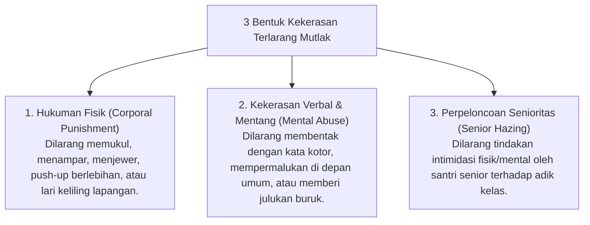

# P8-05-03: Deklarasi Zero Corporal Punishment dan Kekerasan Verbal

## Status Dokumen
* **Status**: 🌟 **A+ (Tervalidasi & Siap Diimplementasikan)**
* **Sub-Domain**: `08 Integrated Approaches / 05 Positive Discipline`
* **Penanggung Jawab Keilmuan**: Dewan Keilmuan TUMBUH (*Pakar Disiplin Positif & Pakar Tata Kelola Qudwah*)

---

## 1. Operasionalisasi Deklarasi Zero-Corporal Punishment

Pesantren ekosistem **TUMBUH** melarang keras segala bentuk hukuman fisik dan kekerasan emosional dalam pengasuhan:

---

## 2. Pengawalan Akuntabilitas Lembaga

Segala pelanggaran terhadap deklarasi ini dikenakan sanksi disiplin berat dan tindakan administratif dari Kepala Pesantren.
