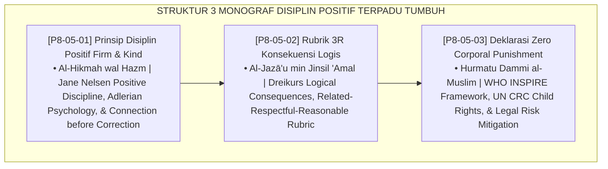

# P8-05: DOKUMEN INDUK PENDEKATAN TERINTEGRASI POSITIVE DISCIPLINE
## *Arsitektur dan Standarisasi Prinsip Disiplin Positif Tegas dan Hangat (Firm and Kind), Rubrik Konsekuensi Logis 3R (Related, Respectful, Reasonable), dan Deklarasi Institusional Zero Corporal Punishment sebagai Tiga Pilar Disiplin Positif Pengasuhan (Firm & Kind Principles Form DIS-FirmKind, 3R Logical Consequences Form DIS-3RKonsekuensi, Serta Zero Violence Declaration Form DIS-ZeroViolence) di Ekosistem TUMBUH Pesantren*

**Nomor Identifikasi**: `P8-05/DOKUMEN-INDUK-PENDEKATAN-TERINTEGRASI-DISIPLIN-POSITIF/2026`  
**Domain**: `08 Integrated Approaches` > `05 Positive Discipline` (Gugus Sub-Domain 05: *Positive Discipline, Logical Consequences, & Child Safeguarding*)  
**Klasifikasi Naskah**: *Master Architecture & Navigation Monograph*  
**Rumpun Disiplin Pengkaji**: Positive Discipline (Jane Nelsen), Adlerian Psychology (Dreikurs), Child Safeguarding (WHO INSPIRE), Fiqh Al-Hikmah wal 'Adl  

---

> ### 💡 INTISARI EKSEKUTIF
>
> * **Kedudukan Strategis Gugus Pendekatan Terintegrasi Positive Discipline:** Gugus ini adalah benteng perlindungan martabat kemanusiaan (*human dignity bastion*) di ekosistem TUMBUH. Membebaskan tradisi pesantren dari belenggu kekerasan fisik, pemukulan rotan, dan bentakan merendahkan, pendekatan ini membuktikan bahwa ketertiban dan adab mulia santri dapat ditegakkan dengan sempurna melalui perpaduan ketegasan prinsipil (*Firmness*) dan kehangatan kasih sayang (*Kindness*) berbasis konsekuensi logis yang bermartabat (*From Fear-Based Tyranny to Dignity-Based Discipline*).
> * **Triad Pendekatan Terintegrasi Disiplin Positif TUMBUH:** (1) **Prinsip Firm and Kind** yang menyeimbangkan batasan aturan dengan kehangatan relasi, (2) **Rubrik 3R Konsekuensi Logis** yang memastikan setiap sanksi relevan, sopan, dan proporsional untuk memperbaiki kerusakan nyata, dan (3) **Deklarasi Zero Corporal Punishment** yang mengharamkan mutlak segala bentuk kekerasan fisik dan verbal.
> * **3 Monograf Riset Komprehensif:** Form DIS-FirmKind, Form DIS-3RKonsekuensi, dan Form DIS-ZeroViolence.

---

## 📑 PETA NAVIGASI TIGA MONOGRAF

---

## 📚 DESKRIPSI RINGKAS 3 BERKAS MONOGRAF

1. **[P8-05-01: Prinsip Disiplin Positif Firm and Kind Jane Nelsen](file:///c:/xampp/htdocs/tumbuh/08%20Integrated%20Approaches/05%20Positive%20Discipline/P8-05-01-Prinsip-Disiplin-Positif-Firm-and-Kind-Jane-Nelsen.md)**  
   *Sintesis simultan ketegasan dan kehangatan, kuadran pengasuhan Adlerian, protokol komunikasi privat tanpa mempermalukan santri, dan Form DIS-FirmKind.*
2. **[P8-05-02: Rubrik 3R Konsekuensi Logis Related Respectful Reasonable](file:///c:/xampp/htdocs/tumbuh/08%20Integrated%20Approaches/05%20Positive%20Discipline/P8-05-02-Rubrik-3R-Konsekuensi-Logis-Related-Respectful-Reasonable.md)**  
   *Matriks komparasi sanksi punitif vs konsekuensi logis 3R (Related, Respectful, Reasonable), lembar verifikasi kelayakan sanksi, dan Form DIS-3RKonsekuensi.*
3. **[P8-05-03: Deklarasi Zero Corporal Punishment dan Kekerasan Verbal](file:///c:/xampp/htdocs/tumbuh/08%20Integrated%20Approaches/05%20Positive%20Discipline/P8-05-03-Deklarasi-Zero-Corporal-Punishment-dan-Kekerasan-Verbal.md)**  
   *Piagam deklarasi resmi pelarangan kekerasan fisik/verbal/perpeloncoan, standar child safeguarding WHO INSPIRE, audit sanksi hukum tanpa impunitas, dan Form DIS-ZeroViolence.*

---

## 🎯 STANDAR PENJAMINAN MUTU DISIPLIN POSITIF

Penerapan gugus **Pendekatan Terintegrasi Disiplin Positif** menjamin bahwa:
1. **Aturan Ditegakkan Secara Konsisten Tanpa Emosi Marah (*Objective Firmness Guarantee*)**: Ketegasan musyrif berpijak pada kebutuhan sistem, bukan kejengkelan personal.
2. **Santri Belajar Bertanggung Jawab Atas Dampak Kesalahannya (*Restitution Learning Guarantee*)**: Konsekuensi logis 3R melatih santri memperbaiki kerusakan fisik dan sosial yang ditimbulkan.
3. **Lingkungan Pesantren 100% Bebas dari Kekerasan Fisik dan Pelecehan Verbal (*Zero Violence Guarantee*)**: Piagam deklarasi menjamin keamanan dan perlindungan hukum mutlak bagi setiap santri.
