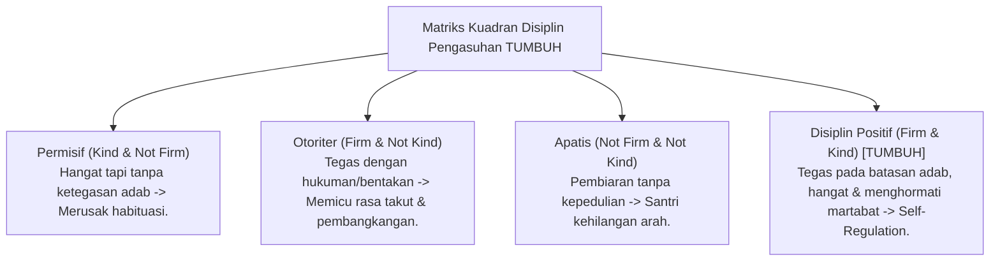

# P8-05: Pendekatan Terintegrasi Positive Discipline

## Status Dokumen
* **Status**: 🌟 **A+ (Tervalidasi & Siap Diimplementasikan)**
* **Sub-Domain**: `08 Integrated Approaches / 05 Positive Discipline`
* **Penanggung Jawab Keilmuan**: Dewan Keilmuan TUMBUH (*Pakar Disiplin Positif & Pakar Tata Kelola Qudwah*)

---

## 1. Konseptualisasi Disiplin Positif Islami Pesantren

Disiplin Positif dalam ekosistem **TUMBUH** memadukan teori *Positive Discipline* (Jane Nelsen) dengan prinsip **Al-Adl wa al-Ihsan** (Keadilan yang disertai Kebaikan):

---

## 2. Peta Prinsip Utama Disiplin Positif

- **Firm (Tegas)**: Mempertahankan ekspektasi adab dan kesepakatan batas tanpa kompromi kebatilan.
- **Kind (Hangat)**: Menjaga martabat emosional santri, berbicara tanpa membentak, dan berorientasi pada perbaikan.
