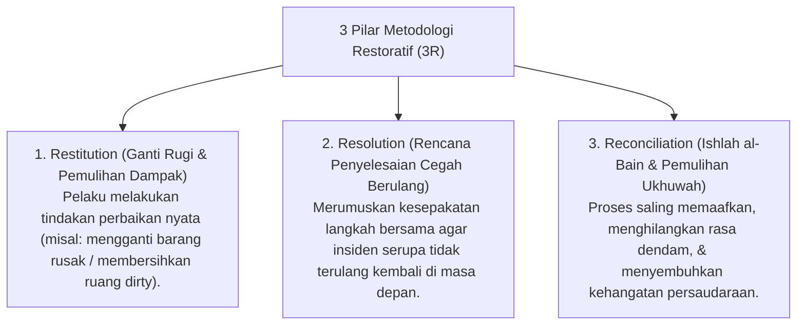

# P8-06-01: Metodologi Restoratif 3R Restitution Resolution Reconciliation

## Status Dokumen
* **Status**: 🌟 **A+ (Tervalidasi & Siap Diimplementasikan)**
* **Sub-Domain**: `08 Integrated Approaches / 06 Restorative Practices`
* **Penanggung Jawab Keilmuan**: Dewan Keilmuan TUMBUH (*Pakar Kuratif Restoratif & Pakar Disiplin Positif*)

---

## 1. Operasionalisasi Metodologi Restoratif 3R Model

---

## 2. Penguatan Hubungan Sosial Santri

Metodologi 3R mengubah insiden pelanggaran menjadi momen pembelajaran empati dan kedewasaan sosial santri.
