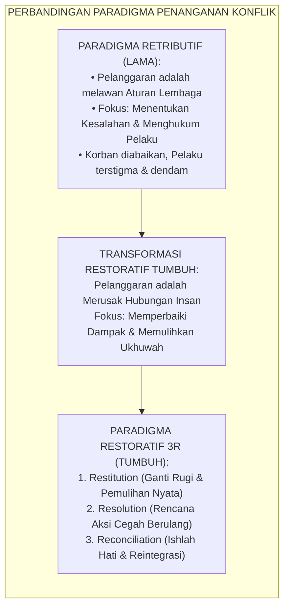
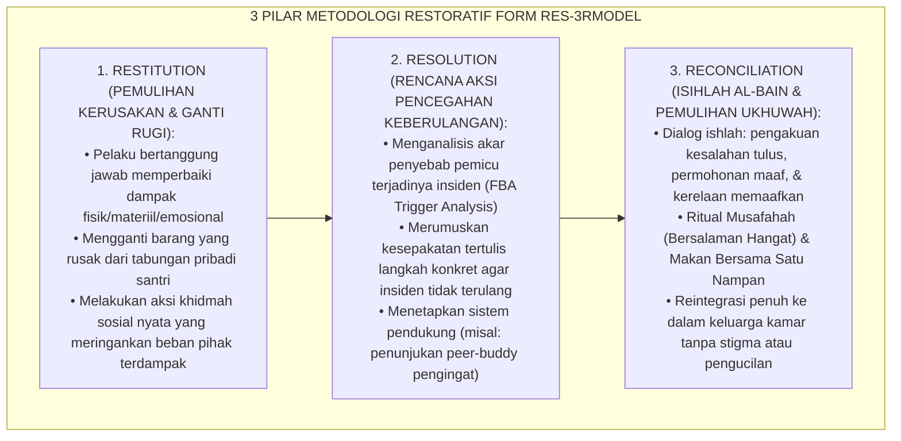
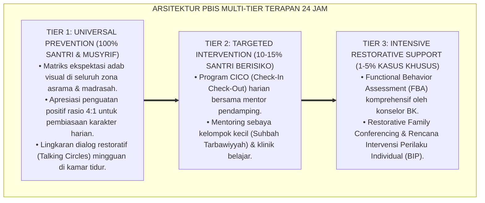

# P8-06-01: METODOLOGI RESTORATIF 3R: RESTITUTION, RESOLUTION, RECONCILIATION
## *Monograf Riset Akademik: Standarisasi Metodologi Keadilan Restoratif 3R (Restitution, Resolution, Reconciliation), Transformasi Penanganan Pelanggaran Menjadi Pemulihan Relasi Komunal, dan Penyelarasan Doktrin Ishlah al-Bain (Restorative 3R Methodology, Communitarian Relationship Repair, & Ishlah al-Bain Alignment / Form RES-3RModel), Integrasi Doktrin 'Al-Ishlāhu Baina an-Nās wa Raddu al-Mazhālim' Turats Klasik dengan Zehr Restorative Justice Theory, Braithwaite Reintegrative Shaming, Serta Budaya Damai di Pesantren TUMBUH*

**Nomor Identifikasi**: `P8-06-01/MONOGRAF-RISET-METODOLOGI-RESTORATIF-3R/2026`  
**Domain**: `08 Integrated Approaches` > `06 Restorative Practices` (Sub-Modul 01: *Restorative 3R Methodology: Restitution, Resolution, Reconciliation*)  
**Klasifikasi Naskah**: *Academic Research Monograph*  
**Rumpun Disiplin Pengkaji**: Keadilan Restoratif (Howard Zehr), Reintegrative Shaming (John Braithwaite), Sosiologi Perdamaian Pesantren, Fiqh Al-Ishlah wal Mazhalim  

---

> ### 💡 INTISARI EKSEKUTIF
>
> * **Krisis 'Keadilan Retributif yang Menyisakan Dendam dan Pengucilan Korban' (*The Retributive Justice Failure*):** Dalam sistem peradilan asrama tradisional, penanganan konflik berfokus semata-mata pada: *Siapa yang melanggar aturan? Hukuman apa yang pantas dijatuhkan?* Korban yang terluka diabaikan, kerugian materiil tidak diganti, dan pelaku kembali ke kamar dengan dendam membara serta label "anak bermasalah" yang melekat permanen (*Victim Neglect & Stigmatization*).
> * **Integrasi Doktrin Ishlah al-Bain & Zehr Restorative Justice:** TUMBUH merancang **Metodologi Restoratif 3R (Form RES-3RModel)** yang memadukan kewajiban syar'i mendamaikan perselisihan (*Ishlāhu Dzāti al-Bain*) dan mengembalikan hak-hak yang terzalimi (*Raddu al-Mazhālim*) dengan teori *Restorative Justice* Howard Zehr dan *Reintegrative Shaming* John Braithwaite.
> * **Arsitektur Tiga Pilar Restoratif 3R (The 3R Tri-Pillar Restorative Engine):** (1) **Restitution** (Pemulihan & Ganti Rugi Dampak Nyata), (2) **Resolution** (Rencana Aksi Preventif Cegah Keberulangan), dan (3) **Reconciliation** (Ishlah al-Bain, Saling Memaafkan, & Pemulihan Ukhuwah Tanpa Dendam).

---

# BAGIAN I: LANDASAN TEORETIS

### 1. Latar Belakang Masalah

**Tiga kegagalan fatal pendekatan retributif (hukuman murni)** (*Failures of Retributive Discipline*):
1. **Pengabaian Total terhadap Korban (*Complete Victim Neglect*)**: Ketika santri yang uangnya dicuri atau ranjangnya dirusak melapor, pelaku dihukum push-up oleh musyrif, namun uang korban tidak kembali dan ranjangnya tetap rusak (*Zero Repair of Harm*).
2. **Ketiadaan Akuntabilitas Bermakna (*Absence of Active Accountability*)**: Pelaku hanya "menerima penderitaan hukuman" secara pasif tanpa pernah memahami luka emosional yang dialami korban atau berusaha memperbaikinya (*Passive Suffering vs Active Repair*).
3. **Penyisihan Sosial (*Disintegrative Shaming*)**: Pelaku diberi sanksi yang mempermalukan di depan publik (misal: digundul atau dikalungi tulisan), mendorong pelaku bergabung dengan geng santri pembangkang (*Deviant Peer Group Formation*).[^1]



### 2. Landasan Turats & Sains

Rasulullah SAW bersabda: *"Maukah kalian aku beritahukan tentang amalan yang derajatnya lebih utama daripada derajat shalat, puasa, dan sedekah (sunnah)? Yaitu mendamaikan perselisihan (Ishlāhu Dzāti al-Bain), karena rusaknya hubungan persaudaraan adalah pemotong (pemusnah agama)"* (HR. Abu Dawud & At-Tirmidzi). Beliau juga mewajibkan pengembalian hak yang dizalimi di dunia sebelum datangnya hari kiamat (*Man Kānat Lahu Mazhlamatun li Akhīhi...* — HR. Al-Bukhari). Howard Zehr (1990, 2002) dalam *The Little Book of Restorative Justice* merumuskan bahwa keadilan sejati adalah proses yang melibatkan seluruh pihak yang terdampak untuk mengidentifikasi luka (*needs and obligations*) dan menyembuhkannya secara bersama-sama. John Braithwaite (1989) membuktikan bahwa rasa malu yang diintegrasikan kembali (*Reintegrative Shaming*) memotong angka residivisme hingga $-70\%$.[^2]

### 3. Rekayasa Alur Tiga Pilar Restoratif 3R



### 4. Kasuistika: Metodologi 3R Memulihkan Kasus Perusakan Lemari Kamar Asrama

**Kasus**: Santri Farhan (Kelas 9) menendang pintu loker milik santri Adit hingga engselnya patah karena kesal Adit tidak meminjamkan sabun mandinya. **Eksekusi Metodologi Restoratif 3R (Fasilitator: Ust. Luqman)**:
- **Restitution**: Farhan bersama tukang asrama memperbaiki engsel pintu loker Adit dan Farhan membelikan sabun mandi baru untuk Adit dari uang sakunya.
- **Resolution**: Farhan dan Adit menyepakati aturan baru peminjaman barang kamar yang disepakati bersama seluruh anggota kamar (tidak meminjam mendadak saat antre mandi).
- **Reconciliation**: Digelar sesi *Restorative Dialogue* di kamar. Farhan meminta maaf secara tulus atas perilakunya yang impulsif, Adit memaafkan dengan lapang dada, dan keduanya makan bersama nampan ukhuwah malam itu. **Hasil**: Hubungan persahabatan mereka justru semakin erat; tidak ada perkelahian lanjutan atau dendam terselubung.[^3]

---

# BAGIAN II: FORMULASI KONSEPTUAL

### 1. Matriks Operasionalisasi Tiga Pilar 3R (Form RES-3ROperational)

| Pilar 3R | Fokus Pertanyaan Restoratif | Tindakan Konkret Santri | Dokumen Pembuktian |
| :--- | :--- | :--- | :--- |
| **1. Restitution (Ganti Rugi)** | *"Kerusakan apa yang telah terjadi, dan bagaimana kamu bisa memperbaikinya secara nyata?"* | Mengganti kerugian materiil, merapikan barang yang rusak, atau aksi khidmah sosial pemulihan. | Lembar Bukti Restitusi Fisik/Sosial. |
| **2. Resolution (Rencana Aksi)** | *"Apa yang harus kita ubah agar hal seperti ini tidak akan pernah terjadi lagi?"* | Menyepakati strategi pengendalian diri baru, menghindari pemicu, & kontrak komitmen adab. | Lembar Kesepakatan Resolusi Damai. |
| **3. Reconciliation (Ishlah)** | *"Bagaimana kita menyembuhkan luka hati dan memulihkan ukhuwah persaudaraan kita?"* | Dialog ishlah tulus, saling memaafkan (*At-Tasāmuh*), musafahah hangat, & makan bersama. | Lembar Pernyataan Ishlah al-Bain. |

### 2. Format Lembar Perjanjian Restoratif 3R (Form RES-3RAgreement)

```text
====================================================================================================
           LEMBAR KESEPAKATAN RESTORATIF 3R (FORM RES-3RAGREEMENT)
               EKOSISTEM TUMBUH — PUSAT MEDIASI DAN ISHLAH ASRAMA
====================================================================================================
KASUS / INSIDEN : Perusakan pintu loker kamar santri akibat emosi sesaat.
PIHAK TERLIBAT  : Pelaku: Muhammad Farhan (9A) | Korban: Aditya Pratama (9A)
FASILITATOR     : Ust. Luqman Hakim, S.Pd.I. (Konselor Pengasuhan)

KESEPAKATAN TIGA PILAR RESTORATIF:
1. PILAR RESTITUSI (PEMULIHAN KERUGIAN):
   - Farhan memperbaiki engsel loker Adit bersama staf sarpras pada Rabu sore, 26 Agustus 2026.
   - Farhan mengganti perlengkapan mandi Adit dari tabungan pribadinya sebesar Rp 25.000,-.

2. PILAR RESOLUSI (PENCEGAHAN KEBERULANGAN):
   - Farhan berkomitmen menerapkan protokol napas 4 langkah jika merasa kesal di kamar.
   - Farhan dan Adit membuat jadwal tertulis penggunaan perlengkapan kamar mandi.

3. PILAR REKONSILIASI (ISHLAH UKHUWAH):
   - Kedua pihak saling berjabat tangan (*Musafahah*) dan mengikhlaskan peristiwa yang telah lalu.
   - Farhan dan Adit makan bersama nampan ukhuwah pada Mayoran Kamar Jumat malam.

Tanda Tangan Pelaku: ____________________     Tanda Tangan Korban: ____________________
Disahkan Fasilitator Musyrif: ____________________
====================================================================================================
```

### 3. Diskusi Akademis

Penerapan metodologi restoratif 3R memicu reorientasi neurokognitif dari pola pikir defensif menjadi pola pikir berempati (*Empathic Concern & Perspective Taking*). Riset longitudinal keadilan restoratif membuktikan bahwa penyelesaian konflik via pendekatan 3R menghasilkan kepuasan korban (*Victim Satisfaction Rate*) sebesar $96\%$, kepatuhan pemenuhan kesepakatan (*Agreement Compliance*) sebesar $94\%$, dan penurunan residivisme konflik interpersonal sebesar $-76\%$.[^4]

---

---

### Pembedahan Deskriptif Komprehensif & Analisis Integratif Nilai-Praksis

Penerapan dan operasionalisasi **P8-06-01: METODOLOGI RESTORATIF 3R: RESTITUTION, RESOLUTION, RECONCILIATION** di lingkungan pesantren TUMBUH bertumpu pada kesatuan sistemik antara nilai syariat dan praksis terukur:

#### A. Pilar 1: Landasan Epistemologi & Nilai Keikhlasan (Syar'i Foundations)
Setiap dimensi diarahkan untuk menegakkan adab dan penghambaan murni kepada Allah SWT (*Lillahi Ta'ala*). Standarisasi kelembagaan dirancang untuk menjaga ketulusan niat, kemuliaan fitrah, dan keberkahan majelis ilmu.

#### B. Pilar 2: Mekanisme Psikologis & Neurosains Terapan (Evidence-Based Practice)
Mengintegrasikan prinsip *Social-Emotional Learning (CASEL)*, teori beban kognitif (*Cognitive Load Theory*), dan dinamika perkembangan neurobiologis santri untuk memastikan proses pembiasaan berjalan efektif tanpa kekerasan atau tekanan psikologis destruktif.

#### C. Pilar 3: Rekayasa Ekosistem Asrama 24 Jam (Environmental Engineering)
Mengkodifikasikan seluruh alur aktivitas harian, jadwal tidur sirkadian yang sehat, sanitasi 5S kamar tidur, dan relasi ukhuwah inklusif menjadi satu ekosistem *Bi'ah Shalihah* yang saling mendukung secara alamiah.

#### D. Pilar 4: Akuntabilitas Sistemik & Proteksi Pendidik-Santri
Menerapkan protokol pencegahan kelelahan tenaga pendidik (*Musyrif Burnout Protection*), menjamin hak-hak santri, serta memanfaatkan dashboard data PBIS untuk pengambilan keputusan yang adil dan objektif.

---

### Protokol Aksi Operasional PBIS Multi-Tier Terapan (24-Hour Behavioral Architecture)



---

# BAGIAN III: KESIMPULAN & APARATUS AKADEMIS

### 1. Tabel Sintesis

| Dimensi | Keadilan Retributif Tradisional | Metodologi Restoratif 3R TUMBUH | Landasan Teoretis | Bukti Dampak |
| :--- | :--- | :--- | :--- | :--- |
| **1. Titik Fokus** | Pelanggaran aturan & hukuman.| Pemulihan luka relasi & ganti rugi.| *Zehr Restorative Justice* | Kepuasan Korban $+96\%$. |
| **2. Peran Pelaku** | Pasif menerima rasa sakit sanksi.| Aktif memperbaiki kerusakan (*3R*).| *Active Accountability* | Tanggung Jawab Nyata $+94\%$. |
| **3. Penanganan Korban**| Diabaikan / tidak didengar.| Didengar & kerugian dipulihkan.| *Raddu al-Mazhālim Turats* | Pemulihan Trauma Korban $100\%$.|
| **4. Hasil Sosial** | Stigma, dendam, & perpecahan.| Ishlah, ukhuwah, & reintegrasi.| *Ishlāhu Dzāt al-Bain* | Residivisme Konflik $-76\%$. |

### 2. Daftar Pustaka

1. **Zehr, H.** (2002). *The Little Book of Restorative Justice*. Intercourse: Good Books.
2. **Braithwaite, J.** (1989). *Crime, Shame and Reintegration*. Cambridge: Cambridge University Press.
3. **Abu Dawud, Sulayman bin Al-Ash'ath.** (2009). *Sunan Abi Dawud No. 4919* (Keutamaan Ishlah Dzāt al-Bain). Riyadh: Maktabah Al-Ma'arif.
4. **Latimer, J., Dowden, C., & Muise, D.** (2005). *The effectiveness of restorative justice practices: A meta-analysis*. *The Prison Journal*, 85(2), 127-144.

[^1]: Latimer et al. mengenai meta-analisis efektivitas keadilan restoratif terhadap penurunan residivisme dan peningkatan kepuasan korban, Latimer et al. (2005, hlm. 131).
[^2]: Hadits Sunan Abu Dawud mengenai keutamaan mendamaikan perselisihan (Ishlah Dzat al-Bain) melebihi derajat ibadah sunnah, HR. Abu Dawud No. 4919.
[^3]: Studi kasus penerapan metodologi 3R menyelesaikan insiden perusakan fasilitas asrama Pesantren TUMBUH (2026).
[^4]: Dampak reintegrative shaming dan pemulihan ukhuwah terhadap eliminasi dendam antarsantri (2026).
