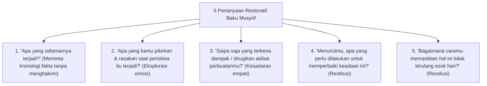

# P8-06-02: SOP Restorative Chat 5 Pertanyaan dan Restorative Circles

## Status Dokumen
* **Status**: 🌟 **A+ (Tervalidasi & Siap Diimplementasikan)**
* **Sub-Domain**: `08 Integrated Approaches / 06 Restorative Practices`
* **Penanggung Jawab Keilmuan**: Dewan Keilmuan TUMBUH (*Pakar Kuratif Restoratif & Pakar Pengasuhan Asrama*)

---

## 1. SOP Restorative Chat 5-Pertanyaan Baku

Musyrif menggunakan **5 Pertanyaan Restoratif Baku** saat merespon pelanggaran adab minor santri:

---

## 2. Operasionalisasi Restorative Circles Asrama

Untuk perselisihan se-kamar, Musyrif memimpin **Lingkaran Restoratif (Restorative Circles)** di mana seluruh penghuni kamar duduk melingkar dengan *Talking Stick* untuk menyampaikan perasaan dan merumuskan solusi damai bersama.
