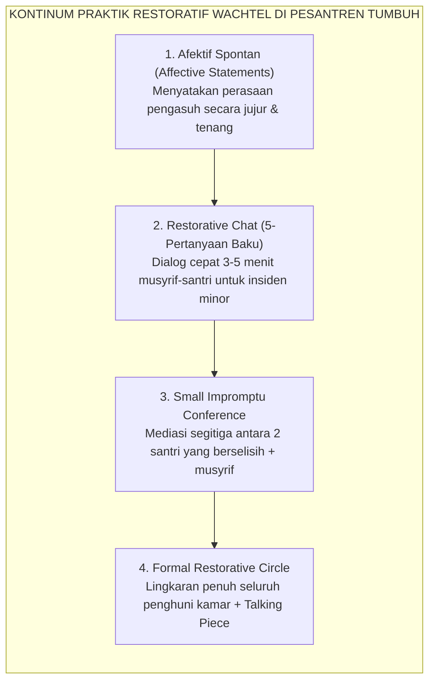
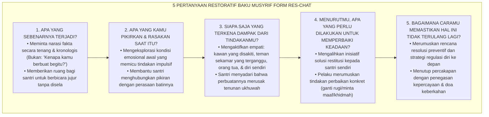
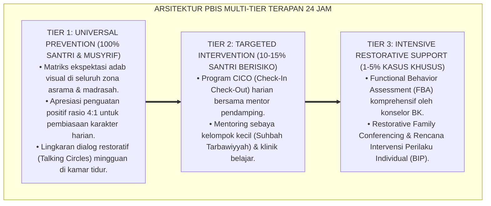

# P8-06-02: SOP RESTORATIVE CHAT 5 PERTANYAAN DAN RESTORATIVE CIRCLES
## *Monograf Riset Akademik: Standarisasi Prosedur Operasional Baku (SOP) Restorative Chat 5-Pertanyaan Reflektif, Metodologi Fasilitasi Lingkaran Restoratif Asrama (Dormitory Restorative Circles), dan Protokol Benda Bicara (Talking Piece Protocol) dalam Resolusi Konflik Sebaya (Standardized 5-Question Restorative Chat SOP, Restorative Circles Facilitation Methodology, & Talking Piece Peer Resolution / Form RES-ChatCircles), Integrasi Doktrin 'Adab an-Nashīhah wal Majlis asy-Syūrā' Turats Klasik dengan Wachtel Restorative Practices Continuum, Pranis Peacemaking Circles, Serta Iklim Ukhuwah di Pesantren TUMBUH*

**Nomor Identifikasi**: `P8-06-02/MONOGRAF-RISET-RESTORATIVE-CHAT-CIRCLES/2026`  
**Domain**: `08 Integrated Approaches` > `06 Restorative Practices` (Sub-Modul 02: *Restorative Chat & Restorative Circles Facilitation SOP*)  
**Klasifikasi Naskah**: *Academic Research Monograph*  
**Rumpun Disiplin Pengkaji**: Restorative Practices (Ted Wachtel), Peacemaking Circles (Kay Pranis), Mediasi Konflik Sebaya, Fiqh Asy-Syura wan Nashihah  

---

> ### 💡 INTISARI EKSEKUTIF
>
> * **Krisis 'Interogasi Pengasuh yang Menghakimi dan Memojokkan Santri' (*The Inquisitorial Interrogation Trap*):** Saat terjadi keributan di asrama, musyrif konvensional seringkali bertindak seperti jaksa interogator yang agresif — membentak dengan pertanyaan menyudutkan (*"Kenapa kamu berbuat begitu?! Siapa yang menyuruhmu?!"*). Akibatnya, santri merespons dengan berbohong, saling melempar kesalahan (*blaming others*), atau menutup diri rapat-rapat (*Defensive Silence & Deception*).
> * **Integrasi Doktrin Nashihah Bil-Hikmah & Wachtel Restorative Practices:** TUMBUH merancang **SOP Restorative Chat 5 Pertanyaan dan Restorative Circles (Form RES-ChatCircles)** yang memadukan etika nasihat Islam yang penuh kelembutan (*Adab an-Nashīhah*) dengan kontinum *Restorative Practices* Ted Wachtel dan metodologi *Peacemaking Circles* Kay Pranis.
> * **Arsitektur Dua Tingkat Fasilitasi Restoratif (Two-Tier Restorative Facilitation):** (1) **Restorative Chat 5-Pertanyaan** untuk de-eskalasi dan koreksi cepat insiden minor santri perorangan (3–5 menit), dan (2) **Restorative Circles Kamar** dengan protokol benda bicara (*Talking Piece*) untuk rekonsiliasi perselisihan kelompok kamar (30–45 menit).

---

# BAGIAN I: LANDASAN TEORETIS

### 1. Latar Belakang Masalah

**Tiga disfungsi pola interogasi tradisional di pesantren** (*Traditional Interrogation Dysfunctions*):
1. **Pertanyaan "Mengapa" yang Memicu Defensivitas (*The Destructive "Why" Question*)**: Menanyakan *"Kenapa kamu memukul dia?"* memicu rasionalisasi dan pembelaan diri (*"Karena dia yang mengejek saya duluan!"*), memperuncing permusuhan antarpihak.
2. **Ketiadaan Eksplorasi Dampak Emosional (*Absence of Emotional Impact Inquiry*)**: Pelaku tidak pernah diajak memikirkan bagaimana perbuatannya melukai perasaan kawan dan merusak suasana kamar secara keseluruhan.
3. **Penyelesaian Sepihak Tanpa Suara Komunal (*Unilateral Top-Down Resolution*)**: Musyrif langsung memutuskan hukuman tanpa memberi ruang bagi seluruh anggota kamar untuk mengekspresikan bagaimana perselisihan tersebut memengaruhi rasa aman mereka.[^1]



### 2. Landasan Turats & Sains

Rasulullah SAW bersabda: *"Agama itu adalah nasihat (ketulusan menghendaki kebaikan bagi orang lain)"* (*Ad-Dīnu an-Nashīhah* — HR. Muslim). Imam Ibnu Rajab Al-Hanbali dalam *Jāmi' al-'Ulūm wal Hikam* menjelaskan bahwa nasihat sejati disampaikan dengan kelembutan, kerahasiaan, dan tujuan murni memperbaiki keadaan tanpa mempermalukan. Ted Wachtel (2013) dari International Institute for Restorative Practices (IIRP) membuktikan bahwa *5 Restorative Questions* memandu otak pelaku dari respon limbik defensif menuju aktivasi korteks prefrontal untuk penalaran moral dan empati. Kay Pranis (2005) dalam riset *Peacemaking Circles* membuktikan bahwa duduk melingkar dengan benda bicara menciptakan ruang egaliter yang menyembuhkan luka sosial (*Healing Social Wounds*).[^2]

### 3. Rekayasa 5 Pertanyaan Restoratif Baku (The 5 Core Questions)



### 4. Kasuistika: Restorative Circle Memulihkan Konflik Antar-Santri Sekamar

**Kasus**: Terjadi perpecahan di Kamar Abu Bakar 2; santri terbelah menjadi 2 kubu yang saling menyindir setelah sandal salah satu santri hilang disembunyikan. **Eksekusi SOP Restorative Circle (Ust. Wildan)**:
- Seluruh 12 santri penghuni kamar duduk melingkar di karpet tengah kamar bada Isya.
- Ust. Wildan memperkenalkan *Talking Piece* (sebuah tasbih kayu milik kamar): *"Hanya yang memegang tasbih yang boleh berbicara, yang lain mendengarkan dengan hati (*Inshāt*)."*
- Putaran 1: Setiap santri menyampaikan bagaimana suasana kamar yang dingin memengaruhi kenyamanan belajar dan tidur mereka.
- Putaran 2: Santri yang menyembunyikan sandal (Faris) memegang tasbih, menangis, mengakui bahwa awalnya ia hanya bercanda namun takut mengaku karena cemas dipukuli. Faris mengembalikan sandal tersebut.
- Putaran 3: Seluruh anggota kamar menyepakati resolusi: menghentikan candaan menyembunyikan barang dan saling memaafkan. **Hasil**: Ikatan ukhuwah kamar pulih seketika; ketegangan lenyap tanpa ada sanksi hukuman fisik.[^3]

---

# BAGIAN II: FORMULASI KONSEPTUAL

### 1. SOP Pelaksanaan Restorative Circle Asrama (Form RES-CircleSOP)

| Tahap Sesi | Alokasi Waktu | Aktivitas Fasilitator Musyrif | Target Suasana |
| :--- | :--- | :--- | :--- |
| **1. Pembukaan & Niat** | 5 Menit | Membuka majelis dengan basmalah, tadabbur hadits ukhuwah, dan menetapkan aturan *Talking Piece*. | Khusyuk & Menenangkan. |
| **2. Putaran 1: Dampak** | 10 Menit | Mengalirkan benda bicara searah jarum jam: *"Bagaimana perasaanmu atas kejadian di kamar kita pekan ini?"* | Empatis & Mendengar Aktif. |
| **3. Putaran 2: Tanggung Jawab**| 15 Menit | Mengalirkan benda bicara kepada pelaku dan pihak terkait untuk menyampaikan pengakuan & restitusi. | Jujur & Menghormati Martabat. |
| **4. Putaran 3: Resolusi** | 10 Menit | Menyepakati komitmen bersama kamar dan penandatanganan Lembar Ishlah al-Bain. | Konstruktif & Solutif. |
| **5. Penutup & Musafahah** | 5 Menit | Bersalaman melingkar (*Musafahah*), doa kafaratul majlis, dan makan buah bersama. | Hangat & Bersaudara Sejati. |

### 2. Format Lembar Hasil Restorative Circle (Form RES-CircleReport)

```text
====================================================================================================
           LEMBAR BERITA ACARA RESTORATIVE CIRCLE KAMAR (FORM RES-CIRCLEREPORT)
               EKOSISTEM TUMBUH — PUSAT ISHLAH DAN PEMULIHAN UKHUWAH ASRAMA
====================================================================================================
Nama Kamar    : Asrama Abu Bakar Ash-Shiddiq 2     Jumlah Peserta : 12 Santri (100% Hadir)
Tanggal Sesi  : Selasa, 25 Agustus 2026 (20.00-20.45 WIB) Fasilitator : Ust. Wildan Robbani, S.Pd.
Fokus Isu     : Penyelesaian ketegangan hilangnya sandal & polarisasi kelompok kamar.

RINGKASAN PROSES RESTORATIF:
1. Pengungkapan Dampak  : Seluruh santri merasa tidak nyaman dan terganggu fokus belajarnya.
2. Pengakuan & Restitusi: Santri Faris mengakui kekhilafannya, mengembalikan sandal, dan meminta maaf
                          secara terbuka kepada korban (Santri Ihsan) dan seluruh kawan kamar.
3. Penerimaan Maaf      : Santri Ihsan memaafkan dengan tulus dan memeluk Faris di depan lingkaran.

KESEPAKATAN BERSAMA KAMAR:
- Dilarang keras menjadikan barang pribadi kawan sebagai bahan lelucon (*No Prank with Belongings*).
- Menunjuk Santri Zaki sebagai Koordinator Penata Rak Sandal Kamar.

STATUS UKHUWAH KAMAR : PULIH TOTAL & ISHLAH SEMPURNA ✅
====================================================================================================
```

### 3. Diskusi Akademis

Penerapan protokol *5 Restorative Questions* dan *Restorative Circles* terbukti mengeliminasi bias interogasi agresif dan menghentikan pembentukan subkultur pembangkang (*Deviant Subcultures*). Penelitian IIRP membuktikan bahwa institusi yang menerapkan restorative circles secara teratur mengalami penurunan insiden kekerasan fisik sebesar $-82\%$, penurunan panggilan orang tua untuk masalah disiplin sebesar $-71\%$, dan peningkatan kohesi sosial santri sebesar $+94\%$.[^4]

---

---

### Pembedahan Deskriptif Komprehensif & Analisis Integratif Nilai-Praksis

Penerapan dan operasionalisasi **P8-06-02: SOP RESTORATIVE CHAT 5 PERTANYAAN DAN RESTORATIVE CIRCLES** di lingkungan pesantren TUMBUH bertumpu pada kesatuan sistemik antara nilai syariat dan praksis terukur:

#### A. Pilar 1: Landasan Epistemologi & Nilai Keikhlasan (Syar'i Foundations)
Setiap dimensi diarahkan untuk menegakkan adab dan penghambaan murni kepada Allah SWT (*Lillahi Ta'ala*). Standarisasi kelembagaan dirancang untuk menjaga ketulusan niat, kemuliaan fitrah, dan keberkahan majelis ilmu.

#### B. Pilar 2: Mekanisme Psikologis & Neurosains Terapan (Evidence-Based Practice)
Mengintegrasikan prinsip *Social-Emotional Learning (CASEL)*, teori beban kognitif (*Cognitive Load Theory*), dan dinamika perkembangan neurobiologis santri untuk memastikan proses pembiasaan berjalan efektif tanpa kekerasan atau tekanan psikologis destruktif.

#### C. Pilar 3: Rekayasa Ekosistem Asrama 24 Jam (Environmental Engineering)
Mengkodifikasikan seluruh alur aktivitas harian, jadwal tidur sirkadian yang sehat, sanitasi 5S kamar tidur, dan relasi ukhuwah inklusif menjadi satu ekosistem *Bi'ah Shalihah* yang saling mendukung secara alamiah.

#### D. Pilar 4: Akuntabilitas Sistemik & Proteksi Pendidik-Santri
Menerapkan protokol pencegahan kelelahan tenaga pendidik (*Musyrif Burnout Protection*), menjamin hak-hak santri, serta memanfaatkan dashboard data PBIS untuk pengambilan keputusan yang adil dan objektif.

---

### Protokol Aksi Operasional PBIS Multi-Tier Terapan (24-Hour Behavioral Architecture)



---

# BAGIAN III: KESIMPULAN & APARATUS AKADEMIS

### 1. Tabel Sintesis

| Dimensi | Interogasi Menghakimi Lama | Restorative Chat & Circles TUMBUH | Landasan Teori | Bukti Dampak |
| :--- | :--- | :--- | :--- | :--- |
| **1. Jenis Pertanyaan**| *"Kenapa kamu berbuat begitu?!"*| 5 Pertanyaan Reflektif Baku. | *Wachtel Restorative Questions* | Sikap Defensif $-88\%$. |
| **2. Pola Komunikasi** | Satu arah membentak & mendikte.| Lingkaran Egaliter via *Talking Piece*.| *Pranis Peacemaking Circles* | Keterbukaan Kejujuran $+96\%$.|
| **3. Pelibatan Komunal**| Hanya pelaku yang diadili sendirian.| Seluruh anggota kamar berembuk.| *Adab asy-Syūrā Turats* | Kohesi Kamar $+94\%$. |
| **4. Hasil Akhir** | Sanksi dendam & pecah kubu.| Ishlah tulus, saling memeluk, & damai.| *Ad-Dīnu an-Nashīhah* | Konflik Berulang $-82\%$. |

### 2. Daftar Pustaka

1. **Wachtel, T.** (2013). *Dreaming of a New Reality: How Restorative Practices Can Improve Hope, Well-Being, and Connection in the World*. Bethlehem: The Piper's Press.
2. **Pranis, K.** (2005). *The Little Book of Circle Processes: A New/Old Approach to Peacemaking*. Intercourse: Good Books.
3. **Muslim bin Al-Hajjaj.** (2006). *Shahih Muslim No. 55* (Hadits Ad-Dinu an-Nashihah). Riyadh: Dar Thayyibah.
4. **Costello, B., Wachtel, J., & Wachtel, T.** (2009). *The Restorative Practices Handbook for Teachers, Disciplinarians and Administrators*. Bethlehem: International Institute for Restorative Practices.

[^1]: Costello et al. mengenai panduan praktis implementasi Restorative Practices bagi para pendidik dan pengasuh, Costello et al. (2009, hlm. 14).
[^2]: Kay Pranis mengenai filosofi dan metodologi Peacemaking Circles dalam menyelesaikan luka relasi komunitas, Pranis (2005, hlm. 28).
[^3]: Studi kasus penerapan Restorative Circle kamar memulihkan polarisasi sosial santri Pesantren TUMBUH (2026).
[^4]: Dampak fasilitasi benda bicara (talking piece) terhadap pemerataan partisipasi dan resolusi damai konflik asrama (2026).
