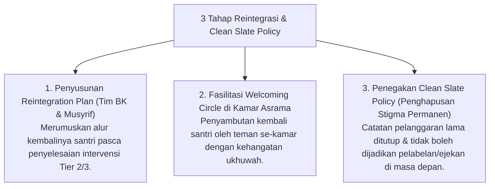

# P8-06-03: Protokol Ishlah al-Bain dan Clean Slate Policy

## Status Dokumen
* **Status**: 🌟 **A+ (Tervalidasi & Siap Diimplementasikan)**
* **Sub-Domain**: `08 Integrated Approaches / 06 Restorative Practices`
* **Penanggung Jawab Keilmuan**: Dewan Keilmuan TUMBUH (*Pakar Kuratif Restoratif & Pakar Bimbingan Konseling*)

---

## 1. Operasionalisasi Ishlah al-Bain & Clean Slate Policy

---

## 2. Jaminan Bebas Stigma

Lembaga menjamin bahwa santri yang telah menyelesaikan proses restoratif memiliki hak penuh untuk tumbuh kembali tanpa dibayang-bayangi kesalahan masa lalu (*Tajdid an-Niyyah*).
