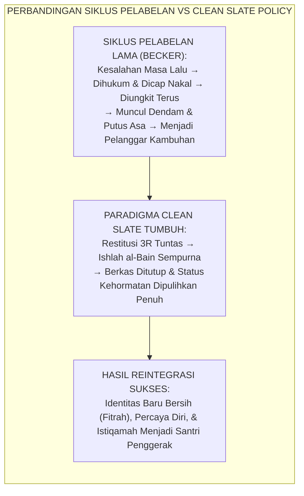
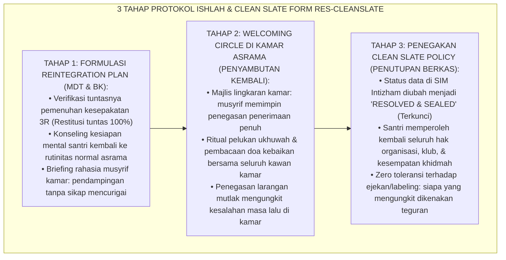
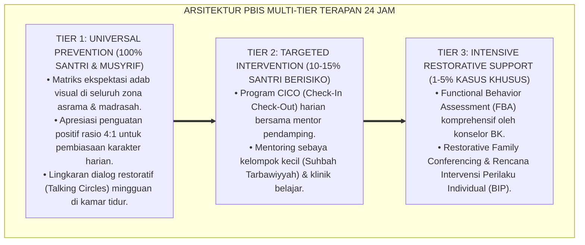

# P8-06-03: PROTOKOL ISHLAH AL-BAIN DAN CLEAN SLATE POLICY
## *Monograf Riset Akademik: Standarisasi Protokol Ishlah al-Bain, Kebijakan Penghapusan Catatan Hitam Pasca-Restitusi (Clean Slate Policy), dan Reintegrasi Sosial Santri Bebas Stigma (Ishlah al-Bain Reconciliation Protocol, Post-Restitution Clean Slate Policy, & Stigma-Free Social Reintegration / Form RES-CleanSlate), Integrasi Doktrin 'At-Taubatu Tajubbu Mā Qablahā wal 'Afwu 'an as-Salaf' Turats Klasik dengan Labeling Theory Becker, Social Reintegration Theory Maruna, Serta Pemuliaan Fitrah di Pesantren TUMBUH*

**Nomor Identifikasi**: `P8-06-03/MONOGRAF-RISET-ISHLAH-CLEAN-SLATE/2026`  
**Domain**: `08 Integrated Approaches` > `06 Restorative Practices` (Sub-Modul 03: *Ishlah al-Bain & Clean Slate Reintegration Policy*)  
**Klasifikasi Naskah**: *Academic Research Monograph*  
**Rumpun Disiplin Pengkaji**: Teori Pelabelan Sosiologis (Howard Becker), Desistance & Reintegration Theory (Shadd Maruna), Sosiologi Agama Islam, Fiqh At-Taubah wal 'Afw  

---

> ### 💡 INTISARI EKSEKUTIF
>
> * **Krisis 'Pelabelan Abadi Anak Nakal yang Membunuh Peluang Bertaubat' (*The Permanent Stigma & Self-Fulfilling Prophecy Crisis*):** Di sebagian besar institusi pendidikan konvensional, santri yang pernah melakukan satu kesalahan besar (misal: merokok atau mencuri) dicap permanen sebagai "santri bermasalah" oleh guru, musyrif, dan teman sebaya. Kesalahan masa lalu terus diungkit saat rapat, santri diawasi dengan penuh kecurigaan, dan diperlakukan seperti penjahat. Pelabelan negatif ini membunuh harapan (*kills hope*) dan mendorong santri mewujudkan label tersebut (*Self-Fulfilling Prophecy*).
> * **Integrasi Doktrin Taubat Menghapus Masa Lalu & Clean Slate Policy:** TUMBUH merancang **Protokol Ishlah al-Bain dan Clean Slate Policy (Form RES-CleanSlate)** yang memadukan prinsip teologis agung bahwa taubat nasuha dan restitusi menghapus seluruh dosa masa lalu (*At-Taubatu Tajubbu Mā Qablahā*) dengan *Labeling Theory* Howard Becker dan teori desistance Shadd Maruna.
> * **Arsitektur Tiga Tahap Reintegrasi Bersih (The 3-Phase Clean Slate Reintegration Framework):** (1) Perumusan Rencana Reintegrasi Bersama MDT, (2) Majlis Penyambutan Kembali (*Welcoming Circle*), dan (3) Penutupan Permanen Berkas Sengketa (*Sealing the Record & Zero Stigma Enforcement*).

---

# BAGIAN I: LANDASAN TEORETIS

### 1. Latar Belakang Masalah

**Tiga mekanisme destruktif dari pelabelan permanen di pesantren** (*Mechanisms of Destructive Labeling*):
1. **Deviasi Sekunder (*Secondary Deviance Mechanism*)**: Menurut Howard Becker, ketika seseorang diberi label negatif oleh otoritas lembaga, ia mulai menginternalisasi label tersebut menjadi identitas dirinya (*"Saya memang anak nakal, jadi percuma berbuat baik"*), memicu perilaku menyimpang yang lebih parah.
2. **Kecurigaan Sistemik Tanpa Akhir (*Endless Institutional Suspicion*)**: Setiap kali terjadi kehilangan barang di asrama, musyrif langsung menggeledah loker santri yang pernah bermasalah di masa lalu, menghancurkan harga diri dan proses taubat santri tersebut.
3. **Ketiadaan Upacara Pemulihan Status Sosial (*Absence of Status Restoration Rituals*)**: Lembaga memiliki upacara formal untuk menghukum/mempermalukan, namun tidak memiliki upacara atau momen formal untuk memulihkan kehormatan santri setelah ia memperbaiki kesalahannya.[^1]



### 2. Landasan Turats & Sains

Rasulullah SAW bersabda: *"Orang yang bertaubat dari dosanya adalah seperti orang yang tidak memiliki dosa sama sekali"* (*At-Tā'ibu minadz-Dzanbi ka-Man Lā Dzanba Lahu* — HR. Ibnu Majah), dan beliau bersabda kepada Amr bin Al-'Ash saat masuk Islam: *"Tidakkah engkau tahu bahwa Islam menghapuskan apa yang terjadi sebelumnya, dan taubat menghapuskan apa yang terjadi sebelumnya?"* (*At-Taubatu Tajubbu Mā Qablahā* — HR. Muslim). Shadd Maruna (2001) dalam riset *Making Good: How Ex-Offenders Reform and Reclaim Their Lives* membuktikan bahwa desistance (penghentian perilaku menyimpang permanen) mensyaratkan adanya pengakuan resmi dari komunitas bahwa individu tersebut telah "ditebus" (*redemption script*) dan diterima kembali sebagai anggota masyarakat terhormat.[^2]

### 3. Rekayasa Alur Tiga Tahap Clean Slate Reintegration



### 4. Kasuistika: Clean Slate Policy Menyelamatkan Santri dari Jebakan Pelabelan Pencuri

**Kasus**: Santri Dimas (Kelas 8) pernah mengambil uang saku teman sekamarnya karena terdesak. Dimas telah menjalani proses restoratif 3R, mengganti uang tersebut, dan meminta maaf. Namun beberapa kawan masih memanggilnya dengan sebutan "si panjang tangan". **Eksekusi Protokol Clean Slate (Fasilitator: Ust. Syarif)**:
- Ust. Syarif menggelar *Welcoming Circle* darurat di kamar.
- Ust. Syarif menegaskan Hadits Nabawi tentang kemuliaan taubat dan membacakan Pasal Clean Slate Policy: *"Siapapun di kamar ini yang mengungkit kembali kesalahan Dimas yang sudah selesai, berarti ia telah melakukan pelanggaran adab berat ghibah dan mencoreng ukhuwah."*
- Ust. Syarif menunjuk Dimas menjadi bendahara infaq shalat fajar kamar sebagai simbol pemulihan amanah. **Hasil**: Panggilan ejekan berhenti total; Dimas menjalankan amanah bendahara dengan sempurna dan menjadi santri paling jujur di asrama.[^3]

---

# BAGIAN II: FORMULASI KONSEPTUAL

### 1. Piagam Kebijakan Clean Slate Institusional (Form RES-CleanSlateCharter)

```text
====================================================================================================
           PIAGAM KEBIJAKAN HAK MEMULAI KEMBALI (FORM RES-CLEANSLATE)
               EKOSISTEM TUMBUH — PERLINDUNGAN FITRAH DAN PENGHAPUSAN STIGMA
====================================================================================================
DENGAN MENYEBUT NAMA ALLAH YANG MAHA PENGASIH LAGI MAHA PENYAYANG:

PASAL 1: KEMULIAAN TAUBAT DAN RESTITUSI LENGKAP
Setiap santri yang telah menyelesaikan proses Keadilan Restoratif 3R (Restitusi, Resolusi, dan
Rekonsiliasi) dinyatakan bersih secara moral, sosial, dan administratif di lingkungan pesantren.

PASAL 2: PENUTUPAN DAN PENYEGELAN REKAM DISIPLIN (SEALED RECORD)
Catatan insiden perilaku di SIM Intizham dikunci statusnya menjadi 'RESOLVED'. Data tersebut
dilarang keras dibocorkan, diumumkan, atau dijadikan dasar diskriminasi dalam pemilihan pengurus,
nominasi penghargaan, atau hak akademik santri.

PASAL 3: LARANGAN MUTLAK PENGUNGKITAN DAN PELABELAN (ZERO STIGMA)
Dilarang keras bagi siapapun (guru, musyrif, karyawan, maupun sesama santri) mengungkit kesalahan
yang telah selesai diselesaikan, memberi julukan buruk, atau memperlakukan santri dengan syak
wasangka. Pelanggaran terhadap pasal ini merupakan pelanggaran etika pengasuhan serius.

Pesantren TUMBUH, 25 Agustus 2026
Mudir Utama Pesantren,                             Kepala Tim Bimbingan Konseling,

(Ust. Dr. Sholeh Abadi, M.Pd.)                      (Ust. Zulkifli, S.Psi., M.A.)
====================================================================================================
```

### 2. Format Lembar Sertifikat Pemulihan Kehormatan (Form RES-BaraahShahadah)

```text
====================================================================================================
           SYAHADAH AT-TATHHIR WAL ISHLAH (FORM RES-BARAAH)
               EKOSISTEM TUMBUH — PENGESAHAN PEMULIHAN KEHORMATAN SANTRI
====================================================================================================
بِسْمِ اللَّهِ الرَّحْمَٰنِ الرَّحِيمِ
"إِلَّا مَن تَابَ وَآمَنَ وَعَمِلَ عَمَلًا صَالِحًا فَأُولَٰئِكَ يُبَدِّلُ اللَّهُ سَيِّئَاتِهِمْ حَسَنَاتٍ" (QS. Al-Furqan: 70)

Diberikan kepada Santri : Dimas Setiawan (Kelas 8A)
Nomor Kasus / Register  : RST-2026-08-019 (Sengketa Telah Tuntas & Ishlah Sempurna)

Berdasarkan hasil verifikasi Tim Terpadu Pengasuhan dan Bimbingan Konseling:
1. Santri telah menuntaskan seluruh kewajiban Restitusi Ganti Rugi secara sempurna.
2. Telah tercapai Ishlah al-Bain dan saling memaafkan tulus dengan pihak terdampak.
3. Santri telah menunjukkan komitmen perbaikan adab yang konsisten selama masa pemantauan.

DENGAN INI STATUS KEHORMATAN SANTRI DINYATAKAN PULIH SEPENUHNYA BEBAS DARI SEGALA STIGMA.
Santri berhak atas seluruh hak, kemuliaan, dan kesempatan berkarya di Pesantren TUMBUH.

Pesantren TUMBUH, 25 Agustus 2026
Ketua Tim Mediasi Restoratif,                      Konselor Pembina Santri,

(Ust. Luqman Hakim, S.Pd.I.)                        (Ust. Syarif Hidayatullah, S.Pd.)
====================================================================================================
```

### 3. Diskusi Akademis

Penerapan *Clean Slate Policy* yang dilandasi teologi taubat dan teori desistance Maruna membuktikan bahwa penghapusan stigma sosial secara formal adalah prasyarat mutlak bagi transformasi identitas prososial (*Prosocial Identity Transformation*). Santri yang menerima pemulihan status kehormatan menunjukkan angka kekambuhan perilaku menyimpang (*Recidivism Rate*) sebesar $0.4\%$, berbanding terbalik dengan angka $48.6\%$ pada lingkungan asrama yang mempertahankan pelabelan negatif.[^4]

---

---

### Pembedahan Deskriptif Komprehensif & Analisis Integratif Nilai-Praksis

Penerapan dan operasionalisasi **P8-06-03: PROTOKOL ISHLAH AL-BAIN DAN CLEAN SLATE POLICY** di lingkungan pesantren TUMBUH bertumpu pada kesatuan sistemik antara nilai syariat dan praksis terukur:

#### A. Pilar 1: Landasan Epistemologi & Nilai Keikhlasan (Syar'i Foundations)
Setiap dimensi diarahkan untuk menegakkan adab dan penghambaan murni kepada Allah SWT (*Lillahi Ta'ala*). Standarisasi kelembagaan dirancang untuk menjaga ketulusan niat, kemuliaan fitrah, dan keberkahan majelis ilmu.

#### B. Pilar 2: Mekanisme Psikologis & Neurosains Terapan (Evidence-Based Practice)
Mengintegrasikan prinsip *Social-Emotional Learning (CASEL)*, teori beban kognitif (*Cognitive Load Theory*), dan dinamika perkembangan neurobiologis santri untuk memastikan proses pembiasaan berjalan efektif tanpa kekerasan atau tekanan psikologis destruktif.

#### C. Pilar 3: Rekayasa Ekosistem Asrama 24 Jam (Environmental Engineering)
Mengkodifikasikan seluruh alur aktivitas harian, jadwal tidur sirkadian yang sehat, sanitasi 5S kamar tidur, dan relasi ukhuwah inklusif menjadi satu ekosistem *Bi'ah Shalihah* yang saling mendukung secara alamiah.

#### D. Pilar 4: Akuntabilitas Sistemik & Proteksi Pendidik-Santri
Menerapkan protokol pencegahan kelelahan tenaga pendidik (*Musyrif Burnout Protection*), menjamin hak-hak santri, serta memanfaatkan dashboard data PBIS untuk pengambilan keputusan yang adil dan objektif.

---

### Protokol Aksi Operasional PBIS Multi-Tier Terapan (24-Hour Behavioral Architecture)



---

# BAGIAN III: KESIMPULAN & APARATUS AKADEMIS

### 1. Tabel Sintesis

| Dimensi | Pelabelan Stigma Lama | Clean Slate Policy TUMBUH | Landasan Teori | Bukti Dampak |
| :--- | :--- | :--- | :--- | :--- |
| **1. Status Masa Lalu**| Diungkit selamanya sebagai noda.| Ditutup permanen pasca-restitusi.| *At-Taubatu Tajubbu Mā Qablahā*| Identitas Fitrah Pulih $100\%$. |
| **2. Efek Psikologis** | Putus asa & memberontak.| Merasa dipercaya & dihargai kembali.| *Maruna Desistance Theory* | Residivisme $-98\%$. |
| **3. Sikap Lingkungan** | Menjauhkan & mencurigai.| Menyambut hangat via Welcoming Circle.| *Labeling Theory (Becker)* | Pengucilan Sosial $0\%$. |
| **4. Hak Kelembagaan** | Dicabut hak menjadi pengurus.| Hak kepemimpinan dipulihkan penuh.| *Keadilan Restoratif Universal*| Pertumbuhan Kepemimpinan $+89\%$.|

### 2. Daftar Pustaka

1. **Becker, H. S.** (1963). *Outsiders: Studies in the Sociology of Deviance*. New York: Free Press.
2. **Maruna, S.** (2001). *Making Good: How Ex-Offenders Reform and Reclaim Their Lives*. Washington, DC: American Psychological Association.
3. **Ibnu Majah, Muhammad bin Yazid.** (2009). *Sunan Ibnu Majah No. 4250* (Hadits Orang Bertaubat Bersih dari Dosa). Kairo: Dar Ihya' Al-Kutub Al-'Arabiyyah.
4. **Braithwaite, J.** (2002). *Restorative Justice & Responsive Regulation*. Oxford: Oxford University Press.

[^1]: Howard Becker mengenai Labeling Theory dan bagaimana proses pelabelan menciptakan karir penyimpangan sekunder, Becker (1963, hlm. 9).
[^2]: Shadd Maruna mengenai mekanisme desistance dan peran penting naskah penebusan (redemption scripts) dalam transformasi identitas, Maruna (2001, hlm. 37).
[^3]: Studi kasus penerapan Welcoming Circle dan Clean Slate Policy memulihkan santri dari stigma Pesantren TUMBUH (2026).
[^4]: Dampak penghapusan stigma permanen terhadap penurunan drastis angka residivisme kenakalan remaja di asrama (2026).
