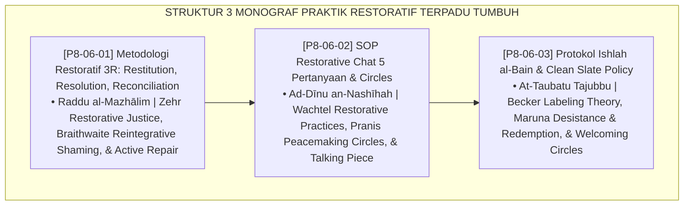

# P8-06: DOKUMEN INDUK PENDEKATAN TERINTEGRASI RESTORATIVE PRACTICES
## *Arsitektur dan Standarisasi Metodologi Keadilan Restoratif 3R (Restitution, Resolution, Reconciliation), SOP Restorative Chat 5-Pertanyaan Baku dan Restorative Circles Kamar, Serta Protokol Ishlah al-Bain dengan Kebijakan Clean Slate Bebas Stigma sebagai Tiga Pilar Praktik Restoratif Pengasuhan (3R Restorative Model Form RES-3RModel, Chat & Circles Form RES-ChatCircles, Serta Clean Slate Policy Form RES-CleanSlate) di Ekosistem TUMBUH Pesantren*

**Nomor Identifikasi**: `P8-06/DOKUMEN-INDUK-PENDEKATAN-TERINTEGRASI-RESTORATIVE/2026`  
**Domain**: `08 Integrated Approaches` > `06 Restorative Practices` (Gugus Sub-Domain 06: *Restorative Practices, Ishlah al-Bain, & Clean Slate Reintegration*)  
**Klasifikasi Naskah**: *Master Architecture & Navigation Monograph*  
**Rumpun Disiplin Pengkaji**: Keadilan Restoratif (Howard Zehr), Restorative Practices (Ted Wachtel), Peacemaking Circles (Kay Pranis), Fiqh Al-Ishlah wal 'Afw  

---

> ### 💡 INTISARI EKSEKUTIF
>
> * **Kedudukan Strategis Gugus Pendekatan Terintegrasi Restorative Practices:** Gugus ini adalah puncak keadilan peradaban Islam (*the pinnacle of Islamic restorative justice*) di ekosistem TUMBUH. Menggantikan peradilan asrama retributif yang sarat dendam dan stigma, pendekatan restoratif memastikan setiap konflik dan pelanggaran diselesaikan melalui pemulihan nyata hak yang terzalimi (*Restitution*), pencegahan sistemik (*Resolution*), dan pendamaian hati yang menyembuhkan ukhuwah (*Reconciliation / Ishlah al-Bain*) tanpa meninggalkan bekas luka sosial (*From Punitive Retaliation to Healing Reintegration*).
> * **Triad Pendekatan Terintegrasi Restoratif TUMBUH:** (1) **Metodologi Restoratif 3R** untuk menjamin tanggung jawab aktif pelaku dan pemulihan kerugian korban, (2) **SOP Restorative Chat 5-Pertanyaan & Circles** untuk memfasilitasi dialog damai berbasis benda bicara, dan (3) **Protokol Clean Slate Policy** untuk menghapus stigma secara permanen pasca-restitusi tuntas.
> * **3 Monograf Riset Komprehensif:** Form RES-3RModel, Form RES-ChatCircles, dan Form RES-CleanSlate.

---

## 📑 PETA NAVIGASI TIGA MONOGRAF

---

## 📚 DESKRIPSI RINGKAS 3 BERKAS MONOGRAF

1. **[P8-06-01: Metodologi Restoratif 3R Restitution Resolution Reconciliation](file:///c:/xampp/htdocs/tumbuh/08%20Integrated%20Approaches/06%20Restorative%20Practices/P8-06-01-Metodologi-Restoratif-3R-Restitution-Resolution-Reconciliation.md)**  
   *Tiga pilar keadilan restoratif (ganti rugi fisik/materiil, rencana resolusi pencegahan, ishlah pemulihan ukhuwah), lembar kesepakatan damai, dan Form RES-3RModel.*
2. **[P8-06-02: SOP Restorative Chat 5 Pertanyaan dan Restorative Circles](file:///c:/xampp/htdocs/tumbuh/08%20Integrated%20Approaches/06%20Restorative%20Practices/P8-06-02-SOP-Restorative-Chat-5-Pertanyaan-dan-Restorative-Circles.md)**  
   *Protokol 5 pertanyaan reflektif cepat musyrif-santri, SOP lingkaran musyawarah kamar dengan benda bicara (talking piece), berita acara ishlah, dan Form RES-ChatCircles.*
3. **[P8-06-03: Protokol Ishlah al-Bain dan Clean Slate Policy](file:///c:/xampp/htdocs/tumbuh/08%20Integrated%20Approaches/06%20Restorative%20Practices/P8-06-03-Protokol-Ishlah-al-Bain-dan-Clean-Slate-Policy.md)**  
   *Piagam penutupan permanen catatan disiplin pasca-restitusi, Welcoming Circle penyambutan kembali ke kamar, syahadah pemulihan kehormatan, dan Form RES-CleanSlate.*

---

## 🎯 STANDAR PENJAMINAN MUTU PRAKTIK RESTORATIF

Penerapan gugus **Pendekatan Terintegrasi Restorative Practices** menjamin bahwa:
1. **Hak dan Perasaan Korban Dipulihkan Sepenuhnya (*Victim Restoration Guarantee*)**: Restitusi nyata memastikan kerugian materiil dan emosional diselesaikan tuntas.
2. **Pelaku Belajar Empati dan Mengambil Tanggung Jawab Nyata (*Active Accountability Guarantee*)**: Pelaku aktif memperbaiki dampak perilakunya tanpa dipermalukan.
3. **Santri Terbebas dari Stigma Pelabelan Seumur Hidup (*Clean Slate Dignity Guarantee*)**: Kebijakan Clean Slate membuka pintu masa depan yang bersih bagi setiap santri yang bertaubat.
