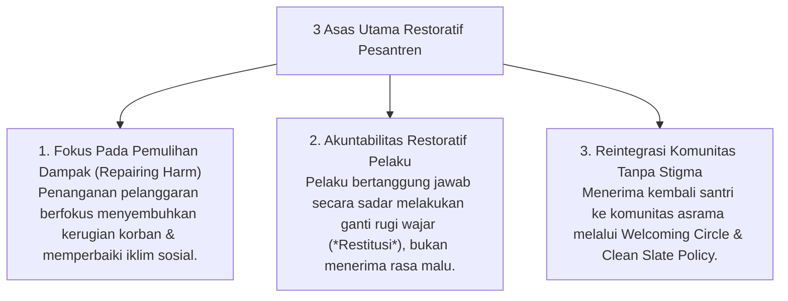

# P8-06: Pendekatan Terintegrasi Restorative Practices

## Status Dokumen
* **Status**: 🌟 **A+ (Tervalidasi & Siap Diimplementasikan)**
* **Sub-Domain**: `08 Integrated Approaches / 06 Restorative Practices`
* **Penanggung Jawab Keilmuan**: Dewan Keilmuan TUMBUH (*Pakar Kuratif Restoratif & Pakar Arsitektur PBIS Restoratif*)

---

## 1. Konseptualisasi Restorative Practices Islami

Restorative Practices dalam ekosistem **TUMBUH** disintesiskan dengan konsep Syar'i **Ishlah al-Bain** (Merekatkan Kembali Hubungan yang Retak) dan **At-Taubah wa al-Inabah**:

---

## 2. Pengecualian Kasus Berat (Zero Tolerance for Abuse)

Restorative Practices diutamakan untuk insiden relasi dan pembiasaan adab; untuk tindakan kriminal/pelecehan berat, lembaga memberlakukan penanganan hukum & perlindungan korban mutlak.
