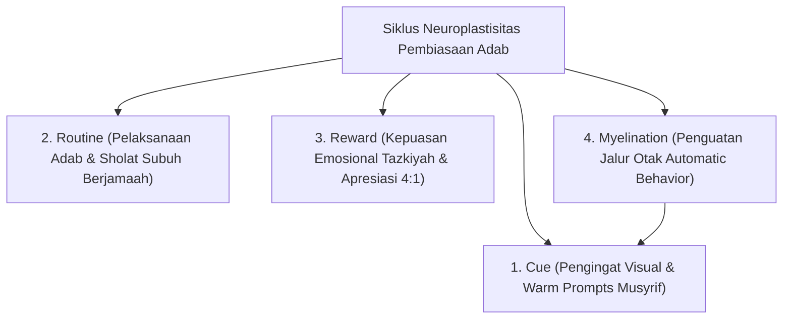

# P8-07-01: Integrasi Neurosains Kognitif dan Neuroplastisitas Adab

## Status Dokumen
* **Status**: 🌟 **A+ (Tervalidasi & Siap Diimplementasikan)**
* **Sub-Domain**: `08 Integrated Approaches / 07 Future Approaches`
* **Penanggung Jawab Keilmuan**: Dewan Keilmuan TUMBUH (*Pakar Neurosains Perkembangan & Pakar Desain Kurikulum Adab*)

---

## 1. Operasionalisasi Neuroplastisitas Adab (Synaptic Wiring)

Neurosains kognitif membuktikan bahwa pembiasaan adab harian santri secara berulang meretas jalur sinaptik baru di otak (*Neuroplasticity*):

---

## 2. Pengaruh Pada Pembentukan Karakter Otomatis

Pengulangan adab selama 66 hari konsisten mengubah usaha berat (*Cognitive Control*) menjadi otomatisasi adab (*Automatic Habituation*) yang melekat pada kepribadian santri.
