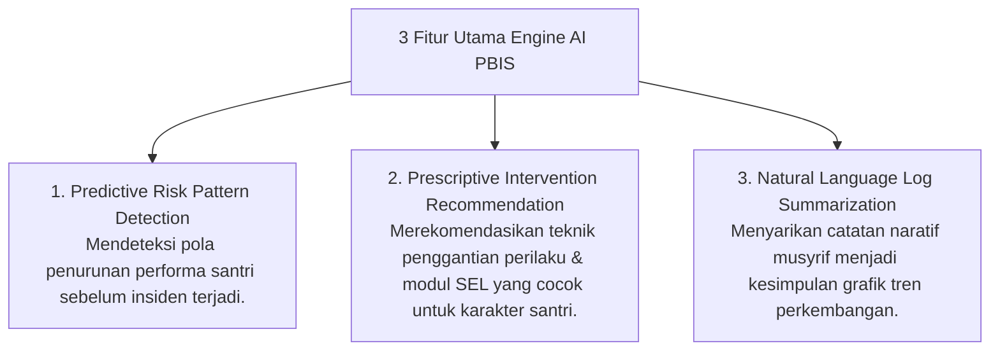

# P8-07-02: Pemanfaatan Teknologi AI dan Analitik Preskriptif PBIS

## Status Dokumen
* **Status**: 🌟 **A+ (Tervalidasi & Siap Diimplementasikan)**
* **Sub-Domain**: `08 Integrated Approaches / 07 Future Approaches`
* **Penanggung Jawab Keilmuan**: Dewan Keilmuan TUMBUH (*Pakar Arsitektur Digital Pesantren & Pakar PBIS*)

---

## 1. Operasionalisasi AI-Driven Prescriptive Analytics

Sistem analitik preskriptif berbasis kecerdasan buatan membantu Tim BK dan Musyrif memprediksi dan merumuskan intervensi optimal secara personal:

---

## 2. Pengawasan Manusia (*Human-in-the-Loop*)

Kecerdasan buatan hanya memberikan rekomendasi preskriptif; keputusan akhir pengasuhan dan konseling tetap berada di tangan Musyrif dan Konselor BK (*Human Centric Governance*).
