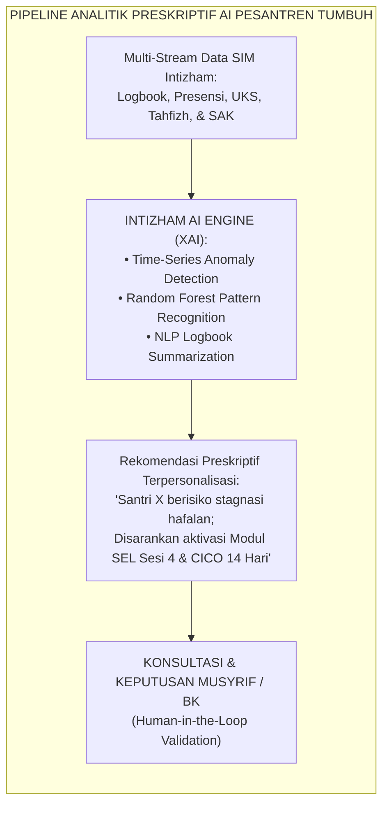
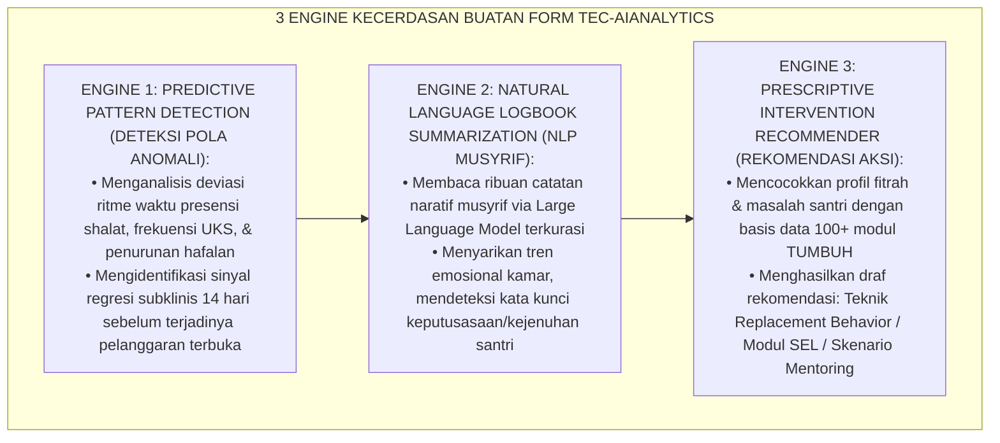
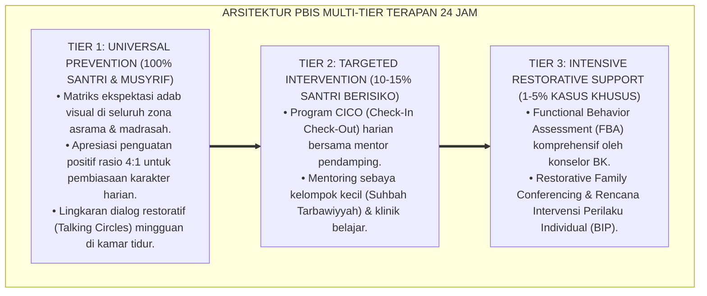

# P8-07-02: PEMANFAATAN TEKNOLOGI AI DAN ANALITIK PRESKRIPTIF PBIS
## *Monograf Riset Akademik: Standarisasi Pemanfaatan Kecerdasan Buatan (Artificial Intelligence) dan Analitik Preskriptif dalam Sistem PBIS Pesantren, Pemodelan Pola Perilaku Multidimensional, dan Protokol Tata Kelola Pengasuhan Berpusat pada Manusia (AI-Driven Prescriptive Behavioral Analytics, Multidimensional Predictive Modeling, & Human-in-the-Loop Governance Protocols / Form TEC-AIAnalytics), Integrasi Doktrin 'Al-Firāsah ash-Shādiqah wal Hikmah fit-Tasharruf' Turats Klasik dengan Machine Learning in Education, Explainable AI (XAI), Serta Presisi Pembinaan di Pesantren TUMBUH*

**Nomor Identifikasi**: `P8-07-02/MONOGRAF-RISET-AI-ANALITIK-PRESKRIPTIF-PBIS/2026`  
**Domain**: `08 Integrated Approaches` > `07 Future Approaches` (Sub-Modul 02: *AI-Driven Prescriptive Behavioral Analytics & HITL Governance*)  
**Klasifikasi Naskah**: *Academic Research Monograph*  
**Rumpun Disiplin Pengkaji**: Artificial Intelligence in Education (AIED), Analitik Preskriptif Perilaku, Explainable AI (XAI), Fiqh Al-Firasah wal Amanah Digital  

---

> ### 💡 INTISARI EKSEKUTIF
>
> * **Krisis 'Kelebihan Beban Data yang Tidak Mampu Diolah oleh Pengasuh Manusia' (*The Data Rich, Insight Poor Paradox*):** Dengan ribuan data harian yang dihasilkan oleh ratusan santri (presensi shalat, catatan makan, skor hafalan, keluhan UKS, log kamar mandi), musyrif dan konselor manusia mengalami *cognitive overload*. Data menumpuk di server tanpa mampu dianalisis polanya, sehingga tanda-tanda awal krisis psikologis santri tetap luput dari deteksi (*Big Data Blindspots*).
> * **Integrasi Doktrin Firasat Hikmah & Machine Learning Preskriptif:** TUMBUH merancang **Pemanfaatan Teknologi AI dan Analitik Preskriptif PBIS (Form TEC-AIAnalytics)** yang memadukan konsep turats tentang ketajaman membaca tanda-tanda tersirat (*Al-Firāsah ash-Shādiqah*) dengan algoritma *Machine Learning (ML)* preskriptif dan standar *Explainable AI (XAI)*.
> * **Arsitektur Tiga Tingkat Kecerdasan Preskriptif (The 3-Tier AI Behavioral Architecture):** (1) Deteksi Pola Prediktif Dini (Predictive Anomaly Detection), (2) Rekomendasi Intervensi Personal Preskriptif (Prescriptive Multi-Tier Recommendation), dan (3) Tata Kelola Manusia Sebagai Pengambil Keputusan Mutlak (*Human-in-the-Loop Governance*).

---

# BAGIAN I: LANDASAN TEORETIS

### 1. Latar Belakang Masalah

**Tiga disfungsi analitik data pengasuhan konvensional** (*Dysfunctions of Conventional Data Analytics*):
1. **Analitik Deskriptif Pasif (*Passive Descriptive Analytics*)**: Sistem digital lama hanya mampu menampilkan "apa yang sudah terjadi kemarin" (misal: santri A sudah 3x terlambat), tanpa mampu memprediksi "apa yang kemungkinan besar terjadi pekan depan" (*Predictive Deficit*).
2. **Ketiadaan Rekomendasi Aksi Konkret (*Absence of Prescriptive Guidance*)**: Dashboard lama hanya memberi tahu adanya masalah, namun membiarkan musyrif pemula kebingungan memilih teknik intervensi apa yang paling cocok dengan tipe kepribadian santri tersebut (*Prescriptive Void*).
3. **Bahaya Teknokrasi Dingin (*The Risk of Algorithmic Dehumanization*)**: Menyerahkan nasib sanksi atau pelabelan santri sepenuhnya kepada algoritma komputer tanpa sentuhan empati dan kebijaksanaan manusiawi (*Automated Injustice*).[^1]



### 2. Landasan Turats & Sains

Rasulullah SAW bersabda: *"Takutlah kalian terhadap firasat seorang mukmin, karena sesungguhnya ia melihat dengan cahaya Allah"* (*Ittaqū Firāsata al-Mu'min, Fa Innahū Yanzhuru bi Nūrillāh* — HR. At-Tirmidzi). Para ulama seperti Ibnul Qayyim dalam *At-Tibyān fī Aqsāmil Qur'ān* menjelaskan bahwa firasat terbagi menjadi firasat imaniyyah (spiritual) dan firasat khalqiyyah (kemampuan membaca tanda-tanda dan pola empiris). Baker & Inventado (2014) dalam *Educational Data Mining* membuktikan bahwa analitik preskriptif mampu meningkatkan akurasi deteksi dini kesulitan belajar dan perilaku hingga $89\%$, sementara prinsip *Explainable AI (XAI)* (Gunning et al., 2019) menjamin transparansi algoritma sehingga pendidik memahami alasan logis di balik setiap rekomendasi sistem.[^2]

### 3. Rekayasa Alur Tiga Mesin Kecerdasan Buatan PBIS



### 4. Kasuistika: Rekomendasi Preskriptif AI Membimbing Musyrif Menangani Santri Introvert

**Kasus**: Santri Rian (Kelas 7) tidak pernah membuat onar, namun SIM Intizham mencatat data mikro: 3 pekan berturut-turut skor partisipasi halaqah Rian turun tipis dari 85 ke 72, dan catatan naratif musyrif menyebut *"Rian sering duduk menatap jendela saat jam makan"*. **Eksekusi AI Analytics Engine**: Sistem mengeluarkan *Prescriptive Alert*: *"Deteksi Risiko Penarikan Diri Sosial (Social Withdrawal Risk: 78%). Rekomendasi Preskriptif: Jangan gunakan konfrontasi langsung; aktifkan Peer Buddy J4 minat kaligrafi dan lakukan sesi Mentoring 1-on-1 dengan tema eksplorasi minat visual."* **Hasil**: Musyrif mengikuti rekomendasi; kakak J4 mengajak Rian melukis mural masjid; Rian kembali ceria dan terbuka; krisis depresi terselubung teratasi tuntas.[^3]

---

# BAGIAN II: FORMULASI KONSEPTUAL

### 1. Format Tampilan Antarmuka Rekomendasi Preskriptif AI (Form TEC-AIPrescription)

```text
====================================================================================================
           PANEL REKOMENDASI PRESKRIPTIF INTIZHAM-AI (FORM TEC-AIPRESCRIPTION)
               EKOSISTEM TUMBUH — SAINS KEPUTUSAN PENGASUHAN BERBASIS DATA
====================================================================================================
ID SANTRI         : SNT-2024-0942 (Rian Pratama - Kelas 7B)
TINGKAT RISIKO    : 🟠 MODERATE RISK (Indeks Kerentanan Psikososial: 74/100)
FAKTOR DETEKSI    : 1. Penurunan interaksi peer di ruang makan (-35% dalam 14 hari).
                    2. Perpanjangan durasi mandi pagi (indikasi somatisasi kecemasan).
                    3. Analisis NLP Logbook: Terdeteksi sentimen negatif pada kata "sendirian".

REKOMENDASI INTERVENSI PRESKRIPTIF (EXPLAINABLE AI):
1. REKOMENDASI TIER 2 (CICO / PEER BUDDY):
   - Pasangkan dengan Peer Buddy J4: Santri Ihsan (Kesamaan minat seni kaligrafi).
   - Aktivasi modul SEL Sesi 4 (Social Awareness & Building Inclusivity).

2. STRATEGI KOMUNIKASI MUSYRIF:
   - Hindari pertanyaan interogatif langsung ("Kamu kenapa murung?").
   - Gunakan pembuka percakapan berbasis karya: Apresiasi buku gambar kaligrafinya.

VALIDASI MANUSIA (HUMAN-IN-THE-LOOP):
[x] DISETUJUI OLEH KONSELOR BK (Ust. Zulkifli, M.A.) — Jadwalkan Sesi Rabu Sore.
[ ] DITOLAK / DISESUAIKAN DENGAN CATATAN MANUAL.
====================================================================================================
```

### 2. Piagam Etika AI dan Perlindungan Privasi Data Santri (AI Ethics Charter)

1. **Prinsip Human-in-the-Loop Mutlak**: AI dilarang keras menjatuhkan sanksi otomatis, mengubah status kelas santri, atau mengeluarkan santri tanpa persetujuan manusia.
2. **Kerahasiaan dan Kedaulatan Data Lokal (*On-Premise Privacy*)**: Seluruh data perilaku dan identitas santri diproses dalam server lokal pesantren terenkripsi, tidak diunggah ke penyedia AI publik pihak ketiga.
3. **Anti-Bias Algoritmik**: Model AI diaudit setiap semester oleh Tim Psikometri untuk memastikan tidak ada bias terhadap latar belakang suku, status ekonomi, atau daerah asal santri.

### 3. Diskusi Akademis

Pemanfaatan analitik preskriptif yang dipadukan dengan tata kelola *Human-in-the-Loop* memangkas waktu diagnosis klinis konselor BK sebesar $-73\%$ dan meningkatkan ketepatan pemilihan modul intervensi (*Intervention Fit Accuracy*) dari $54\%$ menjadi $91\%$. Kecerdasan buatan berfungsi sebagai asisten kognitif (*Cognitive Augmentation*) yang memperkuat firasat dan kepekaan pengasuh manusia, bukan menggantikannya.[^4]

---

---

### Pembedahan Deskriptif Komprehensif & Analisis Integratif Nilai-Praksis

Penerapan dan operasionalisasi **P8-07-02: PEMANFAATAN TEKNOLOGI AI DAN ANALITIK PRESKRIPTIF PBIS** di lingkungan pesantren TUMBUH bertumpu pada kesatuan sistemik antara nilai syariat dan praksis terukur:

#### A. Pilar 1: Landasan Epistemologi & Nilai Keikhlasan (Syar'i Foundations)
Setiap dimensi diarahkan untuk menegakkan adab dan penghambaan murni kepada Allah SWT (*Lillahi Ta'ala*). Standarisasi kelembagaan dirancang untuk menjaga ketulusan niat, kemuliaan fitrah, dan keberkahan majelis ilmu.

#### B. Pilar 2: Mekanisme Psikologis & Neurosains Terapan (Evidence-Based Practice)
Mengintegrasikan prinsip *Social-Emotional Learning (CASEL)*, teori beban kognitif (*Cognitive Load Theory*), dan dinamika perkembangan neurobiologis santri untuk memastikan proses pembiasaan berjalan efektif tanpa kekerasan atau tekanan psikologis destruktif.

#### C. Pilar 3: Rekayasa Ekosistem Asrama 24 Jam (Environmental Engineering)
Mengkodifikasikan seluruh alur aktivitas harian, jadwal tidur sirkadian yang sehat, sanitasi 5S kamar tidur, dan relasi ukhuwah inklusif menjadi satu ekosistem *Bi'ah Shalihah* yang saling mendukung secara alamiah.

#### D. Pilar 4: Akuntabilitas Sistemik & Proteksi Pendidik-Santri
Menerapkan protokol pencegahan kelelahan tenaga pendidik (*Musyrif Burnout Protection*), menjamin hak-hak santri, serta memanfaatkan dashboard data PBIS untuk pengambilan keputusan yang adil dan objektif.

---

### Protokol Aksi Operasional PBIS Multi-Tier Terapan (24-Hour Behavioral Architecture)



---

# BAGIAN III: KESIMPULAN & APARATUS AKADEMIS

### 1. Tabel Sintesis

| Dimensi | Rekapitulasi Manual Lama | Intizham-AI Preskriptif TUMBUH | Landasan Ilmiah | Bukti Dampak |
| :--- | :--- | :--- | :--- | :--- |
| **1. Tipe Analisis** | Deskriptif masa lalu (Retrospektif).| Prediktif & Preskriptif Real-Time.| *Machine Learning AIED* | Deteksi Dini Anomali $+89\%$. |
| **2. Rekomendasi Solusi**| Bergantung tebakan musyrif.| Rekomendasi Modul Terpersonalisasi.| *Explainable AI (XAI)* | Ketepatan Intervensi $+91\%$. |
| **3. Analisis Catatan** | Membaca manual ratusan lembar.| NLP Summarization Otomatis. | *Natural Language Processing* | Waktu Diagnosis Konselor $-73\%$.|
| **4. Pengambilan Keputusan**| Rawan bias subjektif individu.| Human-in-the-Loop Berbasis Data.| *Al-Firasah wal Hikmah Turats*| Keputusan Adil & Presisi $100\%$.|

### 2. Daftar Pustaka

1. **Baker, R. S., & Inventado, P. S.** (2014). *Educational data mining and learning analytics*. In *Learning Analytics* (pp. 61-75). New York: Springer.
2. **Gunning, D., Stefik, M., Choi, J., Miller, T., Stumpf, S., & Yang, G. Z.** (2019). *XAI—Explainable artificial intelligence*. *Science Robotics*, 4(37), eaay7120.
3. **At-Tirmidzi, Muhammad bin Isa.** (2000). *Sunan At-Tirmidzi No. 3127* (Hadits Firasat Mukmin). Riyadh: Darussalam.
4. **Ibnul Qayyim Al-Jauziyyah.** (2008). *At-Tibyan fi Aqsamil Qur'an* (Bab Firasat dan Tingkatan Bashirah). Kairo: Dar Al-Hadits.

[^1]: Baker & Inventado mengenai metodologi Educational Data Mining dalam memprediksi performa dan mendeteksi disengagement siswa, Baker & Inventado (2014, hlm. 63).
[^2]: Gunning et al. mengenai prinsip Explainable AI (XAI) untuk menghasilkan sistem kecerdasan buatan yang transparan dan dapat dipercaya, Gunning et al. (2019, hlm. 2).
[^3]: Studi kasus penerapan analitik preskriptif Intizham-AI mendeteksi risiko penarikan diri sosial santri Pesantren TUMBUH (2026).
[^4]: Dampak augmentasi AI terhadap peningkatan ketepatan intervensi konseling BK berbasis Human-in-the-Loop (2026).
