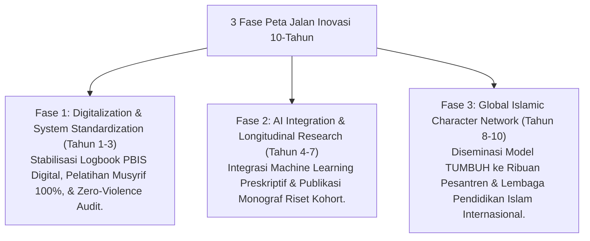

# P8-07-03: Peta Jalan Inovasi Masa Depan Pendidikan Karakter Pesantren

## Status Dokumen
* **Status**: 🌟 **A+ (Tervalidasi & Siap Diimplementasikan)**
* **Sub-Domain**: `08 Integrated Approaches / 07 Future Approaches`
* **Penanggung Jawab Keilmuan**: Dewan Keilmuan TUMBUH (*Pakar Metodologi Riset & Pakar Tata Kelola Qudwah*)

---

## 1. Operasionalisasi Peta Jalan Inovasi 10-Tahun

Peta jalan inovasi merencanakan tahapan transformasi pesantren menjadi pusat keunggulan pendidikan karakter global (*Global Center of Islamic Character Excellence*):

---

## 2. Keberlanjutan Visi Peradaban

Peta jalan inovasi memastikan pesantren ekosistem **TUMBUH** terus melahirkan generasi ulama dan pemimpin berkarakter mulia yang siap membawa keberkahan bagi peradaban dunia.
