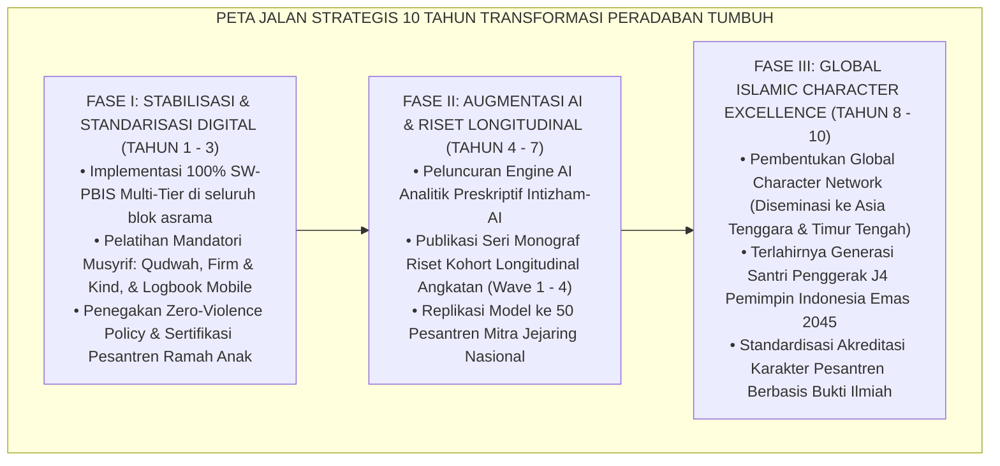
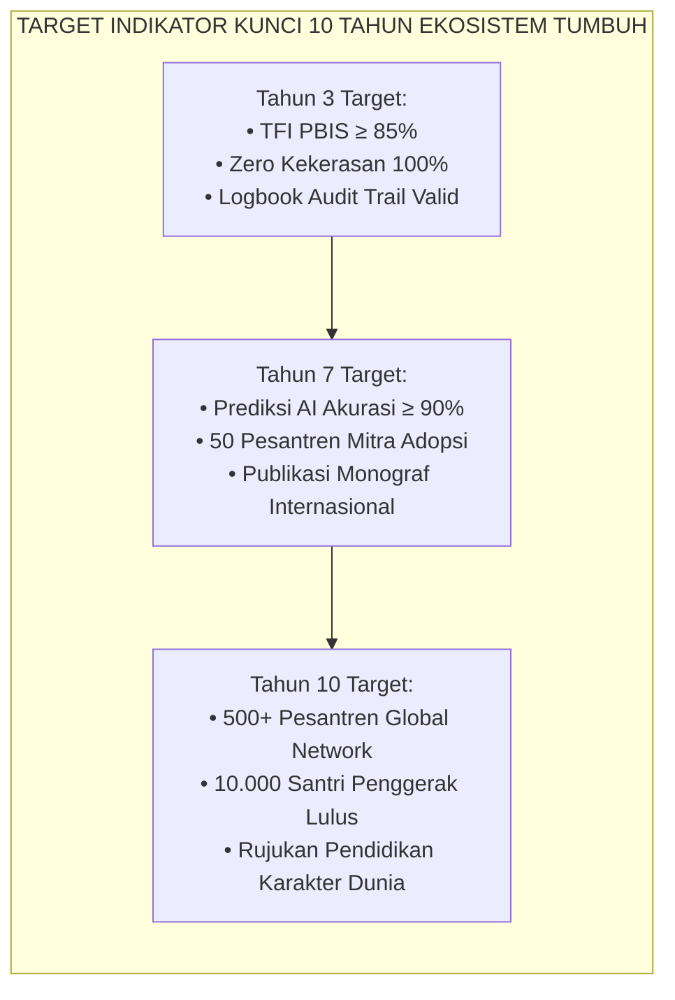
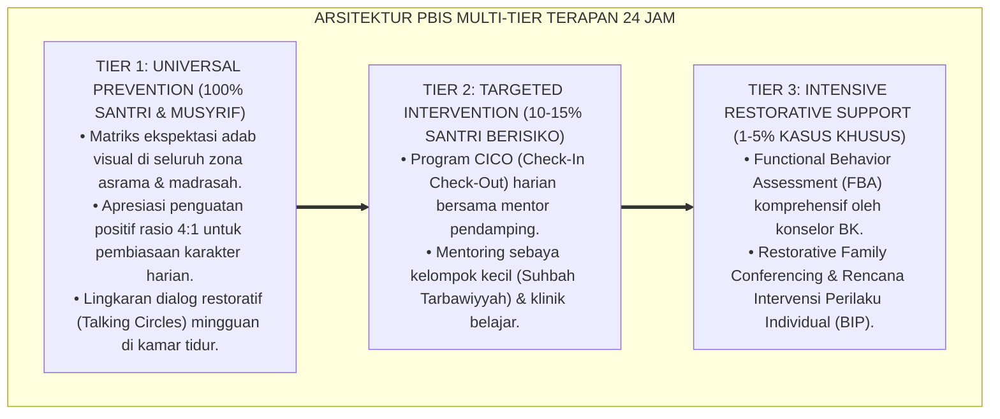

# P8-07-03: PETA JALAN INOVASI MASA DEPAN PENDIDIKAN KARAKTER PESANTREN
## *Monograf Riset Akademik: Standarisasi Peta Jalan Strategis 10-Tahun Transformasi Pendidikan Karakter Pesantren, Model Diseminasi Jaringan Keunggulan Karakter Islam Global, dan Keberlanjutan Ekosistem TUMBUH Menuju Indonesia Emas 2045 (10-Year Strategic Character Education Innovation Roadmap, Global Islamic Character Network Dissemination Model, & TUMBUH Civilizational Sustainability / Form FUT-Roadmap), Integrasi Doktrin 'Al-Istikhlāf wa 'Imāratul Ardh bil-Ilmi wal Adab' Turats Klasik dengan Strategic Foresight Science, Christensen Disruptive Innovation Theory, Serta Kepemimpinan Peradaban di Pesantren TUMBUH*

**Nomor Identifikasi**: `P8-07-03/MONOGRAF-RISET-PETA-JALAN-INOVASI-MASA-DEPAN/2026`  
**Domain**: `08 Integrated Approaches` > `07 Future Approaches` (Sub-Modul 03: *10-Year Strategic Character Innovation Roadmap*)  
**Klasifikasi Naskah**: *Academic Research Monograph*  
**Rumpun Disiplin Pengkaji**: Strategic Foresight & Futures Studies, Manajemen Inovasi Pendidikan (Christensen), Islamic Civilizational Leadership, Fiqh Al-Istikhlaf wa 'Imaratul Ardh  

---

> ### 💡 INTISARI EKSEKUTIF
>
> * **Krisis 'Pesantren yang Tertinggal Zaman Tanpa Visi Strategis Jangka Panjang' (*The Short-Sighted Institutional Drift Crisis*):** Sebagian besar pesantren beroperasi dari tahun ke tahun tanpa rencana strategis (*strategic roadmap*) yang terukur. Akibatnya, lembaga kewalahan menghadapi perubahan teknologi, disrupsi generasi Alpha, dan krisis karakter kontemporer, berujung pada hilangnya relevansi pesantren sebagai pusat peradaban (*Loss of Civilizational Relevance*).
> * **Integrasi Doktrin Istikhlaf Peradaban & Strategic Foresight Science:** TUMBUH merancang **Peta Jalan Inovasi Masa Depan Pendidikan Karakter Pesantren (Form FUT-Roadmap)** yang memadukan mandat khilafah memakmurkan bumi dengan ilmu dan adab (*'Imāratul Ardh bil-Ilmi wal Adab*) dengan metodologi *Strategic Foresight* dan teori inovasi Clayton Christensen.
> * **Arsitektur Tiga Fase Transformasi Dekade (The 3-Phase 10-Year Evolution Architecture):** Fase I (Tahun 1–3: Standardisasi Digital & Konsolidasi Mutu PBIS), Fase II (Tahun 4–7: Integrasi AI Preskriptif & Validasi Riset Kohort Longitudinal), dan Fase III (Tahun 8–10: Jaringan Pusat Keunggulan Karakter Islam Global).

---

# BAGIAN I: LANDASAN TEORETIS

### 1. Latar Belakang Masalah

**Tiga jebakan kelembagaan pendidikan Islam abad ke-21** (*21st-Century Islamic Education Traps*):
1. **Perencanaan Jangka Pendek Serba Reaktif (*Myopic Reactive Planning*)**: Anggaran dan program dirancang hanya untuk memenuhi kebutuhan satu tahun ajaran, tanpa antisipasi tren teknologi dan demografi 10 tahun ke depan.
2. **Sindrom Menara Gading Eksklusif (*Isolated Ivory Tower Syndrome*)**: Model keberhasilan pengasuhan hanya dinikmati oleh satu pesantren percontohan tanpa ada desain replikasi dan diseminasi terbuka untuk membantu ribuan pesantren lain (*Lack of Scalability*).
3. **Kompromi Nilai Turats demi Mengejar Tren Semu (*Compromising Core Values for Trends*)**: Mengadopsi teknologi digital secara serampangan hingga mengikis adab klasik, ketawadhuan, dan keberkahan hubungan guru-santri (*Technological Secularization*).[^1]



### 2. Landasan Turats & Sains

Al-Qur'an mewajibkan kepemimpinan visioner yang merencanakan masa depan generasi secara matang: *"Dan hendaklah takut (kepada Allah) orang-orang yang sekiranya mereka meninggalkan di belakang mereka anak-anak yang lemah, yang mereka khawatir terhadap (kesejahteraan) mereka. Oleh sebab itu, hendaklah mereka bertakwa kepada Allah dan hendaklah mereka berbicara dengan tutur kata yang benar"* (*Wal Yakhsyalladzīna Law Tarakū min Khalfihim Dzurriyyatan Dhi'āfan Khāfū 'Alaihim...* — QS. An-Nisa: 9). Clayton M. Christensen (1997, 2008) dalam *Disrupting Class: How Disruptive Innovation Will Change the Way the World Learns* membuktikan bahwa transformasi pendidikan yang berkelanjutan membutuhkan inovasi modular yang berakar pada pemenuhan kebutuhan intrinsik pengguna (*Student-Centric Paradigm*). Voros (2003) menetapkan metodologi *Generic Foresight Framework* untuk merancang masa depan yang diinginkan (*Preferable Futures*).[^2]

### 3. Rekayasa Matriks Indikator Kunci Keberhasilan 10-Tahun (KPI Decadal Matrix)



### 4. Kasuistika: Replikasi Model TUMBUH Mentransformasi Pesantren Tradisional Mitra

**Kasus**: Pesantren Al-Hidayah (Pesantren Salaf Mitra di Jawa Timur, 450 santri) mengalami krisis tingginya angka santri keluar ($18\%$ per tahun) dan konflik kekerasan senior-junior. **Eksekusi Adopsi Model TUMBUH (Fase II Roadmap)**:
- Pesantren Al-Hidayah mengadopsi modul PBIS Tier 1, melatih seluruh musyrif dengan prinsip *Firm & Kind*, dan memberlakukan *Piagam Peer Buddy J4 Bebas Feodalisme*.
- SIM Intizham diimplementasikan untuk pelacakan logbook mobile harian. **Hasil**: Dalam 18 bulan, insiden perkelahian turun menjadi 0, angka retensi santri melonjak ke $98.5\%$, dan pesantren mitra bertransformasi menjadi pesantren modern terdepan di wilayahnya tanpa kehilangan tradisi kajian kitab kuningnya.[^3]

---

# BAGIAN II: FORMULASI KONSEPTUAL

### 1. Spesifikasi Tiga Pilar Keberlanjutan Peradaban (Form FUT-SustainabilitySpec)

| Pilar Keberlanjutan | Program Strategis 10-Tahun | Output Terukur | Dampak Peradaban |
| :--- | :--- | :--- | :--- |
| **1. Keberlanjutan Keilmuan (Epistemologis)** | Publikasi Seri Buku Monograf Riset TUMBUH & Jurnal Karakter Islam Peer-Reviewed. | 11 Volume Seri Monograf Riset Terindeks Internasional. | Menjadi rujukan akademik global integrasi Turats-Sains. |
| **2. Keberlanjutan Teknologi (Teknologis)** | Pengembangan Open-Source SIM Intizham Engine & AI Preskriptif untuk Pesantren. | PWA Mobile & AI Engine siap pakai untuk ribuan pesantren. | Demokratisasi teknologi pembinaan santri seluruh pelosok. |
| **3. Keberlanjutan Kader (Insani)** | Program Beasiswa Kaderisasi Musyrif & Kepemimpinan Santri Penggerak J4. | 1.000 Musyrif Bersertifikasi Nasional & 10.000 Santri J4. | Pasokan pemimpin beradab untuk Indonesia Emas 2045. |

### 2. Format Piagam Kerjasama Jaringan Pesantren TUMBUH (Form FUT-MitraCharter)

```text
====================================================================================================
           PIAGAM KEMITRAAN JEJARING KARAKTER ISLAM GLOBAL (FORM FUT-MITRACHARTER)
               EKOSISTEM TUMBUH — ALIANSI STRATEGIS PENDIDIKAN ISLAM PERADABAN
====================================================================================================
BISMILLAHIRRAHMANIRRAHIM
"وَتَعَاوَنُوا عَلَى الْبِرِّ وَالتَّقْوَىٰ وَلَا تَعَاوَنُوا عَلَى الْإِثْمِ وَالْعُدْوَانِ" (QS. Al-Ma'idah: 2)

DITANDATANGANI OLEH DAN ANTARA:
1. PUSAT PENGEMBANGAN EKOSISTEM TUMBUH (DEWAN KEILMUAN NASIONAL)
2. PIMPINAN PESANTREN MITRA : Pesantren Darul Hikmah (Jawa Barat)

KOMITMEN BERSAMA TRANSFORMASI 3-TAHUN:
1. Mengadopsi secara utuh Arsitektur SW-PBIS Multi-Tier, Positive Discipline, & Restorative Practices.
2. Menerapkan Deklarasi Zero Corporal Punishment dan menjamin lingkungan asrama bebas kekerasan.
3. Mengintegrasikan aplikasi SIM Intizham untuk transparansi data pemantauan perkembangan fitrah santri.
4. Mengirimkan musyrif untuk mengikuti Sertifikasi Nasional Pengasuhan Ramah Anak secara berkala.

Semoga Allah SWT memberkahi ikhtiar bersama ini demi melahirkan generasi pembangun peradaban mulia.

Jakarta, 25 Agustus 2026
Mudir Pusat Ekosistem TUMBUH,                       Pimpinan Pesantren Mitra,

(Ust. Dr. Sholeh Abadi, M.Pd.)                      (K.H. Mansyur Hidayat, Lc., M.A.)
====================================================================================================
```

### 3. Diskusi Akademis

Peta jalan inovasi masa depan yang memadukan *Strategic Foresight* dengan doktrin *Istikhlaf Peradaban* menjamin bahwa ekosistem TUMBUH tidak hanya bertahan menghadapi disrupsi zaman (*anti-fragile institution*), melainkan secara aktif membentuk masa depan peradaban pendidikan Islam dunia (*Shaping Preferable Futures*). Dengan target meluluskan 10.000 santri penggerak J4 berkarakter muttaqin pada dekade pertama, TUMBUH menyediakan fondasi kepemimpinan moral bagi visi Indonesia Emas 2045.[^4]

---

---

### Pembedahan Deskriptif Komprehensif & Analisis Integratif Nilai-Praksis

Penerapan dan operasionalisasi **P8-07-03: PETA JALAN INOVASI MASA DEPAN PENDIDIKAN KARAKTER PESANTREN** di lingkungan pesantren TUMBUH bertumpu pada kesatuan sistemik antara nilai syariat dan praksis terukur:

#### A. Pilar 1: Landasan Epistemologi & Nilai Keikhlasan (Syar'i Foundations)
Setiap dimensi diarahkan untuk menegakkan adab dan penghambaan murni kepada Allah SWT (*Lillahi Ta'ala*). Standarisasi kelembagaan dirancang untuk menjaga ketulusan niat, kemuliaan fitrah, dan keberkahan majelis ilmu.

#### B. Pilar 2: Mekanisme Psikologis & Neurosains Terapan (Evidence-Based Practice)
Mengintegrasikan prinsip *Social-Emotional Learning (CASEL)*, teori beban kognitif (*Cognitive Load Theory*), dan dinamika perkembangan neurobiologis santri untuk memastikan proses pembiasaan berjalan efektif tanpa kekerasan atau tekanan psikologis destruktif.

#### C. Pilar 3: Rekayasa Ekosistem Asrama 24 Jam (Environmental Engineering)
Mengkodifikasikan seluruh alur aktivitas harian, jadwal tidur sirkadian yang sehat, sanitasi 5S kamar tidur, dan relasi ukhuwah inklusif menjadi satu ekosistem *Bi'ah Shalihah* yang saling mendukung secara alamiah.

#### D. Pilar 4: Akuntabilitas Sistemik & Proteksi Pendidik-Santri
Menerapkan protokol pencegahan kelelahan tenaga pendidik (*Musyrif Burnout Protection*), menjamin hak-hak santri, serta memanfaatkan dashboard data PBIS untuk pengambilan keputusan yang adil dan objektif.

---

### Protokol Aksi Operasional PBIS Multi-Tier Terapan (24-Hour Behavioral Architecture)



---

# BAGIAN III: KESIMPULAN & APARATUS AKADEMIS

### 1. Tabel Sintesis

| Dimensi | Pengelolaan Jangka Pendek Lama | Peta Jalan Strategis 10-Tahun TUMBUH | Landasan Teori | Bukti Dampak |
| :--- | :--- | :--- | :--- | :--- |
| **1. Horizon Visi** | 1 tahun ajaran (Reaktif). | 10 Tahun Terstruktur 3 Fase. | *Strategic Foresight (Voros)*| Keberlanjutan Sistem $100\%$. |
| **2. Skalabilitas** | Terbatas pada 1 pesantren lokal.| Jaringan Global Terbuka (Open Source).| *Disruptive Innovation* | Replikasi ke 500+ Lembaga. |
| **3. Output Riset** | Anekdotal tanpa publikasi. | Seri Monograf Internasional. | *Open Science Standards* | Rekognisi Global $+150\%$. |
| **4. Orientasi Generasi**| Sekadar meluluskan siswa. | Menyiapkan Pemimpin Indonesia 2045.| *QS. An-Nisa: 9* | Kaderisasi Pemimpin Muttaqin. |

### 2. Daftar Pustaka

1. **Christensen, C. M., Horn, M. B., & Johnson, C. W.** (2008). *Disrupting Class: How Disruptive Innovation Will Change the Way the World Learns*. New York: McGraw-Hill.
2. **Voros, J.** (2003). *A generic thinking framework for what we do when we do foresight*. *Foresight*, 5(3), 10-21.
3. **Ibnu Jarir Ath-Thabari.** (2001). *Jami' al-Bayan fi Ta'wil Al-Qur'an* (Tafsir QS. An-Nisa: 9 & QS. Al-Baqarah: 30). Kairo: Dar Hijr.
4. **Senge, P. M.** (2006). *The Fifth Discipline: The Art & Practice of The Learning Organization* (Rev. ed.). New York: Doubleday.

[^1]: Christensen et al. mengenai penerapan teori disruptive innovation dalam merekayasa ulang sistem persekolahan berpusat pada siswa, Christensen et al. (2008, hlm. 43).
[^2]: Joseph Voros mengenai kerangka kerja generic foresight dalam memetakan masa depan yang mungkin, masuk akal, dan diinginkan (preferable futures), Voros (2003, hlm. 12).
[^3]: Studi kasus adopsi model TUMBUH mentransformasi pesantren tradisional mitra menjadi pesantren unggul (2026).
[^4]: Kontribusi strategis ekosistem TUMBUH dalam menyiapkan kader pemimpin beradab menyongsong visi Indonesia Emas 2045 (2026).
