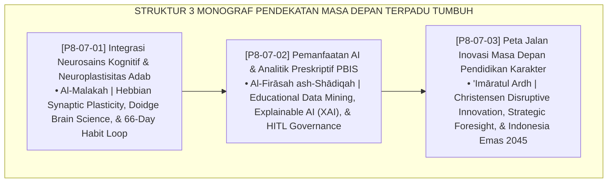

# P8-07: DOKUMEN INDUK PENDEKATAN TERINTEGRASI FUTURE APPROACHES
## *Arsitektur dan Standarisasi Integrasi Neurosains Kognitif Pembiasaan Adab 66 Hari, Pemanfaatan Artificial Intelligence dan Analitik Preskriptif PBIS, Serta Peta Jalan Strategis 10-Tahun Transformasi Peradaban sebagai Tiga Pilar Inovasi Masa Depan Pendidikan Karakter (Adab Neuroplasticity Form NEU-Neuroplastisitas, Prescriptive AI Analytics Form TEC-AIAnalytics, Serta 10-Year Roadmap Form FUT-Roadmap) di Ekosistem TUMBUH Pesantren*

**Nomor Identifikasi**: `P8-07/DOKUMEN-INDUK-PENDEKATAN-TERINTEGRASI-FUTURE/2026`  
**Domain**: `08 Integrated Approaches` > `07 Future Approaches` (Gugus Sub-Domain 07: *Neuroscience, Prescriptive AI, & 10-Year Civilizational Roadmap*)  
**Klasifikasi Naskah**: *Master Architecture & Navigation Monograph*  
**Rumpun Disiplin Pengkaji**: Neurosains Kognitif & Perkembangan, Artificial Intelligence in Education (AIED), Strategic Foresight (Voros), Fiqh Al-Istikhlaf wa 'Imaratul Ardh  

---

> ### 💡 INTISARI EKSEKUTIF
>
> * **Kedudukan Strategis Gugus Pendekatan Terintegrasi Future Approaches:** Gugus ini adalah mercusuar masa depan (*future lighthouse*) ekosistem TUMBUH. Memadukan kemurnian khazanah peradaban Islam klasik dengan penemuan sains mutakhir abad ke-21 — neurosains mielinisasi otak, kecerdasan buatan analitik preskriptif, dan strategic foresight 10-tahun — gugus ini memastikan pesantren tidak hanya menjadi benteng penjaga tradisi, melainkan pelopor peradaban sains dan teknologi yang bermoral tinggi (*Rooted in Turats, Leading the Future*).
> * **Triad Pendekatan Terintegrasi Masa Depan TUMBUH:** (1) **Neurosains Kognitif & Neuroplastisitas Adab** yang memahami biologi pembiasaan 66 hari menuju terbentuknya watak otomatis (*Al-Malakah*), (2) **Teknologi AI & Analitik Preskriptif** yang mengolah big data perilaku menjadi rekomendasi intervensi personal berbasis *Human-in-the-Loop*, dan (3) **Peta Jalan Inovasi 10-Tahun** yang mengawal diseminasi ekosistem menuju Indonesia Emas 2045.
> * **3 Monograf Riset Komprehensif:** Form NEU-Neuroplastisitas, Form TEC-AIAnalytics, dan Form FUT-Roadmap.

---

## 📑 PETA NAVIGASI TIGA MONOGRAF

---

## 📚 DESKRIPSI RINGKAS 3 BERKAS MONOGRAF

1. **[P8-07-01: Integrasi Neurosains Kognitif dan Neuroplastisitas Adab](file:///c:/xampp/htdocs/tumbuh/08%20Integrated%20Approaches/07%20Future%20Approaches/P8-07-01-Integrasi-Neurosains-Kognitif-dan-Neuroplastisitas-Adab.md)**  
   *Mekanisme mielinisasi selubung akson, teori Al-Malakah Ibnu Khaldun, siklus 66 hari otomatisasi adab (cue, routine, reward, myelination), lembar pelacakan habit, dan Form NEU-Neuroplastisitas.*
2. **[P8-07-02: Pemanfaatan Teknologi AI dan Analitik Preskriptif PBIS](file:///c:/xampp/htdocs/tumbuh/08%20Integrated%20Approaches/07%20Future%20Approaches/P8-07-02-Pemanfaatan-Teknologi-AI-dan-Analitik-Preskriptif-PBIS.md)**  
   *3 engine AI (deteksi anomali prediktif, NLP logbook summarization, rekomendasi preskriptif), standar XAI transparan, piagam etika privasi on-premise, dan Form TEC-AIAnalytics.*
3. **[P8-07-03: Peta Jalan Inovasi Masa Depan Pendidikan Karakter Pesantren](file:///c:/xampp/htdocs/tumbuh/08%20Integrated%20Approaches/07%20Future%20Approaches/P8-07-03-Peta-Jalan-Inovasi-Masa-Depan-Pendidikan-Karakter-Pesantren.md)**  
   *Peta jalan 10-tahun 3 fase (digitalisasi tahun 1-3, AI & riset kohort tahun 4-7, global excellence network tahun 8-10), piagam kemitraan pesantren mitra, dan Form FUT-Roadmap.*

---

## 🎯 STANDAR PENJAMINAN MUTU PENDEKATAN MASA DEPAN

Penerapan gugus **Pendekatan Terintegrasi Future Approaches** menjamin bahwa:
1. **Pembentukan Adab Berpijak pada Hukum Biologis Neuroplastisitas Otak (*Scientifically Grounded Habituation Guarantee*)**: Memastikan proses pembiasaan adab dirancang realistis dan berkelanjutan.
2. **Pengambilan Keputusan Pengasuhan Diperkuat Analitik Preskriptif Presisi (*AI-Augmented Wisdom Guarantee*)**: Membantu staf mendeteksi krisis subklinis tanpa menghilangkan empati insani.
3. **Lembaga Memiliki Daya Saing dan Visi Peradaban Abad ke-21 yang Abadi (*Civilizational Competitiveness Guarantee*)**: Mengawal kaderisasi santri penggerak menyongsong masa depan kepemimpinan global.
