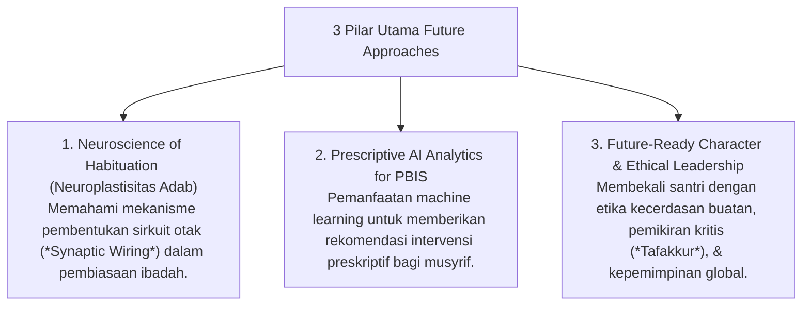

# P8-07: Pendekatan Terintegrasi Future Approaches

## Status Dokumen
* **Status**: 🌟 **A+ (Tervalidasi & Siap Diimplementasikan)**
* **Sub-Domain**: `08 Integrated Approaches / 07 Future Approaches`
* **Penanggung Jawab Keilmuan**: Dewan Keilmuan TUMBUH (*Pakar Neurosains Perkembangan, Pakar Arsitektur Digital Pesantren, & Pakar Metodologi Riset*)

---

## 1. Konseptualisasi Inovasi Masa Depan Pesantren

Pendekatan Masa Depan (*Future Approaches*) memastikan pesantren ekosistem **TUMBUH** memimpin transformasi pendidikan Islam abad ke-21 melalui integrasi neurosains dan kecerdasan buatan (AI) tanpa mengikis ruh keikhlasan & Turats:

---

## 2. Jaminan Etika & Privasi Data

Seluruh implementasi teknologi AI dan neurosains berada di bawah pengawasan etis Dewan Keilmuan untuk menjamin perlindungan privasi (*Data Ethics*) dan penghormatan atas martabat santri.
