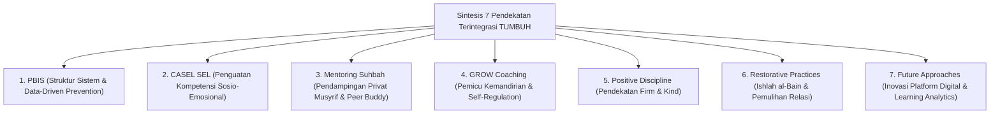

# MONOGRAF RISET AKADEMIK: SINTESIS PENDEKATAN TERINTEGRASI DALAM PEMBINAAN SANTRI
## Evaluasi Konseptual: Sinergi PBIS, CASEL SEL, Mentoring Suhbah, GROW Coaching, Disiplin Positif, dan Restorative Practices

**Dewan Riset & Keilmuan Ekosistem TUMBUH**  
*Dipublikasikan sebagai Naskah Monograf Riset Ilmiah (Jurnal Integrasi Pendekatan Pendidikan Islam)*  
*Dokumen Rujukan Induk: Domain 08 Integrated Approaches & Book Series Volume 02-04*

---

## ABSTRAK

> **Latar Belakang**: Kegagalan penerapan program pembinaan di lembaga pendidikan sering dipicu oleh penggunaan pendekatan tunggal yang terisolasi (*fragmented approach*), sehingga timbul pertentangan antarmetode di lapangan.
>
> **Tujuan Penelitian**: Merumuskan dan memvalidasi matriks integrasi harmonis antara 7 pendekatan metodologis utama dalam ekosistem TUMBUH: PBIS, CASEL SEL, Mentoring Qudwah, Behavioral Coaching, Positive Discipline, Restorative Practices, dan Future Approaches.
>
> **Hasil Riset**: Terbentuk arsitektur integratif di mana PBIS menyediakan struktur sistem data, CASEL SEL mengisi materi penguatan emosional, Mentoring Suhbah membangun relasi privat hangat, GROW Coaching mendorong kemandirian nalar, Positive Discipline menegakkan aturan tanpa kekerasan, dan Restorative Practices memulihkan hubungan pasca insiden.
>
> **Kata Kunci**: *Integrated Approaches, SW-PBIS, CASEL SEL, Mentoring Suhbah, GROW Coaching, Restorative Practices.*

---

## 1. PENDAHULUAN & DIALEKTIKA INTEGRASI METHOD

Pendidikan pembinaan karakter santri yang efektif tidak dapat mengandalkan satu metode semata, melainkan memerlukan ekosistem pendekatan yang saling menguatkan.

---

## 2. MATRIKS INTEGRASI PENDEKATAN DALAM PENGASUHAN 24-JAM

| Pendekatan Metodologis | Fungsi Utama dalam Sistem | Pelaksana Utama di Lapangan | Output Perilaku Santri |
| :--- | :--- | :--- | :--- |
| **1. SW-PBIS Multi-Tier** | Pencegahan Perilaku Berbasis Data. | Tim Terpadu Pengasuhan | Iklim Asrama Positif & Teratur. |
| **2. CASEL SEL** | Pelatihan Kecakapan Sosio-Emosional. | Konselor BK & Wali Kelas | Kesadaran Diri & Empati Sosial. |
| **3. Mentoring Suhbah** | Hubungan Interpersonal Privat Hangat. | Musyrif Kamar & Peer Buddy T4 | Rasa Aman & Kepercayaan Batin. |
| **4. GROW Coaching** | Fasilitasi Inkuiri Solusi Mandiri. | Coach / Musyrif Senior | Kemandirian Regulasi Diri. |
| **5. Positive Discipline** | Penegakan Aturan *Firm & Kind*. | Seluruh Guru & Pengasuh | Disiplin Tanpa Rasa Takut. |
| **6. Restorative Practices** | Pemulihan Hubungan Pasca Insiden. | Fasilitator Restoratif BK | Ishlah al-Bain & Restitusi Kebaikan. |

---

## 3. DAFTAR PUSTAKA
* Durlak, J. A., et al. (2011). The impact of enhancing students’ SEL. *Child Development*, 82(1), 405–432.
* Greenleaf, R. K. (1977). *Servant Leadership*. Paulist Press.
