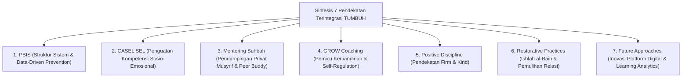
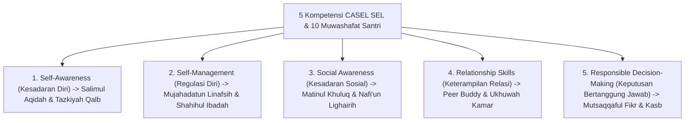

# MONOGRAF RISET AKADEMIK: SINTESIS PENDEKATAN TERINTEGRASI DALAM PEMBINAAN SANTRI
## Evaluasi Konseptual: Sinergi PBIS Multi-Tier, CASEL SEL, Mentoring Suhbah, GROW Coaching, Disiplin Positif, dan Restorative Practices

**Dewan Riset & Keilmuan Ekosistem TUMBUH**  
*Dipublikasikan sebagai Naskah Monograf Riset Ilmiah (Jurnal Integrasi Pendekatan Pendidikan Islam)*  
*Dokumen Rujukan Induk: Domain 08 Integrated Approaches & Book Series Volume 02-04*

---

## ABSTRAK

> **Latar Belakang**: Kegagalan penerapan program pembinaan di lembaga pendidikan sering dipicu oleh penggunaan pendekatan tunggal yang terisolasi (*fragmented approach*), sehingga timbul pertentangan antarmetode di lapangan.
>
> **Tujuan Penelitian**: Merumuskan dan memvalidasi matriks integrasi harmonis antara 7 pendekatan metodologis utama dalam ekosistem TUMBUH: SW-PBIS Multi-Tier, CASEL SEL, Mentoring Qudwah, Behavioral Coaching, Positive Discipline, Restorative Practices, dan Future Approaches.
>
> **Hasil Riset**: Terbentuk arsitektur integratif di mana PBIS menyediakan struktur sistem data, CASEL SEL mengisi materi penguatan emosional, Mentoring Suhbah membangun relasi privat hangat, GROW Coaching mendorong kemandirian nalar, Positive Discipline menegakkan aturan tanpa kekerasan, dan Restorative Practices memulihkan hubungan pasca insiden.
>
> **Kata Kunci**: *Integrated Approaches, SW-PBIS, CASEL SEL, Mentoring Suhbah, GROW Coaching, Positive Discipline, Restorative Practices.*

---

## 1. PENDAHULUAN & DIALEKTIKA INTEGRASI METHOD

Pendidikan pembinaan karakter santri yang efektif tidak dapat mengandalkan satu metode semata, melainkan memerlukan ekosistem pendekatan yang saling menguatkan.

---

## 2. MATRIKS INTEGRASI PENDEKATAN DALAM PENGASUHAN 24-JAM

| Pendekatan Metodologis | Fungsi Utama dalam Sistem | Pelaksana Utama di Lapangan | Output Perilaku Santri |
| :--- | :--- | :--- | :--- |
| **1. SW-PBIS Multi-Tier** | Pencegahan Perilaku Berbasis Data. | Tim Terpadu Pengasuhan | Iklim Asrama Positif & Teratur. |
| **2. CASEL SEL** | Pelatihan Kecakapan Sosio-Emosional. | Konselor BK & Wali Kelas | Kesadaran Diri & Empati Sosial. |
| **3. Mentoring Suhbah** | Hubungan Interpersonal Privat Hangat. | Musyrif Kamar & Peer Buddy T4 | Rasa Aman & Kepercayaan Batin. |
| **4. GROW Coaching** | Fasilitasi Inkuiri Solusi Mandiri. | Coach / Musyrif Senior | Kemandirian Regulasi Diri. |
| **5. Positive Discipline** | Penegakan Aturan *Firm & Kind*. | Seluruh Guru & Pengasuh | Disiplin Tanpa Rasa Takut. |
| **6. Restorative Practices** | Pemulihan Hubungan Pasca Insiden. | Fasilitator Restoratif BK | Ishlah al-Bain & Restitusi Kebaikan. |

---

## 3. BEDAH SAINS & TURATS SW-PBIS MULTI-TIER (*AT-TARSYID WA AT-TASYJI'*)

1. **Landasan Empiris Horner & Sugai (2015)**:
   * Penerapan School-Wide PBIS pada lebih dari 27.000 sekolah membuktikan bahwa penguatan positif universal (Tier 1) efektif mencegah **80-90% pelanggaran umum**.
   * Penanganan berbasis data (*Data-Driven EWS*) menghentikan eskalasi masalah sebelum menjadi krisis berat.
2. **Kaidah Turats Syar'i**:
   * PBIS diselaraskan dengan prinsip **At-Tarsyid wa at-Tasyji'** (Bimbingan & Apresiasi Kebaikan - QS. Al-Baqarah: 25).
   * **Magic Ratio 4:1** (Gottman & Horner): Musyrif memberikan minimal 4 kalimat apresiasi positif untuk setiap 1 teguran korektif.

---

## 4. BEDAH SAINS & TURATS CASEL SOCIAL-EMOTIONAL LEARNING (SEL)

---

## 5. BEDAH SAINS & TURATS DISIPLIN POSITIF & RESTORATIVE PRACTICES

1. **Pendekatan Firm & Kind (Jane Nelsen, 2000)**:
   * Menolak dikotomi otoriter vs permisif. Tegas (*Firm*) menghormati aturan pesantren; Ramah (*Kind*) menghormati martabat santri.
2. **Kaidah Syar'i Ishlah al-Bain & Restorative Justice (Howard Zehr, 2002)**:
   * Sesuai perintah **QS. Al-Hujurat: 9-10**, penanganan perselisihan antar-santri tidak dilakukan dengan hukuman dendam, melainkan melalui **Ishlah al-Bain** (Musyawarah Restoratif) yang berfokus pada perbaikan kerugian (*Restitution*) dan penyatuan hati (*Reconciliation*).

---

## 6. DAFTAR PUSTAKA
* Durlak, J. A., Weissberg, R. P., et al. (2011). The impact of enhancing students’ SEL: A meta-analysis. *Child Development*, 82(1), 405–432.
* Gottman, J. M., & Levenson, R. W. (1992). Marital processes. *Journal of Personality and Social Psychology*, 63(2), 221–233.
* Horner, R. H., & Sugai, G. (2015). School-wide PBIS. *Behavior Analysis in Practice*, 8(1), 80–85.
* Nelsen, J. (2000). *Positive Discipline in the Classroom*. Prima Publishing.
* Zehr, H. (2002). *The Little Book of Restorative Justice*. Good Books.
