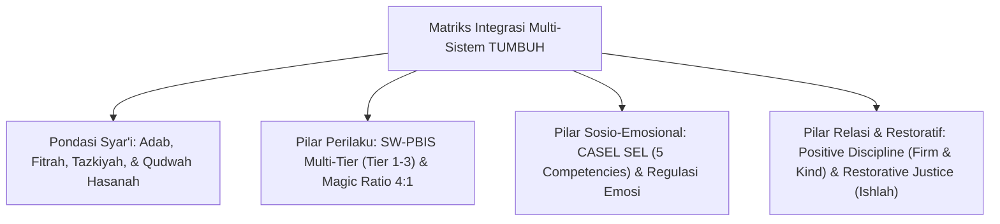
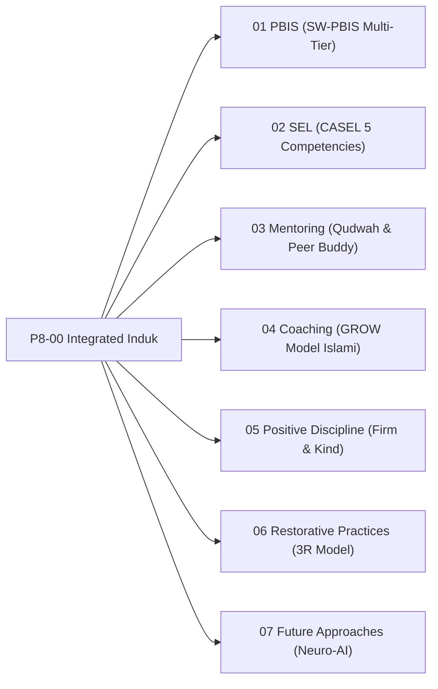

# P8-00: Integrated Approaches Induk (Kerangka Kerja Pendekatan Terintegrasi TUMBUH)

## Status Dokumen
* **Status**: 🌟 **A+ (Tervalidasi & Induk Baku)**
* **Domain**: Project 8 — `08 Integrated Approaches`
* **Penanggung Jawab Keilmuan**: Dewan Keilmuan TUMBUH (*Pakar Epistemologi Turats, Pakar PBIS, Pakar SEL, Pakar Disiplin Positif, & Pakar Kuratif Restoratif*)

---

## 1. Pendahuluan & Prinsip Integrasi Epistemologis

Sesuai Dokumen Induk `AGENTS.md`, seluruh kerangka pembinaan santri di ekosistem **TUMBUH** memadukan kebenaran wahyu & hikmah Turats Klasik (*Tazkiyatun Nafs, Ta'dib, Mujahadatun Linafsih, Bi'ah Shalihah*) dengan konsensus sains pendidikan peer-reviewed kontemporer.

---

## 2. Model Triad Pertumbuhan Simbiotik dalam Pendekatan Terintegrasi

- **Santri Tumbuh**: Memperoleh pembinaan holistik pada kecerdasan emosional, regulasi diri, ketahanan mental, dan kemuliaan adab.
- **Guru & Musyrif Tumbuh**: Memiliki instrumen pedagogi teruji, keterampilan konseling empati, dan terlindungi dari stres operasional.
- **Sistem Lembaga Tumbuh**: Memiliki ekosistem PBIS berbasis data, iklim sekolah aman (*Bi'ah Shalihah*), dan kesiapan menghadapi masa depan (*Future-Ready*).

---

## 3. Peta Hubungan Sub-Domain Multi-Sistem

---

## 4. Rujukan Keilmuan Multidisiplin

1. **Turats Islam**: *Adab al-Alim wa al-Muta'allim* (Imam An-Nawawi), *Ihya 'Ulumiddin* (Imam Al-Ghazali - Tazkiyatun Nafs), *Ta'lim al-Muta'allim* (Al-Zarnuji).
2. **Sains Kontemporer**: *School-Wide Positive Behavioral Interventions and Supports* (Sugai & Horner), *Social Emotional Learning Framework* (CASEL), *Positive Discipline* (Jane Nelsen), *Restorative Justice in Education* (Evans & Vaandering), *Self-Determination Theory* (Deci & Ryan).
