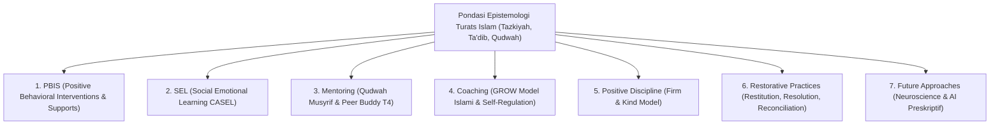

# 08 Integrated Approaches (Kerangka Kerja Pendekatan Terintegrasi Pesantren TUMBUH)

Domain ini memuat sintesis terpadu antara **Turats Islam** (*Tazkiyatun Nafs, Ta'dib, Qudwah Hasanah, Ishlah al-Bain*) dengan **7 Konsensus Sains Internasional** (*SW-PBIS, CASEL SEL, Mentoring Qudwah, Behavioral Coaching, Positive Discipline, Restorative Justice, & Future Neuro-AI Frameworks*).

---

## Arsitektur Integrasi Multi-Sistem Pesantren

---

## Indeks Dokumen Induk & 7 Sub-Domain Modul

* 📄 **[P8-00-Integrated-Approaches-Induk.md](./P8-00-Integrated-Approaches-Induk.md)**: Dokumen Maha-Induk Integrasi Turats Islam & Konsensus Sains Internasional.

### Sub-Domain 01: PBIS
* 📁 **[01 PBIS](./01%20PBIS/)**:
  * 📄 [P8-01-Pendekatan-Terintegrasi-PBIS.md](./01%20PBIS/P8-01-Pendekatan-Terintegrasi-PBIS.md)
  * 📄 [P8-01-01-Arsitektur-SW-PBIS-Multi-Tier-Pesantren.md](./01%20PBIS/P8-01-01-Arsitektur-SW-PBIS-Multi-Tier-Pesantren.md)
  * 📄 [P8-01-02-Integrasi-Nilai-Syari-dalam-Sistem-Apresiasi-PBIS.md](./01%20PBIS/P8-01-02-Integrasi-Nilai-Syari-dalam-Sistem-Apresiasi-PBIS.md)
  * 📄 [P8-01-03-Matriks-Penguatan-Positif-dan-Magic-Ratio-4-1.md](./01%20PBIS/P8-01-03-Matriks-Penguatan-Positif-dan-Magic-Ratio-4-1.md)

### Sub-Domain 02: SEL
* 📁 **[02 SEL](./02%20SEL/)**:
  * 📄 [P8-02-Pendekatan-Terintegrasi-SEL.md](./02%20SEL/P8-02-Pendekatan-Terintegrasi-SEL.md)
  * 📄 [P8-02-01-Integrasi-5-Kompetensi-CASEL-dengan-Adab-Tazkiyah.md](./02%20SEL/P8-02-01-Integrasi-5-Kompetensi-CASEL-dengan-Adab-Tazkiyah.md)
  * 📄 [P8-02-02-Modul-Pengembangan-Regulasi-Emosi-dan-Mujahadah.md](./02%20SEL/P8-02-02-Modul-Pengembangan-Regulasi-Emosi-dan-Mujahadah.md)
  * 📄 [P8-02-03-Kurikulum-Sosio-Emosional-Santri-Remaja.md](./02%20SEL/P8-02-03-Kurikulum-Sosio-Emosional-Santri-Remaja.md)

### Sub-Domain 03: Mentoring
* 📁 **[03 Mentoring](./03%20Mentoring/)**:
  * 📄 [P8-03-Pendekatan-Terintegrasi-Mentoring.md](./03%20Mentoring/P8-03-Pendekatan-Terintegrasi-Mentoring.md)
  * 📄 [P8-03-01-Sistem-Mentoring-Qudwah-Musyrif-Santri.md](./03%20Mentoring/P8-03-01-Sistem-Mentoring-Qudwah-Musyrif-Santri.md)
  * 📄 [P8-03-02-Arsitektur-Peer-Buddy-Santri-T4-Tanpa-Feodalisme.md](./03%20Mentoring/P8-03-02-Arsitektur-Peer-Buddy-Santri-T4-Tanpa-Feodalisme.md)
  * 📄 [P8-03-03-Protokol-Pendampingan-Homesickness-dan-Adaptasi.md](./03%20Mentoring/P8-03-03-Protokol-Pendampingan-Homesickness-dan-Adaptasi.md)

### Sub-Domain 04: Coaching
* 📁 **[04 Coaching](./04%20Coaching/)**:
  * 📄 [P8-04-Pendekatan-Terintegrasi-Coaching.md](./04%20Coaching/P8-04-Pendekatan-Terintegrasi-Coaching.md)
  * 📄 [P8-04-01-Metodologi-Coaching-Karakter-GROW-Model-Islami.md](./04%20Coaching/P8-04-01-Metodologi-Coaching-Karakter-GROW-Model-Islami.md)
  * 📄 [P8-04-02-Teknik-Diakuisisi-Replacement-Behavior-Adaptif.md](./04%20Coaching/P8-04-02-Teknik-Diakuisisi-Replacement-Behavior-Adaptif.md)
  * 📄 [P8-04-03-SOP-Sesi-Coaching-Self-Regulation-Individual.md](./04%20Coaching/P8-04-03-SOP-Sesi-Coaching-Self-Regulation-Individual.md)

### Sub-Domain 05: Positive Discipline
* 📁 **[05 Positive Discipline](./05%20Positive%20Discipline/)**:
  * 📄 [P8-05-Pendekatan-Terintegrasi-Positive-Discipline.md](./05%20Positive%20Discipline/P8-05-Pendekatan-Terintegrasi-Positive-Discipline.md)
  * 📄 [P8-05-01-Prinsip-Disiplin-Positif-Firm-and-Kind-Jane-Nelsen.md](./05%20Positive%20Discipline/P8-05-01-Prinsip-Disiplin-Positif-Firm-and-Kind-Jane-Nelsen.md)
  * 📄 [P8-05-02-Rubrik-3R-Konsekuensi-Logis-Related-Respectful-Reasonable.md](./05%20Positive%20Discipline/P8-05-02-Rubrik-3R-Konsekuensi-Logis-Related-Respectful-Reasonable.md)
  * 📄 [P8-05-03-Deklarasi-Zero-Corporal-Punishment-dan-Kekerasan-Verbal.md](./05%20Positive%20Discipline/P8-05-03-Deklarasi-Zero-Corporal-Punishment-dan-Kekerasan-Verbal.md)

### Sub-Domain 06: Restorative Practices
* 📁 **[06 Restorative Practices](./06%20Restorative%20Practices/)**:
  * 📄 [P8-06-Pendekatan-Terintegrasi-Restorative-Practices.md](./06%20Restorative%20Practices/P8-06-Pendekatan-Terintegrasi-Restorative-Practices.md)
  * 📄 [P8-06-01-Metodologi-Restoratif-3R-Restitution-Resolution-Reconciliation.md](./06%20Restorative%20Practices/P8-06-01-Metodologi-Restoratif-3R-Restitution-Resolution-Reconciliation.md)
  * 📄 [P8-06-02-SOP-Restorative-Chat-5-Pertanyaan-dan-Restorative-Circles.md](./06%20Restorative%20Practices/P8-06-02-SOP-Restorative-Chat-5-Pertanyaan-dan-Restorative-Circles.md)
  * 📄 [P8-06-03-Protokol-Ishlah-al-Bain-dan-Clean-Slate-Policy.md](./06%20Restorative%20Practices/P8-06-03-Protokol-Ishlah-al-Bain-dan-Clean-Slate-Policy.md)

### Sub-Domain 07: Future Approaches
* 📁 **[07 Future Approaches](./07%20Future%20Approaches/)**:
  * 📄 [P8-07-Pendekatan-Terintegrasi-Future-Approaches.md](./07%20Future%20Approaches/P8-07-Pendekatan-Terintegrasi-Future-Approaches.md)
  * 📄 [P8-07-01-Integrasi-Neurosains-Kognitif-dan-Neuroplastisitas-Adab.md](./07%20Future%20Approaches/P8-07-01-Integrasi-Neurosains-Kognitif-dan-Neuroplastisitas-Adab.md)
  * 📄 [P8-07-02-Pemanfaatan-Teknologi-AI-dan-Analitik-Preskriptif-PBIS.md](./07%20Future%20Approaches/P8-07-02-Pemanfaatan-Teknologi-AI-dan-Analitik-Preskriptif-PBIS.md)
  * 📄 [P8-07-03-Peta-Jalan-Inovasi-Masa-Depan-Pendidikan-Karakter-Pesantren.md](./07%20Future%20Approaches/P8-07-03-Peta-Jalan-Inovasi-Masa-Depan-Pendidikan-Karakter-Pesantren.md)
