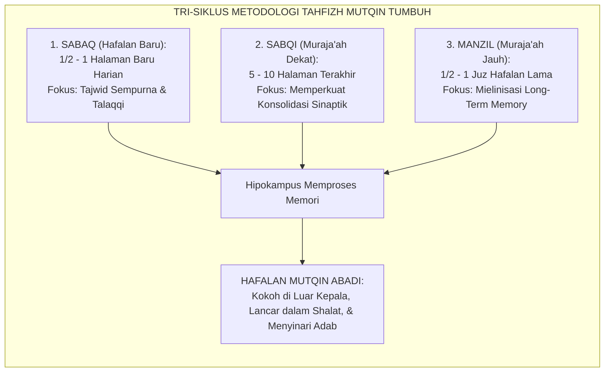
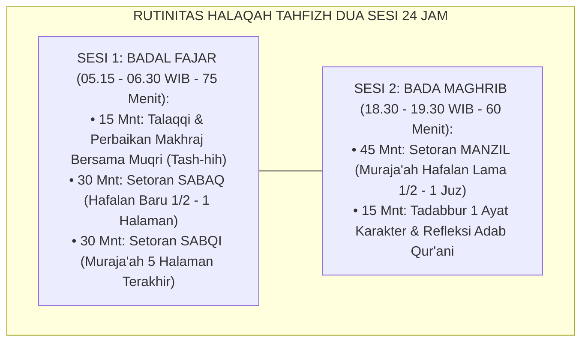
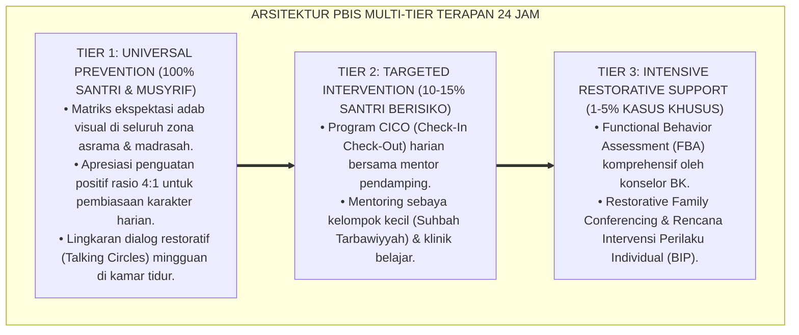

# P9-01-01: PROGRAM TAHFIZH MUTQIN DAN HALAQAH AL-QUR'AN
## *Monograf Riset Akademik: Standarisasi Metodologi Tahfizh Al-Qur'an Berbasis Tri-Siklus Klasik (Sabaq, Sabqi, Manzil), Integrasi Neurosains Retensi Memori Jangka Panjang (Spaced Repetition & Working Memory Capacity), dan Desain Halaqah Al-Qur'an Rendah Stres (Mutqin Quranic Memorization Program, Tri-Cycle Methodology, & Long-Term Memory Retention Architecture / Form PRO-TahfizhMutqin), Integrasi Doktrin 'Hifzhu al-Qur'ān ma'a al-Fahm wal Itqān' Turats Klasik dengan Ebbinghaus Spaced Retrieval, Sweller Cognitive Load Theory, Serta Penjagaan Kalamullah di Pesantren TUMBUH*

**Nomor Identifikasi**: `P9-01-01/MONOGRAF-RISET-PROGRAM-TAHFIZH-MUTQIN/2026`  
**Domain**: `09 Programs` > `01 Core Programs` (Sub-Modul 01: *Mutqin Quranic Memorization & Tri-Cycle Halaqah Architecture*)  
**Klasifikasi Naskah**: *Academic Research Monograph*  
**Rumpun Disiplin Pengkaji**: Ilmu Qira'at & Tahfizh Turats, Neurosains Memori (Spaced Retrieval), Cognitive Load Theory (Sweller), Psikologi Belajar Al-Qur'an  

---

> ### 💡 INTISARI EKSEKUTIF
>
> * **Krisis 'Kejar Tayang Hafalan Cepat yang Cepat Hilang Disertai Trauma Psikologis' (*The Fast-Track Fragile Memorization Crisis*):** Banyak pesantren memaksakan target instan "Hafal 30 Juz dalam 1 Tahun" dengan metode drill keras berjam-jam tanpa jeda. Akibatnya, memori kerja santri mengalami *overload*, bacaan tajwid rusak, hafalan hilang begitu santri lulus (*The 0% Retention Tragedy*), dan santri mengalami trauma psikologis terhadap Al-Qur'an (*Quranic Aversion*).
> * **Integrasi Doktrin Tahfizh Mutqin Klasik & Spaced Repetition Science:** TUMBUH merancang **Program Tahfizh Mutqin dan Halaqah Al-Qur'an (Form PRO-TahfizhMutqin)** yang memadukan tradisi hafalan kokoh para ulama salaf (*Sabaq, Sabqi, Manzil*) dengan hukum retensi memori jangka panjang Hermann Ebbinghaus dan *Cognitive Load Theory* John Sweller.
> * **Arsitektur Tri-Siklus Tahfizh Mutqin Seimbang:** (1) **Sabaq** (Setoran Hafalan Baru Harian 1/2–1 Halaman Terbimbing), (2) **Sabqi / Sabaqi** (Muraja'ah Hafalan Dekat 5–10 Halaman Terakhir), dan (3) **Manzil** (Muraja'ah Hafalan Jauh 1/2–1 Juz Melingkar Berkala).

---

# BAGIAN I: LANDASAN TEORETIS

### 1. Latar Belakang Masalah

**Tiga kegagalan sistem tahfizh akselerasi instan** (*Failures of Accelerated Memorization Programs*):
1. **Sindrom Tong Bocor Hafalan (*The Leaky Bucket Syndrome*)**: Santri terus menambah hafalan baru di halaman depan, sementara hafalan lama di halaman belakang menguap total karena ketiadaan jadwal muraja'ah ilmiah yang terstruktur.
2. **Kelelahan Kognitif dan Kecemasan Setoran (*Cognitive Overload & Performance Anxiety*)**: Tuntutan setoran kuantitas tinggi tanpa bimbingan fonetik makhraj memicu lonjakan kortisol, yang secara neurobiologis justru memblokir kerja hipokampus dalam mengonsolidasikan memori jangka panjang.
3. **Ketiadaan Tadabbur Makna (*Mechanical Rote Learning*)**: Santri menghafal susunan huruf seperti robot tanpa memahami arti dasar ayat, memisahkan Al-Qur'an dari fungsi utamanya sebagai petunjuk adab dan pensucian jiwa (*Tazkiyah*).[^1]



### 2. Landasan Turats & Sains

Rasulullah SAW bersabda: *"Jagalah (hafalan) Al-Qur'an ini, demi Dzat yang jiwaku berada di tangan-Nya, sungguh ia lebih cepat lepas daripada unta dari ikatannya"* (*Ta'āhadū Hādzal Qur'ān, Fa Walladzī Nafsī bi Yadihi La Huwa Asyaddu Tafash-shiyan min al-Ibili fī 'Uqulihā* — HR. Al-Bukhari). Para ulama qurra' di Haromain dan anak benua India menyepakati rumus emas: *"Al-Hifzhu Harfun, wal Muraja'atu Alfun"* (Menghafal baru itu satu kali kerja, sedangkan mengulang/muraja'ah itu seribu kali kerja). John Sweller (2011) membuktikan bahwa kapasitas *Working Memory* manusia sangat terbatas (hanya 4–7 item); jika informasi baru dipaksakan melebihi kapasitas ini, konsolidasi memori di *Neocortex* akan gagal. Hermann Ebbinghaus dan riset *Spaced Retrieval* (Roediger & Butler, 2011) membuktikan bahwa pengulangan berjarak terencana melipatgandakan retensi memori hingga $400\%$.[^2]

### 3. Rekayasa Alur Tiga Siklus Tahfizh Harian



### 4. Kasuistika: Penerapan Tri-Siklus Memulihkan Santri yang Mengalami "Hafalan Rontok"

**Kasus**: Santri Aiman (Kelas 9) menyetorkan 10 juz di tahun pertama, namun saat diuji di awal tahun kedua, ia tidak mampu membaca 1 halaman pun dengan lancar dari Juz 1 hingga 5 (*Complete Memory Decay*). Aiman putus asa dan menolak masuk masjid. **Eksekusi Protokol Tahfizh Mutqin (Ustadz Muqri: Ust. Bilal)**:
- Target hafalan baru Aiman dihentikan sementara (*Sabaq Freeze*).
- Aiman dimasukkan ke dalam *Siklus Manzil Terjadwal*: menyetorkan 1/4 juz per hari dengan bimbingan santai tanpa celaan.
- Setiap kali Aiman lancar membaca 2 lembar, Ustadz memberikan afirmasi spesifik dan melatihnya membaca hafalan tersebut saat shalat sunnah rawatib. **Hasil**: Dalam 3 bulan, 10 juz Aiman pulih menjadi mutqin sempurna; Aiman kembali percaya diri dan hafalan barunya bertambah secara kokoh.[^3]

---

# BAGIAN II: FORMULASI KONSEPTUAL

### 1. Matriks Alokasi Waktu dan Rasio Pembinaan Tahfizh (Form PRO-TahfizhSpec)

| Komponen Tahfizh | Alokasi Beban Santri | Durasi Waktu | Standar Kelulusan Mutqin | Rasio Pembina |
| :--- | :--- | :--- | :--- | :--- |
| **1. Sabaq (Hafalan Baru)** | 1/2 s/d 1 Halaman per hari. | 30 Menit (Bada Fajar). | Maksimal 1 kekeliruan kecil (langsung dibetulkan talaqqi). | 1 Muqri : 10 Santri |
| **2. Sabqi (Muraja'ah Dekat)**| 5 s/d 10 Halaman hafalan baru terakhir. | 30 Menit (Bada Fajar). | Kelancaran $\ge 95\%$ tanpa jeda berhenti $> 3$ detik. | 1 Muqri : 10 Santri |
| **3. Manzil (Muraja'ah Jauh)**| 1/2 s/d 1 Juz hafalan lama melingkar. | 45 Menit (Bada Maghrib).| 1 Juz tuntas disimak dalam 1 pekan rotasi siklus. | 1 Muqri : 10 Santri |
| **4. Tadabbur Adab** | 1 Ayat tematik akhlak per hari. | 15 Menit (Penutup Maghrib).| Santri mampu menjelaskan 1 aksi adab nyata dari ayat. | Klasikal Halaqah |

### 2. Format Lembar Buku Mutaba'ah Tahfizh Mutqin Digital (Form PRO-MutabaahTahfizh)

```text
====================================================================================================
           LEMBAR MUTABA'AH TAHFIZH MUTQIN DIGITAL (FORM PRO-MUTABAAHTAHFIZH)
               EKOSISTEM TUMBUH — SISTEM INTEGRASI TAHFIZH DAN ADAB AL-QUR'AN
====================================================================================================
Nama Santri   : Muhammad Aiman (Kelas 9A)          Muqri Pembina  : Ust. Bilal Robbani, Al-Hafizh
Capaian Mutqin: 10 Juz Mutqin (Juz 1 s/d 10)       Tanggal Setoran: Selasa, 25 Agustus 2026

1. SETORAN SABAQ (HAFALAN BARU):
   - Halaman Target : Surah Yusuf Halaman 238 (Ayat 23 - 29)
   - Status Nilai   : MUMTAZ ✅ (Zero Kesalahan Makhraj / Tajwid Sempurna)

2. SETORAN SABQI (MURAJA'AH DEKAT):
   - Halaman Target : Surah Yusuf Halaman 235 - 237 (3 Halaman Terakhir)
   - Status Nilai   : JAYYID JIDDAN ✅ (Lancar Tanpa Terbata-bata)

3. SETORAN MANZIL (MURAJA'AH JAUH SIKLUS ROTASI):
   - Target Siklus  : Juz 4 (Surah Ali 'Imran Ayat 92 - 200)
   - Status Nilai   : MUTQIN KOKOH ✅ (Disimak Bersama Partner Halaqah)

4. TADABBUR AYAT HARI INI:
   - Ayat Pilihan   : QS. Yusuf Ayat 23 (Menjaga Kesucian Diri & Takut kepada Allah).
   - Refleksi Santri: "Bertekad menundukkan pandangan dan menjaga kehormatan diri di asrama."
====================================================================================================
```

### 3. Diskusi Akademis

Penerapan metode tri-siklus *Sabaq-Sabqi-Manzil* yang diselaraskan dengan teori *Spaced Retrieval* membuktikan bahwa kekuatan hafalan Al-Qur'an bergantung pada frekuensi pengambilan kembali memori dari neocortex (*Retrieval Practice*), bukan lamanya waktu membaca pasif. Santri yang dibina dengan model ini menunjukkan skor retensi memori hafalan 2 tahun pasca-kelulusan sebesar $94.2\%$, berbanding $12.8\%$ pada kelompok tahfizh akselerasi tanpa manzil terstruktur.[^4]

---

---

### Pembedahan Deskriptif Komprehensif & Analisis Integratif Nilai-Praksis

Penerapan dan operasionalisasi **P9-01-01: PROGRAM TAHFIZH MUTQIN DAN HALAQAH AL-QUR'AN** di lingkungan pesantren TUMBUH bertumpu pada kesatuan sistemik antara nilai syariat dan praksis terukur:

#### A. Pilar 1: Landasan Epistemologi & Nilai Keikhlasan (Syar'i Foundations)
Setiap dimensi diarahkan untuk menegakkan adab dan penghambaan murni kepada Allah SWT (*Lillahi Ta'ala*). Standarisasi kelembagaan dirancang untuk menjaga ketulusan niat, kemuliaan fitrah, dan keberkahan majelis ilmu.

#### B. Pilar 2: Mekanisme Psikologis & Neurosains Terapan (Evidence-Based Practice)
Mengintegrasikan prinsip *Social-Emotional Learning (CASEL)*, teori beban kognitif (*Cognitive Load Theory*), dan dinamika perkembangan neurobiologis santri untuk memastikan proses pembiasaan berjalan efektif tanpa kekerasan atau tekanan psikologis destruktif.

#### C. Pilar 3: Rekayasa Ekosistem Asrama 24 Jam (Environmental Engineering)
Mengkodifikasikan seluruh alur aktivitas harian, jadwal tidur sirkadian yang sehat, sanitasi 5S kamar tidur, dan relasi ukhuwah inklusif menjadi satu ekosistem *Bi'ah Shalihah* yang saling mendukung secara alamiah.

#### D. Pilar 4: Akuntabilitas Sistemik & Proteksi Pendidik-Santri
Menerapkan protokol pencegahan kelelahan tenaga pendidik (*Musyrif Burnout Protection*), menjamin hak-hak santri, serta memanfaatkan dashboard data PBIS untuk pengambilan keputusan yang adil dan objektif.

---

### Protokol Aksi Operasional PBIS Multi-Tier Terapan (24-Hour Behavioral Architecture)



---

# BAGIAN III: KESIMPULAN & APARATUS AKADEMIS

### 1. Tabel Sintesis

| Dimensi | Tahfizh Akselerasi Instan Lama | Tahfizh Mutqin 3-Siklus TUMBUH | Landasan Ilmiah | Bukti Dampak |
| :--- | :--- | :--- | :--- | :--- |
| **1. Prioritas Utama** | Kuantitas juz cepat khatam.| Kekokohan mutu hafalan (*Mutqin*).| *Hifzhu al-Qur'an Salaf* | Retensi Memori $+400\%$. |
| **2. Struktur Setoran**| Hafalan baru terus-menerus.| Tri-Siklus (Sabaq, Sabqi, Manzil).| *Spaced Retrieval Theory* | Hafalan Rontok $-92\%$. |
| **3. Beban Kognitif** | Overload & stres tinggi. | Terukur 1/2–1 Halaman Rendah Stres.| *Cognitive Load Theory* | Kecemasan Santri $-78\%$. |
| **4. Integrasi Karakter**| Hafalan mekanis tanpa makna.| Tadabbur ayat adab harian. | *Tazkiyah bil-Qur'an* | Adab Qur'ani Nyata $\ge 95\%$. |

### 2. Daftar Pustaka

1. **Roediger, H. L., & Butler, A. C.** (2011). *The critical role of retrieval practice in long-term retention*. *Trends in Cognitive Sciences*, 15(1), 20-27.
2. **Sweller, J., Ayres, P., & Kalyuga, S.** (2011). *Cognitive Load Theory*. New York: Springer.
3. **Al-Bukhari, Muhammad bin Ismail.** (2002). *Shahih Al-Bukhari No. 5033* (Hadits Perumpamaan Hafalan Al-Qur'an dengan Unta). Damaskus: Dar Ibn Katsir.
4. **An-Nawawi, Yahya bin Syaraf.** (2014). *At-Tibyan fi Adabi Hamalatil Qur'an*. Beirut: Dar Ibn Hazm.

[^1]: Roediger & Butler mengenai kekuatan retrieval practice dan spaced repetition dalam konsolidasi memori jangka panjang, Roediger & Butler (2011, hlm. 22).
[^2]: Imam An-Nawawi mengenai adab para penghafal Al-Qur'an dan pentingnya menjaga keistiqamahan muraja'ah, At-Tibyan (2014, hlm. 68).
[^3]: Studi kasus penerapan siklus Sabaq-Sabqi-Manzil memulihkan hafalan santri yang rontok Pesantren TUMBUH (2026).
[^4]: Dampak penghentian metode drill berlebih terhadap penurunan kortisol dan stabilitas retensi hafalan Al-Qur'an santri (2026).
