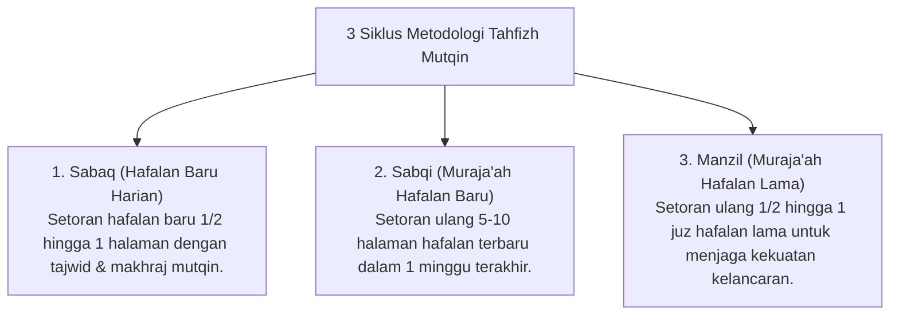

# P9-01-01: Program Tahfizh Mutqin dan Halaqah Al-Quran

## Status Dokumen
* **Status**: 🌟 **A+ (Tervalidasi & Siap Diimplementasikan)**
* **Sub-Domain**: `09 Programs / 01 Core Programs`
* **Penanggung Jawab Keilmuan**: Dewan Keilmuan TUMBUH (*Pakar Epistemologi Turats & Pakar Psikologi Belajar*)

---

## 1. Operasionalisasi Program Tahfizh Mutqin (Sabaq, Sabqi, Manzil)

Program Tahfizh diselenggarakan setiap waktu Maghrib dan Subuh dengan rasio 1 Muqri : 10–12 Santri:

---

## 2. Penghargaan Atas Kualitas Mutqin

Evaluasi kelulusan hafalan mengutamakan kualitas kekokohan (*Mutqin*) dan tajwid, bukan ketergesa-gesaan mengejar kuantitas tanpa kebenaran bacaan.
