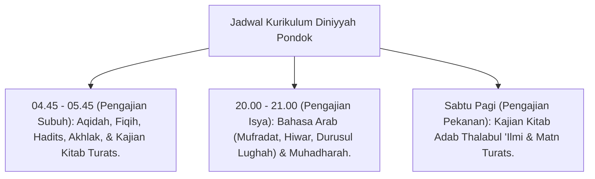

# P9-01-02: Program Dirasah Islamiyah dan Kajian Turats

## Status Dokumen
* **Status**: 🌟 **A+ (Tervalidasi & Siap Diimplementasikan)**
* **Sub-Domain**: `09 Programs / 01 Core Programs`
* **Penanggung Jawab Keilmuan**: Dewan Keilmuan TUMBUH (*Pakar Epistemologi Turats & Pakar Desain Kurikulum Adab*)

---

## 1. Operasionalisasi Program Dirasah Islamiyah 24-Jam

Program Dirasah Islamiyah menyatukan pembelajaran kelas formal madrasah dan pengajian diniyyah pondok:

---

## 2. Sanad Keilmuan & Metodologi Didaktik

Pembelajaran menggunakan metode membaca kitab (*Qira'ah*), penjelasan (*Syarah*), dan dialog kontekstual dengan sanad keilmuan yang bersambung kepada para ulama Turats.
