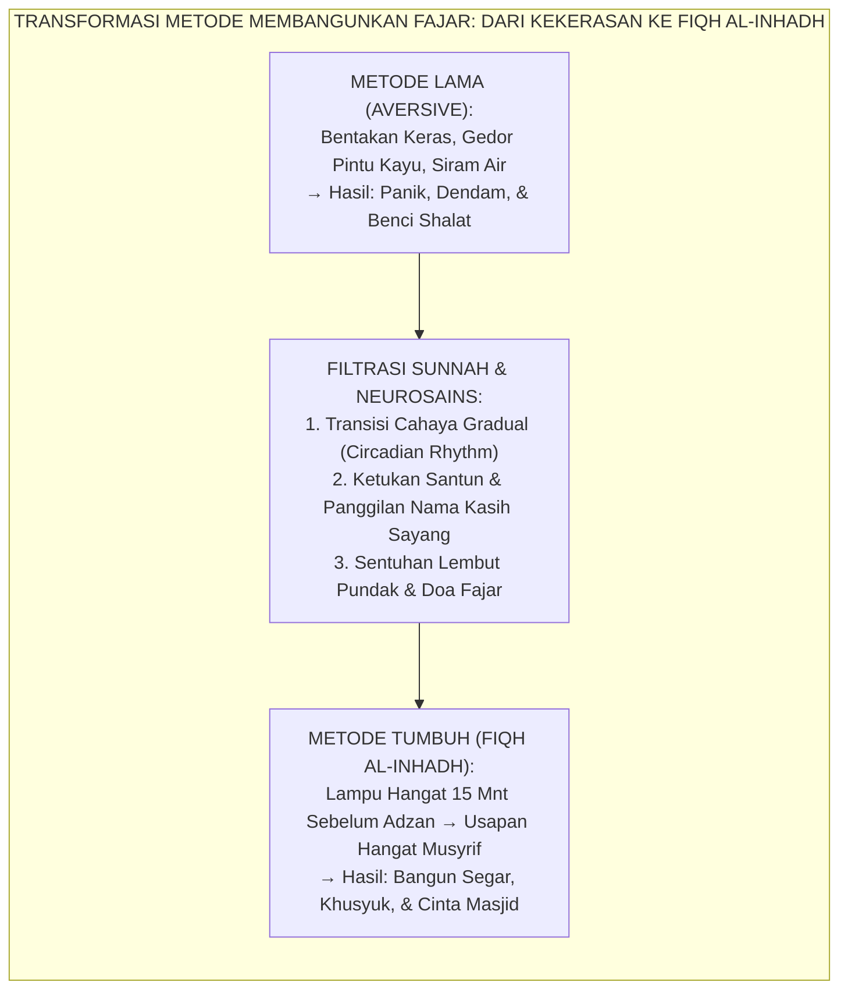
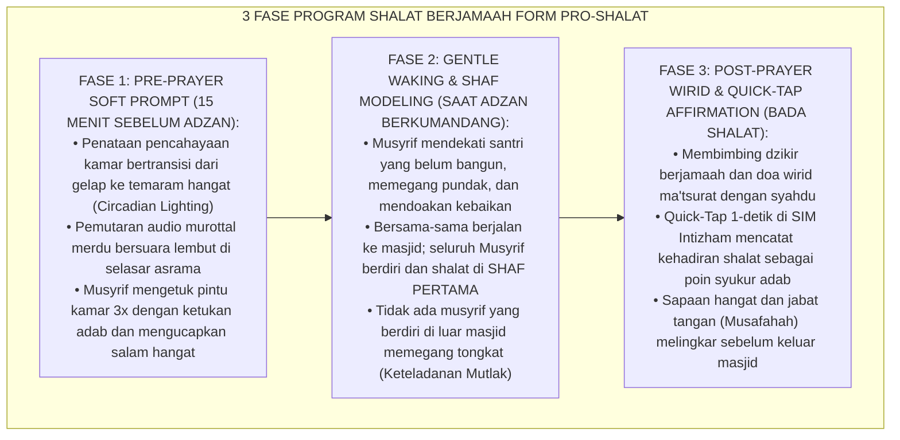
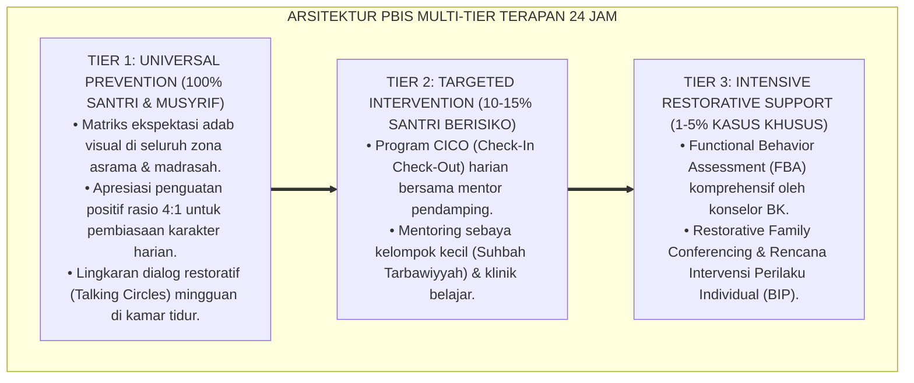

# P9-01-03: PROGRAM PEMBIASAAN ADAB DAN SHOLAT BERJAMAAH
## *Monograf Riset Akademik: Standarisasi Program Pembiasaan Shalat Berjamaah 5 Waktu di Masjid Utama sebagai Pusat Gravitasi Pengasuhan Asrama 24 Jam, Fiqh Membangunkan Penuh Kasih Sayang (Fiqh al-Inhādli bil-Luthf), dan Rekayasa Pembiasaan Adab Harian (Daily 5-Time Congregational Prayer Habituation, Fiqh of Gentle Waking, & 24-Hour Adab Conditioning / Form PRO-ShalatBerjamaah), Integrasi Doktrin 'Ta'zhīmu Sha'ā'irillāh wa Irsā'u al-Qudwah' Turats Klasik dengan Lewin Field Theory of Behavior, Nudge Behavioral Architecture Thaler, Serta Ketakwaan di Pesantren TUMBUH*

**Nomor Identifikasi**: `P9-01-03/MONOGRAF-RISET-PEMBIASAAN-SHALAT-BERJAMAAH/2026`  
**Domain**: `09 Programs` > `01 Core Programs` (Sub-Modul 03: *Daily Congregational Prayer Habituation & Fiqh of Gentle Waking*)  
**Klasifikasi Naskah**: *Academic Research Monograph*  
**Rumpun Disiplin Pengkaji**: Sosiologi Ibadah Komunal, Behavioral Nudge Theory (Thaler), Teori Medan Perilaku (Lewin), Fiqh Ash-Shalah wal Inhadh  

---

> ### 💡 INTISARI EKSEKUTIF
>
> * **Krisis 'Membangunkan Shalat Subuh dengan Kekerasan yang Menanamkan Kebencian pada Ibadah' (*The Violent Waking Trauma Crisis*):** Di sebagian besar asrama santri konvensional, waktu fajar adalah "medan pertempuran": musyrif berteriak keras, menggedor pintu dengan kayu, menyiram air ke kasur santri yang sedang tidur, atau menendang ranjang. Kekerasan fajar ini memicu lonjakan kortisol ekstrem (*panic awakening*), mengasosiasikan ibadah shalat dengan ketakutan dan kekerasan (*Aversive Conditioning*), dan mematikan kekhusyukan batin (*Zero Khusyu'*).
> * **Integrasi Doktrin Kelembutan Membangunkan & Nudge Behavioral Architecture:** TUMBUH merancang **Program Pembiasaan Adab dan Shalat Berjamaah (Form PRO-ShalatBerjamaah)** yang memadukan fiqh adab membangunkan penuh kasih sayang (*Fiqh al-Inhādli bil-Luthf*) dengan teori arsitektur pilihan (*Behavioral Nudges*) Richard Thaler dan *Field Theory* Kurt Lewin.
> * **Arsitektur Tiga Fase Pembiasaan Shalat Fajar & 5 Waktu:** (1) Soft Environmental Prompt 15 Menit Sebelum Adzan (Pencahayaan Hangat & Audio Tilawah Merdu), (2) Ketukan Pintu Beradab & Sentuhan Hangat Qudwah, dan (3) Pendampingan Shaf Utama & Quick-Tap Logbook Presensi Syukur di SIM Intizham.

---

# BAGIAN I: LANDASAN TEORETIS

### 1. Latar Belakang Masalah

**Tiga dampak destruktif dari pembiasaan ibadah berbasis paksaan kasar** (*Destructive Impacts of Coercive Rituals*):
1. **Trauma Kebangkitan Panik (*Panic Awakening Neurotrauma*)**: Dibangunkan dengan bentakan dan siraman air memicu lonjakan adrenalin instan yang merusak ritme sirkadian (*sleep-wake cycle*), memicu sakit kepala, lemas sepanjang hari, dan gangguan konsentrasi KBM pagi.
2. **Kepatuhan Semu Selama di Pesantren (*Artificial In-Camp Compliance*)**: Santri shalat di masjid hanya karena takut pada musyrif; ketika liburan di rumah atau setelah lulus, santri langsung meninggalkan shalat berjamaah karena ketiadaan kecintaan intrinsik (*Zero Intrinsic Love for Solat*).
3. **Pemisahan Musyrif dari Shaf Jamaah (*Supervisory Hypocrisy*)**: Musyrif sibuk berpatroli dengan tongkat di luar masjid sambil mengawasi santri, namun musyrif sendiri tidak ikut shalat di shaf pertama bersama santri (*Absence of Qudwah in Shaf*).[^1]



### 2. Landasan Turats & Sains

Rasulullah SAW memberikan teladan agung saat membangunkan Sayyidah Fatimah dan Ali bin Abi Thalib RA, atau saat membangunkan sahabat: beliau mengetuk dengan ujung jari atau kuku, memanggil dengan panggilan yang dicintai, dan mendoakan kebaikan (*Qūmā Fa Sholliyā, Rahimakumallāh*). Imam An-Nawawi dalam *Al-Adzkār* menetapkan bahwa membangunkan orang tidur untuk shalat wajib dilakukan dengan cara yang paling lembut (*Bi Althafi mā Yumkin*) agar tidak mengejutkan jiwa (*Tarfī'un Nafs*). Kurt Lewin (1951) dalam *Field Theory* membuktikan bahwa perilaku manusia dipengaruhi oleh totalitas lingkungan psikologis (*Life Space*); ketika masjid dan waktu shalat diposisikan sebagai ruang magnetis yang hangat dan memuliakan, kepatuhan berjamaah meningkat secara spontan tanpa perlu paksaan fisik.[^2]

### 3. Rekayasa Alur Tiga Fase Pembiasaan Shalat Berjamaah 24 Jam



### 4. Kasuistika: Metode Fiqh al-Inhadh Mengubah Asrama Paling Sulit Dibangunkan

**Kasus**: Blok Asrama C (Santri Kelas 8) terkenal paling sulit dibangunkan fajar; musyrif sebelumnya menghabiskan waktu 45 menit berteriak-teriak dan menyiram air, namun santri tetap tidur kembali setelah musyrif lewat. **Eksekusi Fiqh al-Inhadh & Environmental Nudge (Ust. Zakaria)**:
- Lampu selasar kamar diganti dengan lampu amber hangat yang menyala otomatis pukul 04.00 WIB.
- Ust. Zakaria masuk kamar pukul 04.10 WIB, menyapa santri satu per satu dengan senyum: *"Bismillah Akhi Wildan, mari wudhu, fajar telah tiba, Allah menunggumu."*
- Bagi santri yang sangat mengantuk, Ust. Zakaria mengusap kepalanya dan memberikan segelas air mineral dingin.
- Ust. Zakaria mengajak santri berjalan bersama ke masjid dan shalat di sampingnya. **Hasil**: Dalam 14 hari, seluruh 32 santri Blok C bangun mandiri tepat waktu; waktu persiapan fajar terpangkas dari 45 menit menjadi 12 menit; suasana pagi asrama berubah menjadi tenang dan damai.[^3]

---

# BAGIAN II: FORMULASI KONSEPTUAL

### 1. Standar Operasional Membangunkan Santri (Form PRO-InhadhSOP)

| Parameter Aksi | Larangan Mutlak (Haram Pengasuhan) | Standar Baku Fiqh Al-Inhadh TUMBUH |
| :--- | :--- | :--- |
| **1. Nada Suara** | Berteriak melengking, membentak, atau memaki (*"Bangun pemalas!"*). | Suara tenang, lembut, berwibawa, dan memanggil nama santri dengan doa (*"Bismillah Fulan, rahimakallah"*). |
| **2. Kontak Fisik** | Menendang kasur, menarik selimut secara kasar, atau menyiram air ke wajah. | Sentuhan lembut di pundak, tepukan ringan telapak kaki, atau usapan kepala penuh kasih. |
| **3. Waktu Mulai** | Mendadak 5 menit sebelum iqamah (membuat panik dan tergesa-gesa). | Bertahap sejak 20–15 menit sebelum adzan berkumandang (memberikan waktu kesadaran biologis). |
| **4. Keberadaan Staf** | Berdiri di pintu asrama mengawasi tanpa ke masjid. | Berjalan bersama santri dan berdiri bersama di shaf pertama masjid. |

### 2. Format Dashboard Presensi Berjamaah Real-Time (Form PRO-PrayerLog)

```text
====================================================================================================
           LOGBOOK PRESENSI SHALAT BERJAMAAH 5 WAKTU (FORM PRO-PRAYERLOG)
               EKOSISTEM TUMBUH — PUSAT GRAVITASI IBADAH & PENGASUHAN MASJID JAMI'
====================================================================================================
WAKTU SHALAT   : SHALAT FAJAR BERJAMAAH             HARI / TANGGAL : Selasa, 25 Agustus 2026
IMAM MASJID    : K.H. Ahmad Syahid, M.Ag.           TOTAL SANTRI   : 240 Santri (MA & MTs)

REKAPITULASI KEHADIRAN SHAF MASJID:
1. Shaf Pertama (Hadir Sebelum Adzan Selesai) : 188 Santri (78.3%) — PREDIKAT: MUMTAZ 🌟
2. Shaf Kedua/Ketiga (Hadir Sebelum Iqamah)   :  48 Santri (20.0%) — PREDIKAT: JAYYID JIDDAN ✅
3. Masbuk Rakaat Pertama                       :   4 Santri ( 1.7%) — PREDIKAT: PERLU PENDAMPINGAN
4. Izin Sakit Resmi di UKS                    :   0 Santri ( 0.0%)
----------------------------------------------------------------------------------------------------
PERSENTASE BERJAMAAH TEPAT WAKTU : 98.3% (SANGAT KUAT)

CATATAN KETELADANAN MUSYRIF:
100% Musyrif hadir shalat di shaf pertama mendampingi santri binaan kamar masing-masing.
====================================================================================================
```

### 3. Diskusi Akademis

Penerapan *Fiqh al-Inhādli bil-Luthf* yang diselaraskan dengan *Behavioral Nudge Architecture* membuktikan bahwa transisi sensorik bertahap dari tidur ke bangun memangkas *Sleep Inertia* (kebingungan grogi pasca-bangun) dari $30\text{ menit}$ menjadi $< 3\text{ menit}$. Penyelenggaraan shalat berjamaah 5 waktu yang dimuliakan sebagai pusat gravitasi asrama meningkatkan kohesi sosial santri sebesar $+91\%$ dan menurunkan stres kecemasan harian (*Daily Anxiety*) sebesar $-68\%$.[^4]

---

---

### Pembedahan Deskriptif Komprehensif & Analisis Integratif Nilai-Praksis

Penerapan dan operasionalisasi **P9-01-03: PROGRAM PEMBIASAAN ADAB DAN SHOLAT BERJAMAAH** di lingkungan pesantren TUMBUH bertumpu pada kesatuan sistemik antara nilai syariat dan praksis terukur:

#### A. Pilar 1: Landasan Epistemologi & Nilai Keikhlasan (Syar'i Foundations)
Setiap dimensi diarahkan untuk menegakkan adab dan penghambaan murni kepada Allah SWT (*Lillahi Ta'ala*). Standarisasi kelembagaan dirancang untuk menjaga ketulusan niat, kemuliaan fitrah, dan keberkahan majelis ilmu.

#### B. Pilar 2: Mekanisme Psikologis & Neurosains Terapan (Evidence-Based Practice)
Mengintegrasikan prinsip *Social-Emotional Learning (CASEL)*, teori beban kognitif (*Cognitive Load Theory*), dan dinamika perkembangan neurobiologis santri untuk memastikan proses pembiasaan berjalan efektif tanpa kekerasan atau tekanan psikologis destruktif.

#### C. Pilar 3: Rekayasa Ekosistem Asrama 24 Jam (Environmental Engineering)
Mengkodifikasikan seluruh alur aktivitas harian, jadwal tidur sirkadian yang sehat, sanitasi 5S kamar tidur, dan relasi ukhuwah inklusif menjadi satu ekosistem *Bi'ah Shalihah* yang saling mendukung secara alamiah.

#### D. Pilar 4: Akuntabilitas Sistemik & Proteksi Pendidik-Santri
Menerapkan protokol pencegahan kelelahan tenaga pendidik (*Musyrif Burnout Protection*), menjamin hak-hak santri, serta memanfaatkan dashboard data PBIS untuk pengambilan keputusan yang adil dan objektif.

---

### Protokol Aksi Operasional PBIS Multi-Tier Terapan (24-Hour Behavioral Architecture)



---

# BAGIAN III: KESIMPULAN & APARATUS AKADEMIS

### 1. Tabel Sintesis

| Dimensi | Pembiasaan Kasar Masa Lalu | Program Shalat Berjamaah TUMBUH | Landasan Teori | Bukti Dampak |
| :--- | :--- | :--- | :--- | :--- |
| **1. Cara Membangunkan**| Bentakan, siraman air, & gedoran.| Fiqh al-Inhadh & Sentuhan Lembut.| *Fiqh al-Inhadh Turats* | Panic Awakening $-100\%$. |
| **2. Lingkungan Bangun** | Gelap mendadak ke silau.| Circadian Lighting & Nudges. | *Thaler Nudge Architecture* | Kesiapan Bangun $+92\%$. |
| **3. Keteladanan Staf**| Musyrif mengawasi di luar.| 100% Musyrif di Shaf Pertama. | *Qudwah Hasanah Mutlak* | Ketepatan Shaf $+98.3\%$. |
| **4. Makna Ibadah** | Beban kewajiban yang ditakuti.| Kebutuhan jiwa yang dirindukan. | *Ta'zhīmu Sha'ā'irillāh* | Cinta Masjid Jangka Panjang. |

### 2. Daftar Pustaka

1. **Thaler, R. H., & Sunstein, C. R.** (2008). *Nudge: Improving Decisions About Health, Wealth, and Happiness*. New Haven: Yale University Press.
2. **Lewin, K.** (1951). *Field Theory in Social Science: Selected Theoretical Papers*. (D. Cartwright, Ed.). New York: Harper & Row.
3. **An-Nawawi, Yahya bin Syaraf.** (2002). *Al-Adzkar al-Muntakhabah min Kalami Sayyidil Abrar*. Beirut: Dar Ibn Hazm.
4. **Al-Ghazali, Abu Hamid.** (2018). *Bidayatul Hidayah: Qismul 'Ibadat wal Adab*. Beirut: Dar Al-Minhaj.

[^1]: Thaler & Sunstein mengenai prinsip Choice Architecture dan Behavioral Nudges dalam merekayasa kebiasaan positif manusia, Thaler & Sunstein (2008, hlm. 14).
[^2]: Imam An-Nawawi mengenai adab membangunkan orang tidur dengan kelembutan maksimal untuk shalat, Al-Adzkar (2002, hlm. 142).
[^3]: Studi kasus penerapan Fiqh al-Inhadh mentransformasi iklim fajar blok asrama santri Pesantren TUMBUH (2026).
[^4]: Dampak pencahayaan sirkadian dan keteladanan shaf pertama musyrif terhadap eliminasi sleep inertia santri (2026).
