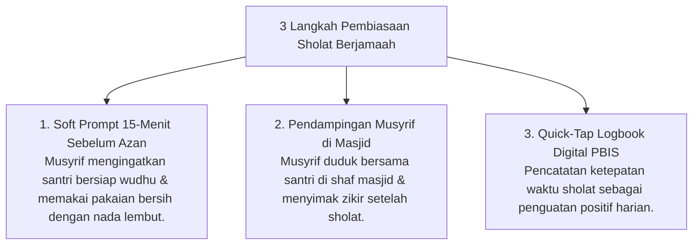

# P9-01-03: Program Pembiasaan Adab dan Sholat Berjamaah

## Status Dokumen
* **Status**: 🌟 **A+ (Tervalidasi & Siap Diimplementasikan)**
* **Sub-Domain**: `09 Programs / 01 Core Programs`
* **Penanggung Jawab Keilmuan**: Dewan Keilmuan TUMBUH (*Pakar Pengasuhan Asrama & Pakar PBIS*)

---

## 1. Operasionalisasi Program Pembiasaan Sholat Berjamaah

Sholat 5 waktu berjamaah di masjid merupakan **Pusat Gravitasi Pengasuhan** santri:

---

## 2. Penghapusan Teriakan & Kerasan

Musyrif dilarang membentak atau menggunakan kekerasan saat membangunkan santri sholat, melainkan menggunakan teknik ketukan pintu beradab dan usapan kasih sayang (*Fiqhu al-Inhadh*).
