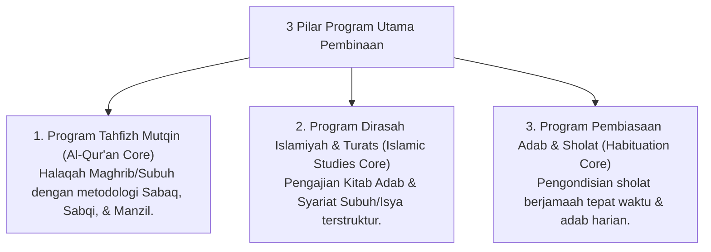

# P9-01: Program Utama Pembinaan

## Status Dokumen
* **Status**: 🌟 **A+ (Tervalidasi & Siap Diimplementasikan)**
* **Sub-Domain**: `09 Programs / 01 Core Programs`
* **Penanggung Jawab Keilmuan**: Dewan Keilmuan TUMBUH (*Pakar Epistemologi Turats & Pakar Desain Kurikulum Adab*)

---

## 1. Konseptualisasi Core Programs Pesantren

Program Utama (*Core Programs*) merupakan fondasi spiritual dan intelektual santri di ekosistem **TUMBUH** yang dilaksanakan secara terpadu sepanjang 24-jam:

---

## 2. Integrasi Pengasuhan 24-Jam

Seluruh program utama didampingi oleh Musyrif Asrama dan Ustadz Diniyyah dalam satu alur koordinasi terpadu.
