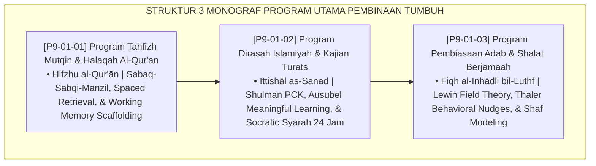

# P9-01: DOKUMEN INDUK PROGRAM UTAMA PEMBINAAN PESANTREN
## *Arsitektur dan Standarisasi Program Tahfizh Mutqin Tri-Siklus (Sabaq, Sabqi, Manzil), Kurikulum Dirasah Islamiyah dan Kajian Turats Terpadu 24 Jam, Serta Program Pembiasaan Adab dan Shalat Berjamaah 5 Waktu sebagai Tiga Pilar Program Inti Pengasuhan (Mutqin Tahfizh Form PRO-TahfizhMutqin, Integrated Turats Form PRO-DirasahTurats, Serta Daily Prayer Habituation Form PRO-ShalatBerjamaah) di Ekosistem TUMBUH Pesantren*

**Nomor Identifikasi**: `P9-01/DOKUMEN-INDUK-PROGRAM-UTAMA-PEMBINAAN/2026`  
**Domain**: `09 Programs` > `01 Core Programs` (Gugus Sub-Domain 01: *Core Spiritual & Academic Programs*)  
**Klasifikasi Naskah**: *Master Architecture & Navigation Monograph*  
**Rumpun Disiplin Pengkaji**: Ilmu Qira'at & Tahfizh Turats, Kurikulum Diniyyah 24 Jam, Fiqh Al-Inhadh wal 'Ibadah, Cognitive Science of Memory  

---

> ### 💡 INTISARI EKSEKUTIF
>
> * **Kedudukan Strategis Gugus Program Utama Pembinaan:** Gugus ini adalah detak jantung spiritual dan akademik (*spiritual & academic heartbeat*) ekosistem TUMBUH. Memadukan kemuliaan penjagaan Al-Qur'an melalui metodologi hafalan mutqin seimbang, kedalaman kajian kitab turats bersanad otentik, dan pembiasaan shalat 5 waktu berjamaah yang ramah jiwa di masjid utama, gugus ini memastikan pondasi keislaman santri berdiri kokoh, berakar kuat pada nilai-nilai nubuwah, dan memancarkan adab luhur dalam setiap dimensi kehidupan (*Deeply Rooted Faith, Radiant Adab*).
> * **Triad Program Utama Pembinaan TUMBUH:** (1) **Tahfizh Mutqin 3-Siklus** (Sabaq, Sabqi, Manzil) berbasis neurosains retensi memori jangka panjang, (2) **Dirasah Islamiyah & Turats Terpadu** yang menyatukan KBM madrasah dan pengajian diniyyah 24 jam dengan metode Socratic Syarah, dan (3) **Pembiasaan Shalat Berjamaah 5 Waktu** berbasis Fiqh Al-Inhadh yang meniadakan bentakan fajar.
> * **3 Monograf Riset Komprehensif:** Form PRO-TahfizhMutqin, Form PRO-DirasahTurats, dan Form PRO-ShalatBerjamaah.

---

## 📑 PETA NAVIGASI TIGA MONOGRAF

---

## 📚 DESKRIPSI RINGKAS 3 BERKAS MONOGRAF

1. **[P9-01-01: Program Tahfizh Mutqin dan Halaqah Al-Quran](file:///c:/xampp/htdocs/tumbuh/09%20Programs/01%20Core%20Programs/P9-01-01-Program-Tahfizh-Mutqin-dan-Halaqah-Al-Quran.md)**  
   *Metodologi tri-siklus klasik (Sabaq setoran baru, Sabqi muraja'ah dekat, Manzil muraja'ah jauh rotasi), rasio 1:10 muqri, tadabbur adab qur'ani, dan Form PRO-TahfizhMutqin.*
2. **[P9-01-02: Program Dirasah Islamiyah dan Kajian Turats](file:///c:/xampp/htdocs/tumbuh/09%20Programs/01%20Core%20Programs/P9-01-02-Program-Dirasah-Islamiyah-dan-Kajian-Turats.md)**  
   *Kurikulum diniyyah terintegrasi 24 jam (KBM formal + pengajian subuh/isya/sabtu), tangga kitab turats 4 jenjang (J1-J4), ijazah sanad bersambung, dan Form PRO-DirasahTurats.*
3. **[P9-01-03: Program Pembiasaan Adab dan Sholat Berjamaah](file:///c:/xampp/htdocs/tumbuh/09%20Programs/01%20Core%20Programs/P9-01-03-Program-Pembiasaan-Adab-dan-Sholat-Berjamaah.md)**  
   *Pusat gravitasi masjid 24 jam, protokol Fiqh al-Inhadh membangunkan fajar dengan kelembutan, circadian lighting nudges, shaf modeling qudwah musyrif, dan Form PRO-ShalatBerjamaah.*

---

## 🎯 STANDAR PENJAMINAN MUTU PROGRAM UTAMA

Penerapan gugus **Program Utama Pembinaan** menjamin bahwa:
1. **Hafalan Al-Qur'an Santri Kokoh Mutqin Seumur Hidup (*Permanent Memorization Guarantee*)**: Tri-siklus Sabaq-Sabqi-Manzil mencegah hafalan rontok dan mengeliminasi trauma target akselerasi.
2. **Keilmuan Syariat Santri Mendalam, Moderat, dan Kontekstual (*Authentic & Contextual Turats Guarantee*)**: Integrasi PCK dan Sanad menjamin pemahaman fikih yang aplikatif dan beradab.
3. **Shalat Berjamaah Menjadi Sumber Kebahagiaan dan Kedamaian Batin (*Joyful Worship Guarantee*)**: Protokol kelembutan fajar meniadakan ketakutan dan mengukuhkan kecintaan abadi pada rumah Allah.
