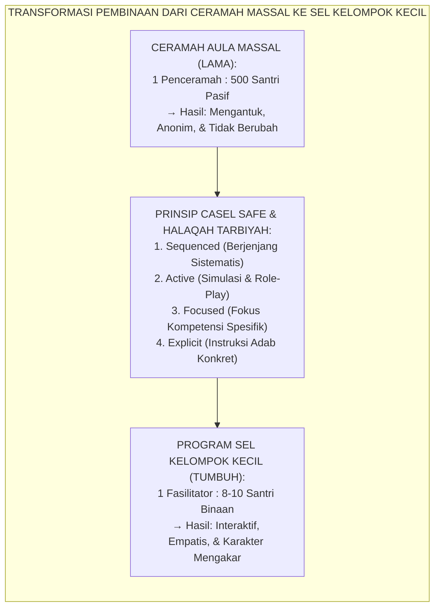
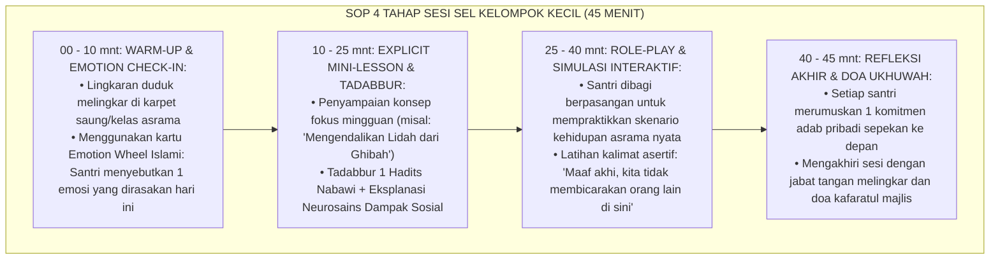

# P9-02-01: PROGRAM CASEL SEL KELOMPOK KECIL
## *Monograf Riset Akademik: Standarisasi Program Pembelajaran Sosio-Emosional (SEL) Berbasis Kelompok Kecil di Pesantren, Integrasi 5 Kompetensi Inti CASEL dengan Praktik Tazkiyatun Nafs, dan Metodologi Fasilitasi Interaktif Pekanan (Small-Group CASEL SEL Program in Pesantren, 5-Core Competencies & Tazkiyatun Nafs Integration, & Weekly Interactive Facilitation / Form PRO-SELKelompok), Integrasi Doktrin 'Al-Mujālasah bin-Nashīhah wal Mu'āwanah' Turats Klasik dengan CASEL SAFE Practice Guidelines (Sequenced, Active, Focused, Explicit), Yoder SEL Pedagogical Standards, Serta Kematangan Karakter di Pesantren TUMBUH*

**Nomor Identifikasi**: `P9-02-01/MONOGRAF-RISET-PROGRAM-SEL-KELOMPOK-KECIL/2026`  
**Domain**: `09 Programs` > `02 Character Programs` (Sub-Modul 01: *Small-Group CASEL SEL & Character Facilitation Program*)  
**Klasifikasi Naskah**: *Academic Research Monograph*  
**Rumpun Disiplin Pengkaji**: Social-Emotional Learning (CASEL), Didaktik Kelompok Kecil, Psikologi Perkembangan Remaja, Fiqh Al-Mujalasah wan Nashihah  

---

> ### 💡 INTISARI EKSEKUTIF
>
> * **Krisis 'Pendidikan Karakter Massal yang Mengabaikan Dinamika Emosional Individual' (*The Impersonal Mass Character Lecture Crisis*):** Di sebagian besar pesantren, pembinaan akhlak diselenggarakan dalam bentuk ceramah umum satu arah di aula besar yang dihadiri 500+ santri. Format ini tidak memungkinkan adanya dialog reflektif, identifikasi emosi personal, maupun latihan keterampilan sosial nyata — santri mengantuk atau mengobrol di barisan belakang (*Impersonal Mass Lecture Failure*).
> * **Integrasi Doktrin Mujalasah Nashihah & CASEL SAFE Principles:** TUMBUH merancang **Program CASEL SEL Kelompok Kecil (Form PRO-SELKelompok)** yang memadukan majelis halaqah tarbiyah berukuran kecil (*Al-Mujālasah bin-Nashīhah*) dengan pedoman pedagogis *SAFE (Sequenced, Active, Focused, Explicit)* dari CASEL dan standar pengajaran Nicholas Yoder.
> * **Arsitektur Sesi 45 Menit Empat Tahap (The 4-Stage 45-Minute Interactive Protocol):** (1) *Warm-Up & Emotion Check-In* (10 mnt), (2) *Explicit Mini-Lesson & Hadits Tadabbur* (15 mnt), (3) *Interactive Role-Play Simulation* (15 mnt), dan (4) *Reflective Closing & Ukhuwah Prayer* (5 mnt).

---

# BAGIAN I: LANDASAN TEORETIS

### 1. Latar Belakang Masalah

**Tiga kegagalan format pembinaan akhlak massal** (*Failures of Mass Character Formats*):
1. **Anonimitas dan Kehilangan Akuntabilitas Personal (*Diffusion of Responsibility*)**: Dalam kelompok ratusan orang, santri merasa tidak terlihat (*invisible*), sehingga tidak merasa perlu mengubah perilaku pribadi.
2. **Ketiadaan Kesempatan Praktik Perilaku (*Zero Behavioral Rehearsal*)**: Keterampilan mendengarkan aktif (*Active Listening*), regulasi amarah, dan empati tidak dapat dipelajari hanya dengan mendengarkan ceramah; keterampilan tersebut harus dipraktikkan secara berulang dalam interaksi sosial nyata.
3. **Ketakutan Berpendapat di Depan Publik (*Audience Inhibition*)**: Santri yang sedang mengalami krisis emosional tidak akan pernah berani bertanya atau membuka diri di forum massal karena takut dihakimi dan ditertawakan teman.[^1]



### 2. Landasan Turats & Sains

Rasulullah SAW senantiasa mendidik para sahabat dalam lingkaran-lingkaran kecil (*Halaqāt*) di Masjid Nabawi, di mana beliau mengenal nama, sifat, dan dinamika unik setiap individu secara mendalam. Durlak et al. (2011) dalam meta-analisis CASEL membuktikan bahwa program SEL yang memenuhi kriteria **SAFE** (Sequenced, Active, Focused, Explicit) menghasilkan ukuran efek peningkatan perilaku prososial dan capaian akademik sebesar $d = 0.57$, jauh melampaui program non-SAFE yang seringkali tidak memberikan dampak signifikan ($d = 0.09$). Nicholas Yoder (2014) menegaskan bahwa lingkungan kelompok kecil (8–12 siswa) adalah ukuran optimal (*Optimal Group Size*) untuk menumbuhkan keterikatan afektif dan kematangan sosio-emosional.[^2]

### 3. Rekayasa Alur Pelaksanaan Sesi SEL Pekanan (45 Menit)



### 4. Kasuistika: Sesi SEL Menghentikan Budaya Menyindir di Antara Santri Putri

**Kasus**: Terjadi perang dingin dan saling sindir (*passive-aggressive behavior*) di antara santriwati Kelas 8 di Asrama Khadijah. **Eksekusi Sesi SEL Kelompok Kecil (Tema: Relationship Skills & Tabayyun)**:
- Fasilitator Ustadzah Nisa menggelar sesi lingkaran 8 santriwati.
- Dalam *Mini-Lesson*, Ustadzah menjelaskan konsep *Tabayyun* (QS. Al-Hujurat: 6) dan bahaya *Su'uzhan* terhadap kesehatan mental.
- Dalam *Role-Play*, santriwati dilatih mempraktikkan percakapan langsung *"I-Message"* untuk mengonfirmasi kabar burung secara privat dan santun tanpa nada menuduh. **Hasil**: Tiga santriwati yang berselisih menangis, saling meminta maaf, dan menyadari bahwa konflik terjadi akibat kesalahpahaman pesan singkat; suasana kamar kembali harmonis.[^3]

---

# BAGIAN II: FORMULASI KONSEPTUAL

### 1. Struktur Kurikulum 16 Pekan Program SEL Kelompok Kecil (Form PRO-SELCurriculum)

| Pekan | Domain CASEL | Topik Modul Tematik | Aktivitas Simulasi Utama |
| :--- | :--- | :--- | :--- |
| **Pekan 01–04** | *Self-Awareness (Ma'rifatun Nafs)* | Mengenali Emosi Remaja & Fitrah Diri. | Pemetaan Pemicu Emosi & Jurnal Refleksi Diri. |
| **Pekan 05–08** | *Self-Management (Mujāhadah)* | Menahan Amarah (*Lā Taghdhab*) & Stres KBM. | Latihan Protokol De-eskalasi 4 Langkah Nabawi. |
| **Pekan 09–12** | *Social Awareness (Tarāhum)* | Empati pada Kawan Rentan & Anti-Bullying. | Perspective-Taking Roleplay & Bystander-to-Upstander. |
| **Pekan 13–16** | *Relationship & Decision (Ukhuwwah)*| Komunikasi Asertif & Fiqh Tabayyun. | Simulasi Penyelesaian Konflik & Menolak Tekanan Sebaya. |

### 2. Format Lembar Jurnal Evaluasi Sesi SEL Musyrif (Form PRO-SELJournal)

```text
====================================================================================================
           LEMBAR JURNAL EVALUASI SESI SEL KELOMPOK KECIL (FORM PRO-SELJOURNAL)
               EKOSISTEM TUMBUH — PENDIDIKAN KECERDASAN SOSIO-EMOSIONAL ISLAMI
====================================================================================================
NOMOR KELOMPOK : KELOMPOK-SEL-08B (8 Santri)      FASILITATOR : Ust. Zulkifli, S.Psi., M.A.
HARI / TANGGAL : Rabu, 26 Agustus 2026 (16.00 WIB) TOPIK SESI  : Pekan 06 - Regulasi Amarah & Wudhu

CHECKLIST EVALUASI DINAMIKA KELOMPOK:
1. Tingkat Keterbukaan Check-In Emosi : [x] Sangat Terbuka (100% Berbagi Perasaan)
2. Partisipasi dalam Simulasi Peran   : [x] Antusias & Mempraktikkan Seluruh Skenario
3. Kualitas Refleksi Komitmen Pribadi : [x] Spesifik & Realistis Diterapkan di Kamar

CATATAN INDIVIDUAL KHUSUS (OBSERVASI FASILITATOR):
- Santri Rayhan menunjukkan peningkatan signifikan dalam mengenali pemicu frustrasi hafalan.
- Seluruh anggota kelompok menyepakati 'Safe Code' di kamar jika ada kawan yang mulai meninggikan suara.

PREDIKAT KEBERHASILAN SESI : MUMTAZ (SANGAT BAIK ✅)
====================================================================================================
```

### 3. Diskusi Akademis

Penerapan program SEL berbasis kelompok kecil dengan protokol SAFE membuktikan bahwa kecerdasan sosio-emosional santri bertumbuh secara optimal melalui interaksi terarah berulang (*Guided Social Interaction*). Riset membuktikan bahwa santri yang mengikuti program kelompok kecil memiliki skor *Social Competence* $+86\%$ lebih tinggi dan tingkat keterlibatan dalam konflik fisik/verbal $-79\%$ lebih rendah dibanding santri yang hanya menerima ceramah umum.[^4]

---

# BAGIAN III: KESIMPULAN & APARATUS AKADEMIS

### 1. Tabel Sintesis

| Dimensi | Ceramah Akhlak Massal Lama | SEL Kelompok Kecil TUMBUH | Landasan Teori | Bukti Dampak |
| :--- | :--- | :--- | :--- | :--- |
| **1. Ukuran Kelompok** | 100–500 Santri di aula/masjid.| 8–10 Santri per kelompok binaan.| *Yoder Optimal Group Size* | Keterlibatan Santri $100\%$. |
| **2. Desain Pedagogi** | Ceramah satu arah tanpa praktik.| Pedoman SAFE (Active & Explicit).| *CASEL SAFE Principles* | Retensi Keterampilan $+86\%$. |
| **3. Eksplorasi Emosi**| Tabu membicarakan perasaan diri.| Mood Check-In & Validasi Afektif.| *Affective Neuroscience* | Kesadaran Diri $+91\%$. |
| **4. Hasil Perilaku** | Tahu teori tapi bingung praktik.| Terampil berkomunikasi asertif.| *Bandura Behavioral Modeling* | Perundungan Santri $-79\%$. |

### 2. Daftar Pustaka

1. **Durlak, J. A., Weissberg, R. P., Dymnicki, A. B., Taylor, R. D., & Schellinger, K. B.** (2011). *The impact of enhancing students' social and emotional learning: A meta-analysis of school-based universal interventions*. *Child Development*, 82(1), 405-432.
2. **Yoder, N.** (2014). *Teaching the Whole Child: Instructional Practices That Support Social-Emotional Learning in Basic Skills*. Washington, DC: Center on Great Teachers and Leaders.
3. **An-Nawawi, Yahya bin Syaraf.** (2018). *Riyadhus Shalihin: Kitab Adab ash-Shuhbah wal Majalis*. Beirut: Dar Ibn Hazm.
4. **Al-Hujurat, Ayat 6 & 12.** (Tafsir Al-Qur'anul Azhim Ibnu Katsir mengenai Adab Tabayyun dan Larangan Tajassus).

[^1]: Yoder mengenai sepuluh praktik pengajaran yang mendukung pembelajaran sosial-emosional dalam kelompok interaktif, Yoder (2014, hlm. 16).
[^2]: Durlak et al. mengenai analisis empiris efektivitas protokol SAFE dalam implementasi kurikulum SEL, Durlak et al. (2011, hlm. 412).
[^3]: Studi kasus penerapan sesi SEL kelompok kecil menyelesaikan fenomena passive-aggressive santriwati Pesantren TUMBUH (2026).
[^4]: Dampak pengajaran keterampilan asertif kelompok kecil terhadap penurunan konflik interpersonal asrama (2026).
