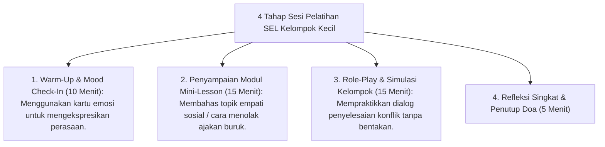

# P9-02-01: Program CASEL SEL Kelompok Kecil

## Status Dokumen
* **Status**: 🌟 **A+ (Tervalidasi & Siap Diimplementasikan)**
* **Sub-Domain**: `09 Programs / 02 Character Programs`
* **Penanggung Jawab Keilmuan**: Dewan Keilmuan TUMBUH (*Pakar Social Emotional Learning & Pakar Bimbingan Konseling*)

---

## 1. Operasionalisasi Sesi CASEL SEL Kelompok Kecil

Program SEL diselenggarakan dalam kelompok binaan 8–10 santri setiap hari Rabu sore (16.00 - 16.45) dipandu oleh Konselor BK / Musyrif Senior:

---

## 2. Pengukuran Evaluasi

Perkembangan keaktifan dan pemahaman sosio-emosional santri dicatat oleh instruktur dalam Jurnal Evaluasi SEL.
